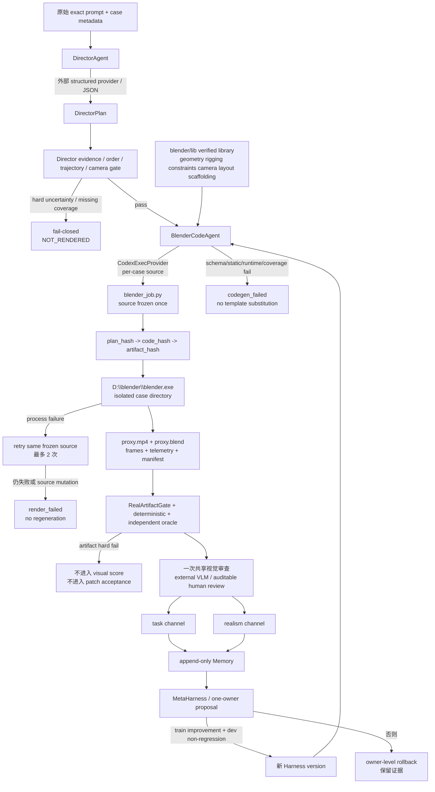

# T2Blendercodeharness v5：训练前内部架构

## 标注门禁交接

人工视觉校准使用 `dataset/golden-review-exact-v2` 和本地中文页面，而不是把
deterministic、frame statistics 或模板 baseline 当成视觉真值。页面分别展示
原始英文 VBench prompt 与中文辅助翻译；每个匿名视频必须由两名不同 ID 的
评分者独立完成 14 维评分。完成后运行：

```powershell
uv run python scripts/finalize_golden_review.py --root dataset/golden-review-exact-v2
uv run python scripts/validate_golden_review_set.py --root dataset/golden-review-exact-v2
```

在这两个命令通过、真实 agent/provider smoke 和 agent/template paired gate
通过之前，`training_allowed` 必须保持 `false`。

本文档记录当前 `director-multi-entity-harness` 工作树中的真实生产边界。它描述的是“训练开始前”的 Harness，不代表六轮训练已经完成，也不把历史模板结果当成 agent 能力。

## 1. 总体职责边界



生产路径只有一条：

```text
exact prompt
  -> DirectorAgent
  -> DirectorPlan
  -> case coverage gate
  -> BlenderCodeAgent
  -> frozen per-case Blender source
  -> real Blender CLI
  -> artifact gate / deterministic diagnostics
  -> one shared visual review
  -> separate task and realism scores
  -> outer-loop Harness evolution
```

`Scene/Prompt Parser`、`Character/Object Trajectory Planner` 和 `Camera Choreography Planner` 已经融合为 `DirectorAgent` 内部职责；它们不再是可绕过 `DirectorPlan` 的平行生产入口。`SceneContract` 与 `TrajectoryPlan` 只是现有 executor/evaluator 的兼容投影。

## 2. 每个 case 的实际生命周期

### 2.1 输入与 DirectorPlan

输入保留原始 prompt，不先做固定关键词模板替换。`DirectorAgent.plan` 负责：

- 从 prompt 中建立带稳定 ID 的 actor、prop、support/environment 实体，并给每个实体记录证据 span、外观/几何要求和初始布局；
- 建立有向无环事件图，显式表示 `then`、`after`、`while`、pause、reveal、approach、attach、detach、handoff、return 等顺序；
- 为每个 actor 和 prop 生成连续轨迹、接触/所有权生命周期和最终状态；
- 生成多目标 `CameraPlan`：shot、cue、targets、时间窗、lens、visibility predicates、`continuity_group` 和 occlusion 预算；
- 把“可见事件”和“必须调用的行为”写入 coverage obligations；
- 保留 prompt evidence、assumption、uncertainty、provider/policy fingerprint，并计算 `director_plan_hash`。

动态生产模式先通过外部 OpenAI-compatible structured provider 请求 Director interpretation，再由本地 contracts/critic 复核；通过后，BlenderCodeAgent 再通过本地 `CodexExecProvider` 请求 Blender source。两个 provider 都把 Pydantic schema 转成严格 structured-output 可接受的形式：所有 object properties 都进入 `required`（可选值用 nullable 表达）、固定 tuple 转成带长度约束的 `items` 数组、自由字典关闭额外字段。外部 provider 的 endpoint、schema/JSON/网络错误和本地 Codex 的 CLI/JSON 错误都保留为 hard failure。以下情况在 Blender 编译前直接 `fail-closed`：空 prompt、无法落到实体或可执行事件、证据越界、未知 ID、循环依赖、时间/所有权矛盾、缺少 reveal/handoff 生命周期、未覆盖 camera cue，或 unresolved hard uncertainty。正式 model path 必须有一个外部 Director call 和一个本地 Blender-code call；`codex-local`/`rule_template_baseline` 只作为显式诊断对照，不能冒充正式模型路径。

历史兼容路径可显式调用 `plan_explicit_baseline`，但它只能服务于 template baseline/fake-MCP/历史对比，不能被 agent 失败路径偷偷调用。

在 Codex app 中可以进行一次显式 `assistant_diagnostic`：当前会话直接提供
经过 Director contract 校验的 interpretation 和本案独立 Blender source，
不启动 `codex exec`，也不使用 `compile_real_proxy_job` 或任何模板 fallback。
它复用相同的 AST/coverage gate、真实 Blender CLI、trusted observer 和 evaluator，
并把两个阶段记为 `provider_kind=assistant_generated`。该模式只能作为当前会话的
链路诊断，不能伪装成 `provider_mode=model`，不能解锁 G0/G4，也不能替换正式
model provider 的 provenance 要求。

### 2.2 BlenderCodeAgent 与 L2 library

`BlenderCodeAgent` 的输入是当前 case 的 `DirectorPlan`、`blender/lib/signatures.json`、Harness 版本和约束；它通过独立的 `CodexExecProvider` codegen call 按 case 生成一次 `blender_job.py`。代码 agent 不能直接接受一个固定场景模板，也不能调用 `compile_real_proxy_job`、`direct_prompt_code` 或其他模板救援路径。

代码在冻结前必须通过：

1. JSON/schema 与 provider 状态检查；
2. Python AST 检查：禁止 `os`/`subprocess`/`sys`、`eval`/`exec` 等越权路径；
3. L2 library-call 检查：只能使用 `signatures.json` 中的 verified 函数；
4. runtime contract 检查：能保存可观测的 `candidate.blend` 并执行 animation render；正式 telemetry 由独立 trusted observer 读取，不接受生成代码自报的语义结论；
5. `case coverage gate`：当前 case 的实体、事件、轨迹和 camera cue 必须在源代码调用或明确 hard uncertainty 中可追溯；
6. duplicate/source hash 检查：不同语义 case 不能复用相同的冻结源代码。

L2 是可复用的“执行原语”而不是场景模板，包括 geometry、character rigging、constraints/handoff、camera DSL、layout 和 scaffolding。L3 只负责把当前 DirectorPlan 组合成 case-specific source。L4 仅在 L3 明确返回 `library_insufficient` 时以显式策略调用；provider/schema/static/coverage 失败不允许升级成 L4，更不允许换回模板。

few-shot context 不是隐式历史模板。`scripts/validate_codegen_examples.py`
先检查每个真实样例的 MP4、artifact、`director_plan.json`、计划内容
`plan_hash`、源文件 `code_hash`、deterministic evidence 和合规视觉 review
provenance；只有通过的样例才由 `codegen_context.py` 加载到
`CodegenRequest.context_examples`。清单存在但无效时，`prepare_real_jobs.py`
在调用 BlenderCodeAgent provider 前写入 `codegen_failed`，清单缺失则显式记为
`context_status=none`。job/cache manifest 记录 context IDs/status，防止无证据
样例或旧模板成为训练信号。

`template_baseline` 是显式的历史对照臂。它可单独运行并单独标记，但绝不是 agent fallback，也不进入 agent 的成功率。

### 2.3 冻结、渲染与重试

代码冻结后留下以下可追踪链：

```text
prompt_hash
  -> director_plan_hash / plan_hash
  -> code_hash (blender_job.py)
  -> artifact_hash (由 RealArtifactGate 对 artifact_hashes 做审计聚合)
```

审计摘要的规范表达为：`plan_hash → code_hash → artifact_hash`。

当前 manifest 存储 `plan_hash`、`director_plan_hash`、`code_hash` 和运行 fingerprint；`RealArtifactReport` 存储每一个必需 artifact 的 `artifact_hashes`。因此 `artifact_hash` 在文档中表示规范化 artifact hash 汇总，而不是把一个尚未落盘的字段冒充成 manifest 字段。

渲染阶段每个 case 使用隔离目录和真实的 `D:\blender\blender.exe`。渲染器最多 12 workers；每次执行都检查 frozen source 的 hash。Blender 进程失败可以对同一份 source 最多重试 2 次；重试不重新调用 DirectorAgent/BlenderCodeAgent、不改 plan、不切模板。发现 source 在重试期间变化，立即失败关闭。

合格 artifact 至少包含：

```text
run_manifest.json
director_plan.json
scene_contract.json
trajectory.json
camera_plan.json
blender_job.py
proxy.blend
proxy.mp4
telemetry.json
frames/index.json
至少 3 张可读 PNG sample frames
```

缺任一关键 artifact、MP4 不可播放、PNG 不可读、telemetry 缺失或 code hash 不匹配，都只能得到 `incomplete`/`NOT_RENDERED`，不能进入视觉分数或 Harness patch acceptance。

## 3. Evaluator：三个不混淆的输出通道

### 3.1 Deterministic / artifact 通道

这一层回答“运行是否真实、证据是否完整、硬约束是否违反”，不冒充主要视觉质量分数。它检查：

- artifact 完整性、MP4 可解码性、PNG 可读性、帧率/时长/分辨率和黑帧/静帧等 frame health；
- DirectorPlan 与 telemetry 的实体、事件帧、轨迹连续性、相机激活、target visibility、cue 执行；
- independent oracle 的穿模、穿透、错误所有权、handoff 时间窗、可见性证据等负约束；
- source/plan/director/artifact hash 链和 duplicate/template reuse。

它输出 `artifact_status`、`deterministic_status`、findings、evidence paths、`artifact_health` 和可解释诊断。`deterministic_score` 是诊断/闸门摘要，不参与替代 VLM 的视觉主分数。

### 3.2 共享一次视觉审查，分离两个分数

artifact gate 通过后，对按事件中点、端点和均匀时间抽取的真实视频帧执行一次共享 review。主 judge 的 blind 输入只包含 exact prompt、时序 frames/timecodes 和评分 schema；DirectorPlan 摘要、deterministic findings、owner、arm 和 Harness version 都排除在主 payload 外。允许的 provenance 是：

- 外部 compliant endpoint，模型名只能记录为小写 `gpt-5.6-luna` 或 `gpt-5.6-terra`；
- `human_review` 或 `codex_local_visual_review` 的可审计 payload。

网络/策略/schema 不可用时记录 `unavailable`/`needs_human_review`，不写入伪造的 0 或 100，也不把 frame statistics 推断成语义分数。

任务通道：

```text
semantic_core = GM(applicable required dimensions:
                    prompt_compliance,
                    physical_plausibility,
                    object_trajectory,
                    event_timing,
                    character_trajectory only when an actor is applicable)

choreography = GM(camera_coverage,
                  camera_innovation only when camera motion is required,
                  character_trajectory only when an actor is applicable,
                  temporal_smoothness)

observability = GM(camera_coverage, visual_clarity)

task_score = 0.75 * semantic_core
           + 0.25 * observability
task_final_score = task_score
```

真实性通道独立计算：

```text
realism_vlm = GM(appearance_detail,
                  physical_realism,
                  spatial_consistency,
                  motion_naturalness,
                  visual_presentation)

reviewed_realism = 0.15 * geometry_score
                 + 0.15 * frame_evidence_score
                 + 0.70 * realism_vlm
```

`task_score` 与 `reviewed_realism` 不相加；真实性不能用轨迹任务高分掩盖，轨迹也不能被外观分数掩盖。没有独立视觉 review 时，仅保留带 `not_established` 标记的 `artifact_only_proxy`，不进入训练 patch 的语义决策。

实现中将 `camera_innovation` 的结果以 `camera_effectiveness` 记录；它只在
prompt/plan 明确要求运动时进入适用维度。required event 的 evidence-bound
score 小于 25 会把 `semantic_status` 置为 `failed_required_event` 并把 task
上限设为 49；缺失证据是 `uncertain`，不当作 0。每个适用维度分别保留
score、confidence、evidence completeness、evidence refs 和 interval。

## 4. 外循环 Harness 自进化

外循环固定 dataset、evaluator、Blender binary、review policy 和 prompt；只改一个 Harness owner。可修改的 owner 例如 `director_prompt_interpreter`、`director_event_scheduler`、`director_trajectory`、`director_camera`、`blender_code_agent`、`blender_executor`、`proxy_renderer` 或 `meta_harness`。训练 patch 不修改 evaluator、dataset labels、Blender 模板实现或已经生成的 plan。

每轮协议：

```text
6 轮
每轮最多 5 次 attempt
每次 attempt：10 train + 10 paired dev
每轮末：完整 60 train + 60 dev = 120 case
理论上限：6 * (5 * 20 + 120) = 1320 次真实视频执行
```

候选 patch 需要同一归一化 failure 在至少两个不同 train case 重复出现，并包含 `predicted_fixes`、`predicted_regressions`、`prediction_rationale`、唯一 owner、重跑命令和 rollback 路径。重新运行时重新生成对应版本的 DirectorPlan 和 Blender source，但不执行“内循环反复修场景”；每一次 render retry 只重跑冻结 source。

接受条件是 train 严格提升、paired dev 与完整 dev 不下降、无新的 hard regression、artifact completion 不下降；视觉/renderer owner 还必须满足 realism 提升且 task 不下降。否则只保留证据并按 owner 粒度拒绝/回滚。frozen test 只做最终盲测，不能生成 proposal。

每个 split 和每轮结束都更新 append-only Memory：原始 prompt、绝对 MP4 地址或 `NOT_RENDERED: reason`、Director/task/realism 分数、review provenance/confidence、Harness 问题、修改位置与方法、前后 delta 和自然语言处理决定；同时写 JSONL 事件和曲线数据。

训练前先运行 `scripts/check_training_readiness.py`。它将 full test、capability、
dataset、frozen-eval、agent Blender smoke、golden review、dynamic provider 和
paired gate 分开记录；只有八个 gate 全部为 `pass` 才能启动六轮。模板 baseline
即使 artifact 完整也会被标记为非 agent smoke，数字占位和 unavailable review
不会被转换成分数或通过状态。

## 5. 当前训练前状态

已具备并已验证：

- VBench-2.0 verbatim prompt index：`dataset/vbench2-agent-training-index-v1`，60 train / 60 dev / 20 frozen test；每条 `prompt` 与本地原始 `prompt_en` 完全一致，不携带本地编写的实体、事件或 oracle 标签；
- `trajectory-v5-agent-codegen`、`vbench-derived-100-v1` 与 `trajectory-v4-multi` 仅保留为历史/对照数据，readiness 与训练入口会拒绝它们；
- DirectorPlan → case coverage → per-case BlenderCodeAgent → frozen source → real CLI 的代码边界；
- fail-closed 的 Director、codegen、coverage、source mutation 和 render retry 逻辑；
- task/realism 分离的 visual-primary evaluator；
- codegen examples validator、context provenance/cache boundary 和只读 L4 promotion report；
- 独立的 `training_readiness_report.json` 准入矩阵；
- `D:\blender\blender.exe` 真实 baseline smoke：产出可播放 MP4、`.blend`、telemetry 和 sample frames；
- 全量自动化测试与 capability check 的可重复命令。

训练前仍不能伪称已完成的项目：

- 没有真实的双人 golden-review 标注，故 evaluator 的人工校准闸门仍为待完成；
- 外部 structured Director + 本地 Codex BlenderCodeAgent 的真实成对调用尚未作为训练前 gate 跑通；
- 尚未开始六轮 Harness 训练，因此目前没有“训练后提升”结论。

当前 `dataset/codegen-examples-v1` 没有真实 reviewed bundle，因此 few-shot
context 状态为 `none`，不会阻塞普通 L3 请求，但不能被描述为 few-shot 已验证。

这三个状态必须在训练报告中明确显示为 `pending`，不能用 baseline 模板分数、artifact-only 分数或 VLM unavailable 代替通过。
## 10.1 2026-08-28 本地 Codex 与内循环修订

正式训练的 provider 必须显式使用 `provider_mode=model`，由
外部 structured provider 完成 Director 调用，本地 `CodexExecProvider` 完成
Blender-code 调用；
`CodexLocalProvider`/`codex-local` 仅作为无 external endpoint 的
`rule_template_baseline` 诊断对照。每个 case 的 plan/code/真实渲染候选最多
重新生成三次（`max_inner_attempts=3`），同一 source 的隐式 render retry 为
零；三次失败写 `NOT_RENDERED` 并保留全部失败证据。该内循环只负责执行恢复，
不修改 evaluator、dataset 或 Harness owner。`1320` 仍是六轮协议的 case-slot
上限，考虑三次候选生成时最坏候选预算为 `3960`，不是必须全部执行的数量。
## 2026-08-29 exact-prompt calibration checkpoint

当前用于人工校准的真实素材为 `dataset/golden-review-exact-v2`。它从
`dataset/vbench2-agent-training-index-v1` 只抽取 train/dev 的 30 个原始
VBench case，生成 90 个 MP4：当前 `codex-local` Harness、显式
`template_baseline` 对照和 `direct_code` 消融各一条。构建器会读取每条
run 的 `prompt_hash`，与显示给评审者的原始 prompt 做 SHA-256 比对；任何
不一致都会把 bundle 标为 comparison-only，不能通过 readiness。

训练入口的外循环由 `scripts.train_real_harness.run_bounded_outer_attempts`
驱动：每次 attempt 先产生不可变证据，再由 Codex Host 明确返回一个
`patch`、`accept` 或 `stop` 状态。没有 patch 时状态是
`awaiting_harness_patch`，最多五次，不能隐式重复同一个 Harness。人工
校准完成前，真实视频虽已生成，视觉分数仍保持 unavailable/pending，不能
启动正式六轮自进化。

## 2026-08-29 improvement-plan implementation boundary

本分支已经把 T09--T16 的机器边界接入 Harness：

- `source-fingerprint-v1` 对 normalized AST、import/call、control-flow、
  scene graph 和 animation signature 做语义复用审计，并保留 100 对有标签
  回归报告；
- `paired-statistics-v1` 用固定 seed 的 bootstrap CI 处理 evaluator noise，
  同时硬性检查 artifact、execution、required-event 和 hard-failure 安全指标；
- `cross-owner-ablation-v1` 只有在 dependency manifest、A-only、B-only、A+B
  三臂证据齐全时才允许联合 owner；
- `physics-oracle-v2-obb-bvh-contact-ownership` 只读取 trusted observer 的原始
  observations，生成代码写入的 success/ownership 标记不具备证明力；
- `experiment-fingerprint-v1` 覆盖两次 provider call 到 MP4/evaluator/环境的
  全链哈希；`dataset/frozen-eval-v2` 通过 exact、normalized、near-duplicate
  和 source-family 四层隔离；`active-sampling-v2-replay` 明确禁止读取 test，
  并用历史回放审计预算节省与决策一致率；
- `release-gates-v1` 将 G0、G1、G2 paired pilot、G3 shadow 和 G4 formal run
  连接起来。没有 sealed G0--G3 报告，`train_real_harness.py` 的 formal mode
  在准备 case 前即拒绝。

当前仍然是训练前状态：golden review 尚无两名独立标注者的完整 14 维记录，
真实 model-driven Director/codegen 双调用 smoke 也尚未在本工作树重新跑通；
因此不能把现有 baseline 或旧 smoke 报告写成 G1/G2 通过。
