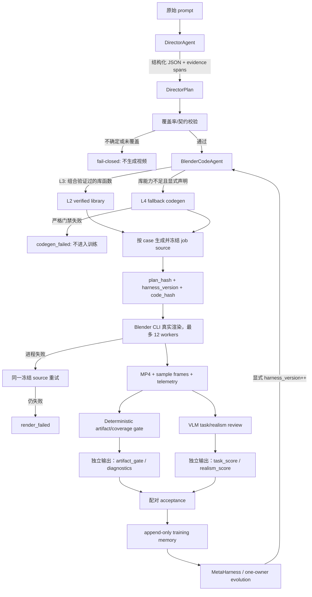

# Harness 质量修复与 Agent Codegen 分层进化统一计划

> 版本：v1.0 · 日期：2026-08-27  
> 上游计划：`E:/2026-08-27-harness-quality-remediation.md`、`E:/2026-08-27-agent-codegen-layered-evolution.md`  
> 当前选择：先完成 remediation 的评估器与执行层前置门槛，再启动分层 Agent Codegen。

## 0. 计划决策与当前结论

本计划把两份计划合并为一条有硬门槛的流水线，不把两个不确定性同时放进训练循环：

1. 先让 evaluator 能够真正区分“prompt 是否被实现、事件顺序是否正确、人物/物体轨迹是否可见、摄像机 cue 是否执行、画面是否真实”，并用人工黄金集校准。
2. 再修复 Blender 执行层，使 DirectorPlan 的骨架、约束、CameraPlan 和渲染质量真的落到视频中。
3. 然后把执行能力抽成可测试的 L2 library，由 Blender code agent 在每个 case 上生成不同的代码；固定模板只保留为独立 baseline，不能成为 agent 臂的隐式 fallback。
4. 最后才进行六轮 harness 外循环进化，用冻结的 code、真实 Blender 视频和冻结 evaluator 做配对比较。

当前已知的阻塞事实必须写进实验结论：不同 prompt 目前只产生约四类重复视频，说明现有 renderer 仍按固定 action variant 生成通用模板；这不是 UI 问题，也不能被“分数正常”掩盖。修复后的硬验收必须要求每个 case 的原始语义、事件顺序和摄像机 cue 在 plan、code、telemetry 和视频中都有可追溯证据。

### 0.1 不可违反的约束

- 生产 agent 臂中，`DirectorAgent` 负责把原始 prompt 转为结构化 `DirectorPlan`；`BlenderCodeAgent` 负责按 case 生成 Blender job source。
- `blender/real_proxy_job.py` 可以保留为 `template_baseline` 的历史实现，但不得被 agent 臂、L4 失败路径或渲染重试路径偷偷调用。
- agent codegen、DirectorAgent、外部 VLM 或 Codex-local review 任何一步失败，都必须 `fail-closed`：记录原因、停止该 case 的有效评分，不渲染模板替代品。
- Blender CLI 进程失败可以对同一份冻结 source 做有限次数重试；重试不重新生成代码，也不换模板。代码/语义/覆盖率失败只能标记失败，或在显式新版本/`--force-regen` 下重新生成。
- evaluator 代码、评分权重、数据集标签、冻结 dev/test 集不得作为 harness patch 的提分手段修改。
- 每次 harness 修改只允许一个 owner；patch 必须有预测修复集、预测回归集、证据和回滚路径。
- 所有质量结论必须来自真实 Blender 生成的 MP4/帧；帧统计只能报告 artifact health，不能冒充语义或真实性评分。
- 使用的模型 canonical name 统一写为小写：`gpt-5.6-luna`、`gpt-5.6-terra`。endpoint、token、base URL 只由运行环境注入，不写进 skill 或数据集。
- Blender 默认可执行文件为 `D:\blender\blender.exe`；渲染允许并行到 12 workers，但要记录机器、worker 数、分辨率、采样数和失败重试次数。

## 1. 目标架构



### 1.1 四层职责

| 层 | 组件 | 职责 | 失败行为 |
|---|---|---|---|
| L1 | `DirectorPlan` | entities、layout、ordered events、trajectories、camera cues、evidence、coverage obligations | schema/evidence/顺序不通过即停止 |
| L2 | `blender/lib/*` | geometry、rigging、constraints、camera、layout、scaffolding 的可复用确定性原语 | 单元测试或 contract 不通过不能被 agent 看到 |
| L3 | `BlenderCodeAgent` | 读取 DirectorPlan、库签名、few-shot，按 case 组合库函数 | 网络/schema/静态检查失败为 `hard_uncertainty` |
| L4 | `FallbackCodegen` | L2 无法表达时显式生成新几何原语 | artifact、geometry、穿模、视觉门禁任一失败则不入训练 |

`DirectorAgent` 内部合并原来的 Scene/Prompt Parser、Trajectory Planner、Camera Planner：它不是额外的旁路 skill，而是现有 harness 的一个模块；可提供独立 skill 文档作为调用约定，但不能绕过 `DirectorPlan`、evidence 校验和 fail-closed。

L3 的 few-shot context 也有独立边界：`scripts/validate_codegen_examples.py`
必须先验证真实 MP4、artifact、`director_plan.json`、计划内容 hash、源文件
hash、deterministic evidence 和 review provenance；只有通过的样例才能进入
`CodegenRequest.context_examples`。缺少样例是 `context_status=none`，存在但
无效的样例在 provider 调用前导致 `codegen_failed`，不允许退回模板。context
ID/status 会写入 job/cache manifest；`scripts/promote_fallback_primitives.py`
只生成 L4 候选报告，不自动修改 L2 library。

## 2. Phase 0：前置门槛审计（先做，未通过不得启动 Codegen）

### 2.1 当前门槛状态

| 门槛 | 当前观察 | 状态 | 处理 |
|---|---|---|---|
| 真实 VLM 可调用并返回 schema | 已有 adapter 代码，但必须重新做 endpoint smoke；失败不得转数字 | 未验收 | 先完成 VLM/codex-local/human provenance 分层 |
| 人工黄金集 | 现有 review bundle 有视频，但 human annotations 尚未完成 | 未通过 | 生成匿名工作表并完成双人标注 |
| evaluator 校准 | 旧 frame-statistics 结果不能证明语义质量 | 未通过 | 计算逐维相关与整体门禁 |
| 骨架/约束/CameraPlan/渲染质量 | 有部分实现，但尚未完成真实 smoke 与可追溯验收 | 未通过 | 按 Phase 2 逐项补齐 |
| paired train/dev 可信实验 | 旧重复视频和旧代理评分不能作为证据 | 未通过 | 重新生成 baseline/agent 配对视频 |
| prompt→plan→code→video 覆盖 | 当前存在四类重复视频 | 未通过 | 加 case coverage gate 和 duplicate gate |

### 2.2 Gate 0 验收命令

```powershell
Set-Location C:\Users\sy\Desktop\T2BlenderCode\.worktrees\director-multi-entity-harness
python -m pytest -q -p no:cacheprovider --basetemp .pytest-tmp-gate0
python skills/t2blendercodeharness/scripts/capability_check.py --project-root .
python scripts/validate_golden_review_set.py --root dataset/golden-review-v1
python scripts/validate_frozen_eval_set.py --root dataset/frozen-eval-v1 `
  --reference-root dataset/vbench-derived-100-v1 `
  --reference-root dataset/trajectory-v4-multi `
  --reference-root dataset/trajectory-v5-agent-codegen
python scripts/check_training_readiness.py --project-root .
```

若某命令不存在，先补对应 task，不得把缺失检查当作通过。Gate 0 只在下面全部成立时关闭：

- VLM 或明确标注为 `codex_local_visual_review` / `human_review` 的真实视觉审查能够给出 evidence；endpoint 失败时状态为 `unavailable`，不是 0 分。
- 黄金集至少 30 个 case、至少 2 位独立标注者、14 维完整、无 arm 泄漏，且维度 agreement 已报告。
- 语义/任务总分与人工任务分的 Spearman 达到预设门槛（目标 ≥ 0.60）；不满足时重写维度定义并重标，而不是调权重刷过。
- 一个 baseline 与一个候选臂的真实配对结果方向与人工判断一致。
- 真实渲染 smoke 能证明不同语义 prompt 不会都落到同一个 job source/video hash；失败 case 被拒绝而不是换模板。

## 3. Phase 1：评估器可信化与独立评分逻辑

这一阶段是所有画质和 harness 训练的阻塞项。评分不再把 deterministic 和 VLM 混成一个难以解释的数字。

### 3.1 三个独立结果

每个 case 输出三个互不替代的结果：

1. `artifact_gate`：确定性检查的通过/失败与诊断，不是视觉质量主分。
2. `task_score`：VLM 对 prompt 完成度、事件、人物/物体轨迹、摄像机调度、时序清晰度的 0–100 分。
3. `realism_score`：VLM 对几何/材质/灯光/动作物理观感的 0–100 分，单独保留，不与 task 维度混写。

最终用于质量比较的数字只在 `artifact_gate=pass` 且视觉审查可用时生成：

```text
semantic_score = GM(
    prompt_compliance,
    event_timing,
    physical_plausibility
)

trajectory_score = GM(
    object_trajectory,
    character_trajectory,
    temporal_smoothness
)

camera_score = GM(
    camera_coverage,
    camera_cue_following,
    camera_innovation
)

task_score =
    0.35 * semantic_score +
    0.35 * trajectory_score +
    0.20 * camera_score +
    0.10 * visual_clarity

realism_score = GM(
    geometry_specificity,
    material_appearance,
    lighting_composition,
    motion_physicality
)

overall_vlm_score = 0.70 * task_score + 0.30 * realism_score
```

这里 VLM 是主分数；deterministic 不再以 `0.60 * deterministic + 0.40 * vlm` 的形式压低视觉判断，而是作为硬门和可解释诊断。初始权重只是候选配置，必须在黄金集上冻结并报告校准结果；训练过程中禁止为某一轮修改公式。

### 3.2 每个维度如何被检查

| 维度 | VLM 必须回答的可见问题 | 证据要求 |
|---|---|---|
| `prompt_compliance` | 原始实体、属性、关系和动作是否出现，是否有模板替换 | 指出实体/动作所在帧与 prompt span |
| `event_timing` | 事件是否按 prompt 顺序发生，anticipation/contact/settle 是否可辨 | 至少两个时间窗口或明确“缺失” |
| `object_trajectory` | 物体是否从正确起点经过正确路径，carry/handoff/release 是否连续 | 起点、接触、交接、终点帧 |
| `character_trajectory` | 人物是否走到目标、身体/手臂是否参与动作而非整体平移 | 角色位置与局部动作证据 |
| `camera_coverage` | 所有 required targets 是否被看到，关键事件是否有合适景别 | shot/cue 对应帧 |
| `camera_cue_following` | zoom/pan/orbit/follow/reveal 等原始 cue 是否真正执行 | 镜头运动方向、起止帧 |
| `camera_innovation` | 是否存在与事件匹配的调度，而非固定三点镜头 | cue-specific evidence |
| `temporal_smoothness` | 轨迹是否连续、无跳变、无滑步或突然停顿 | 时间片段描述 |
| `geometry_specificity` | 是否按 prompt 创建有辨识度的实体，而非球/圆柱/灰色 placeholder | 形状/部件/材质证据 |
| `material_appearance` | 颜色、材质、透明/反射/粗糙度等要求是否体现 | 可见表面证据 |
| `lighting_composition` | 地面、阴影、光照层次、构图和景深是否支持辨识 | 帧级构图描述 |
| `motion_physicality` | 接触、重力、惯性、遮挡和穿模是否自然 | 接触/穿模/悬空证据 |

VLM 必须同时接收原始 prompt、冻结 DirectorPlan 摘要和 sample frames；不能只看文件名或 plan。`prompt_compliance`、事件和轨迹不能由 parser 自己回填为高分。

### 3.3 evaluator task

- [ ] 为 VLM 请求和响应建立 `VLMJudgeResponse` schema；支持 `gpt-5.6-luna`、`gpt-5.6-terra`，失败统一 `unavailable`。
- [ ] 明确三种 provenance：真实 endpoint、`codex_local_visual_review`、`human_review`；不同 provenance 在报告中分开，不把本地帧统计称作视觉 review。
- [ ] 帧统计保留 `artifact_health`：PNG 可读、全黑、静止、帧数、前景占比、文件完整性；六个不可能从像素统计得到的语义/轨迹维度返回 `None`。
- [ ] 真实感 evaluator 加 `template_reuse`、`prompt_coverage`、`geometry_specificity`、`camera_cue_execution` 检查；发现通用模板或缺少 required evidence 时 hard finding。
- [ ] 增加 anti-gaming 测试：同一视频换 prompt 不得保持相同 compliance；“运动更多”不得自动换成更高的 trajectory；缺实体时不能仅凭可读 PNG 得分。
- [ ] 构建匿名黄金集 30–50 case，至少两名标注者，计算 ICC 或 Krippendorff α；黄金集只校准 evaluator，不得进入 patch 选择。
- [ ] 生成 `docs/evaluator-v5-calibration.md`：逐维 Spearman/Pearson、bootstrap CI、frame-only 对照、通过/失败结论、冻结权重。
- [ ] 每个 evaluator task 后运行 focused tests、3 个真实 MP4 smoke 和全量 suite；只有通过后才进入下一 task。

## 4. Phase 2：Decision observability 与可回滚进化

### 4.1 PatchProposal 合约

`PatchProposal` 至少包含：

```text
owner
root_cause_id
affected_files
observed_failure_pattern
desired_behavior
predicted_fixes: case_id[]
predicted_regressions: case_id[]
prediction_rationale
rerun_command
patch_scope = one-harness-owner
```

预测 case ID 必须来自本轮 train/dev；frozen test 只做里程碑评估，不得出现在 proposal 或 acceptance 逻辑中。

### 4.2 跨轮次裁决

- [ ] 在 root-cause distillation 前执行 attribution。
- [ ] 用实际 case-level delta 判定 `confirmed`、`partial`、`refuted`。
- [ ] `refuted` 按 owner→file 粒度回滚；不得整仓 reset，不得删除历史 memory。
- [ ] 把 verdict、预测修复命中率、预测回归命中率写入 append-only `optimization_record.jsonl`。
- [ ] evaluator、dataset、run manifest、trace verifier 和 API 配置目录设为只读边界；harness patch 只能改 owner 文件。

## 5. Phase 3：执行层表达力修复

### 5.1 角色骨架与动作

文件：`blender/character_rig.py`、`blender/real_proxy_job.py`、`tests/test_character_rig.py`、`tests/test_multi_entity_blender_job.py`。

- [ ] 先写 RED 测试：每个 character 有独立 armature、骨骼父子关系、vertex groups、ARMATURE modifier、IK target。
- [ ] 使用最小 humanoid rig：`root → hips → spine/chest/neck/head`，左右肩/上臂/前臂/手，左右大腿/小腿/脚。
- [ ] 将现有部件按最近骨骼绑定；保持 `entity_kind` 与 `geometry_style` metadata。
- [ ] 用轨迹位移驱动走路相位，伸手由 IK target 驱动，不允许整个人只做刚体平移。
- [ ] 真实 smoke 至少人工查看一个 walk/reach/grasp/release case；记录 sample frames 和结论。

### 5.2 物体附着与交接

文件：`src/videoact/director_trajectory.py`、`blender/real_proxy_job.py`、相关 tests。

- [ ] 删除 `_HAND_OFFSET`、按颜色前缀推断位置的逻辑。
- [ ] `attach` 使用 hand bone 的 Child Of constraint；`transfer` 在同一 handoff 窗口让 giver influence 1→0、receiver 0→1；`detach` 交给 support surface。
- [ ] carry 期间不为物体写独立 location keyframe；检查最小距离、穿模和悬空。
- [ ] 初始位置来自 DirectorPlan layout/proxy spec，不能由 `red`、`blue` 等名字决定。
- [ ] 真实 smoke 检查物体从起点到终点、接触、交接和 settle 的连续性。

### 5.3 CameraPlan 完整执行

文件：`blender/camera_dsl.py`、`blender/real_proxy_job.py`、camera tests。

- [ ] `orbit` 使用至少 8 个关键帧的圆弧，不得用穿过场景中心的直线替代。
- [ ] 执行 `zoom/dolly/pan/tilt/orbit/follow/reveal/hold` 的 cue、时间窗、lens 和 easing。
- [ ] 用 TrackTo/DampedTrack 或等价约束保持目标朝向；多目标按边界球计算 framing distance。
- [ ] 对 `visibility_predicates`、`max_occlusion`、`continuity_group` 做真实检查并记录 finding；不能静默忽略。
- [ ] `camera_cue_execution` evaluator 必须能从 telemetry 与帧中反证 cue 是否发生。

### 5.4 真实度与渲染质量

- [ ] 每个 job 必须有地面/支撑面、阴影和至少三路光照或环境光；材质使用 Principled BSDF，按 entity kind/属性区分。
- [ ] 不允许用球、圆柱、统一灰色壳作为最终 prompt 实体的唯一表示；低多边形 proxy 可以保留，但必须有语义特异部件、颜色/材质和可辨轨迹。
- [ ] 在 3 个 case 上实测 512×512/16–32 samples 与并行 worker 的成本后冻结渲染设置。
- [ ] 记录 Blender 版本、渲染设置、真实 MP4 路径、帧 hash 和 artifact manifest。

## 6. Phase 4：DirectorAgent 与覆盖率契约

### 6.1 DirectorAgent 输入输出

文件：`src/videoact/director_prompt_llm.py`、`src/videoact/director_prompt.py`、`src/videoact/director_schedule.py`、`src/videoact/director_trajectory.py`、`src/videoact/director_camera.py`、contracts/tests。

输入是原始 prompt，不先经过固定关键词模板。输出必须包含：

```text
DirectorPlan {
  entities: [{id, role, appearance, geometry_requirements, evidence_span}]
  layout: {surfaces, spatial_relations, initial_states}
  events: [{id, type, actors, props, preconditions, start, contact, end, evidence_span}]
  trajectories: {entity_id: keyframes + motion_intent}
  camera: [{shot_id, cue, targets, time_window, lens, visibility_predicates}]
  coverage_obligations: [required entity/event/cue]
  assumptions: [{text, reason, confidence}]
  uncertainties: [...]
}
```

- [ ] LLM 输出用 JSON schema 约束；保留旧 `PromptInterpretation` 与 evidence span 校验。
- [ ] evidence span 必须由代码在原 prompt 字符区间中验证，不能信任模型自报位置。
- [ ] 事件顺序由代码检查：前置状态、接触、交接、释放和最终状态不能逆序或重叠冲突。
- [ ] 简洁/含蓄 prompt 可以补齐合理 staging，但补齐内容必须标记为 assumption；关键实体、关系、动作或镜头 cue 无法确定时返回 `hard_uncertainty`。
- [ ] 固定 parser 只作为显式 `deterministic_baseline`，不得作为生产 DirectorAgent 的静默 fallback。
- [ ] 对 “词表外人名/物体、双角色 handoff、reveal、subjectless handoff、camera cue” 建回归测试。

### 6.2 覆盖率与重复视频 gate

每个 case 在编译前生成 `coverage_report.json`，至少检查：

- prompt 中每个 required entity/property/action/camera cue 是否映射到 plan；
- plan 中每个 event 是否映射到 trajectory、camera cue 和 Blender code call；
- Blender telemetry 是否报告实体数量、事件帧、约束 influence、camera cue；
- sample frames/MP4 是否存在且 hash 不属于另一语义 case 的冻结输出；
- `job_source_hash`、`plan_hash`、`code_hash`、`artifact_hash` 是否形成完整链。

缺 coverage、hash 复用到不相容 prompt、或 code 没有执行 required call 时，case 状态为 `coverage_failed`，不得渲染模板补齐。

## 7. Phase 5：L2 Verified Function Library

目录：`blender/lib/`；每个函数必须能脱离 Blender 进行纯数据测试，并由 compiler 转译为 `bpy` 调用。

### 7.1 库内容

- `geometry.py`：box、ellipsoid、capsule 及不少于 8 个带契约的几何原语。
- `rigging.py`：minimal humanoid armature、mesh binding、IK target 等不少于 3 个函数。
- `constraints.py`：child-of/handoff influence、track-to 等不少于 2 个函数。
- `camera.py`：orbit、follow、dolly、reveal、visibility、framing distance 等不少于 4 个摄像机原语。
- `layout.py`：lane-separated paths、place-on-surface、handoff sequence、avoid-penetration 等不少于 3 个布局/交互函数。
- `scaffolding.py`：metadata、telemetry、sample_frames、artifact manifest 的公共脚手架，避免生成代码复制模板实现。
- `__meta__.py` + `scripts/export_library_signatures.py`：输出签名、docstring、tags、cost、example、usage_count 到 `signatures.json`。

### 7.2 每个库函数的完成条件

- [ ] 类型标注、前置/后置条件、边界行为和副作用声明齐全。
- [ ] 至少一个正常用例和一个边界/失败用例；Blender smoke 至少一次。
- [ ] 高层 renderer 复用库函数，不维护第二套同名几何逻辑。
- [ ] 修改库函数必须递增 `harness_version`，触发 code cache 隔离和显式 regen。

## 8. Phase 6：L3 BlenderCodeAgent（按 case 生成，绝不回模板）

### 8.1 合约

新建 `src/videoact/codegen_contracts.py`：

```text
CodegenRequest {
  director_plan
  library_signatures
  context_examples
  harness_version
  constraints
}

CodegenResponse {
  status: success | library_insufficient | hard_uncertainty
  generated_code
  library_calls
  fallback_reason?
  uncertainties
  llm_call_id
}
```

`library_calls` 必须是 `signatures.json` 的子集；`generated_code` 必须通过 `ast.parse`、禁止 `os/subprocess/sys`、禁止 `eval/exec`、禁止未知文件/网络操作，并包含 scaffolding telemetry。

### 8.2 Agent prompt 与生成边界

- [ ] system prompt 明确要求：只实现当前 DirectorPlan，不复制固定模板，不丢弃原始实体/属性/事件/camera cue。
- [ ] context 只给库签名和 2–3 个由真实视频证明过的 few-shot case；不把某个 case 的固定坐标当通用规则。
- [ ] 生成代码必须 import L2 函数，且每个 required entity/event/cue 有可追踪 library call 或明确 hard uncertainty。
- [ ] 代码由每个 case 独立生成一次，马上 hash/freeze；render rollout 只执行冻结 source，不重复调用 agent。
- [ ] 生产路径 agent 调用失败、schema 不合规、库调用越权、覆盖率不完整时返回 `codegen_failed`；禁止调用 `compile_real_proxy_job`、`direct_prompt_code` 或其他模板救援。
- [ ] `template_baseline` 只在 paired ablation 中显式运行，路径、manifest、评分和训练 memory 与 agent 臂完全分开。

### 8.3 Generate-once-freeze

`CodeCache.lookup(plan_hash, harness_version)` 命中即复用；未命中才允许一次 codegen。manifest 至少记录：

```text
plan_hash, harness_version, code_hash, timestamp,
llm_provider, model, llm_call_id, frozen_path,
library_version, status, fallback_reason
```

`--force-regen` 必须显式指定；新库版本或 L3 prompt 改动必须递增 `harness_version`，旧版本缓存不可被覆盖。

## 9. Phase 7：L4 Fallback 与原语晋升

- [ ] 只有 L3 明确返回 `library_insufficient` 才能进入 L4；`hard_uncertainty` 不能转 L4。
- [ ] L4 新代码仍需静态检查、artifact gate、geometry audit、穿模检查、可见性检查和视觉最低阈值（至少 3 维 ≥60、无维度 <30，阈值冻结并可校准）。
- [ ] 任一门禁失败写 finding，case 标记 `codegen_failed`，不进入训练集统计。
- [ ] 统计 `new_primitives`；同一新原语出现 ≥3 次后只生成晋升候选，不自动改库。
- [ ] 人工审核补 docstring、签名、测试和副作用检查；通过后加入 L2、更新 signatures、递增版本，下一版本显式 regen。

## 10. Phase 8：数据、配对实验与六轮训练协议

### 10.1 数据分层

- `train`：60 个互不重复的 case，分六轮，每轮首次使用 10 个新 train case。
- `dev`：60 个互不重复的 case，每轮配套评估 10 个；dev 不参与 prompt/label/evaluator 调参。
- `frozen-eval-v1`：独立第三方测试集，和 train/dev 以 prompt hash、source index、语义签名全部隔离，只在里程碑运行，不产生 proposal。
- 每个 case 的 prompt 必须有不同场景和事件组合；至少覆盖单人物/单物体基础集、双角色 handoff、camera cue、含蓄 prompt、复杂故事和长轨迹。后续多实体扩展不能污染当前单实体 baseline。

### 10.2 首次 paired gate

在六轮训练之前先选 20 个 train case（覆盖四类 action variant 和不同 camera cue），运行：

1. `template_baseline`：旧模板，独立标注为 baseline。
2. `agent_codegen_v1`：L3 组合库函数，失败即 fail-closed。
3. 可选 `deterministic_direct_code`：仅作为历史消融，不进入训练。

两臂均使用真实 Blender 视频、相同 prompt、相同 seed 与相同 evaluator。首要验收不是 agent 必须高于模板，而是它的 prompt coverage 不低于模板、重复 hash 率下降、task/trajectory/camera 的配对差异与人工判断一致；能力相同阶段总体差异目标在 ±3 分内。未通过不得进入六轮自进化。

### 10.3 每轮训练与记忆表

每轮最多 5 次 candidate patch；每次 candidate：

1. 只改一个 harness owner/component。
2. 运行本轮 10 个 train + 10 个 dev，重新生成对应版本的 DirectorPlan/code，真实 Blender CLI 渲染；并行上限 12 workers。
3. Blender 进程失败时对同一冻结 source 最多重试 2 次；记录每次失败，不换模板。
4. 运行 evaluator；若 VLM 不可用，该 candidate 只能 `blocked/unavailable`，不能用 frame statistics 接受 patch。
5. 记录 before/after、逐 case delta、finding、patch、预测命中和自然语言处理决定。

每轮结束额外跑一次完整 train+dev（120 个 case；如采用单 rollout 即 120 个视频；若启用 k=2，数量和成本必须单独报告）。按六轮、每轮最多五次局部候选的上限，单 rollout 预算为：

```text
6 × (5 × (10 train + 10 dev) + 120 full evaluation) = 1320 videos
```

`docs/t2blendercodeharness-agent-training-memory-v1.md` 必须 append-only，表格至少包含：

| 轮数/尝试 | split/case | 原始 prompt | plan/code/video 地址 | artifact/task/realism 分数 | evaluator provenance | harness 错误点 | 修改 owner 与自然语言修复 | 修复后提升/下降 | 接受/拒绝及处理 |
|---|---|---|---|---|---|---|---|---|---|

同时保存 JSONL 机器可读记录和每轮汇总曲线；每轮结束立即更新，不能等六轮结束补写。

### 10.4 接受门禁

一个 candidate 只有同时满足以下条件才接受：

- train 的冻结 `overall_vlm_score` 和关键 trajectory/camera 子分数有预先定义的最小有效提升；
- dev 不下降，且多 case 的置信区间/方差没有显著恶化；
- artifact gate、coverage gate、重复视频 gate 均不回退；
- 预测修复集至少有一个实测命中，未出现未预测的严重回归；
- patch 只触及一个 owner，evaluator/dataset/frozen test 未改；
- 代码、plan、MP4 的指纹链完整，日志和自然语言说明已写入 memory。

否则拒绝 candidate；若 `refuted`，按文件粒度回滚该 patch，保留所有失败证据和 verdict。

### 10.5 k-rollout 策略

默认六轮主实验为单 rollout，保证上面的 1320 视频预算清晰可核算。稳定性验证单独使用 `--rollouts-per-case 2`：

- train 可选 k=2，报告均值、标准差、pass-rate；
- dev/frozen 默认 k=1，若不对称必须在报告中显式说明；
- seed 进入 run fingerprint；同一 case/版本/seed 才可复用 artifact；
- k-rollout 不触发额外 codegen，始终执行同一冻结 source。

## 11. Phase 9：Skill 与文档交付

修改/新增：

- `skills/t2blendercodeharness/SKILL.md`：四层架构、fail-closed、冻结机制、owner 边界、真实渲染与 evaluator 约束。
- `skills/director-agent/SKILL.md`：原始 prompt→DirectorPlan、evidence、event order、camera cue、uncertainty。
- `skills/blender-code-agent/SKILL.md`：L2/L3/L4、按 case codegen、静态检查、不能回模板、freeze/hash、L4 晋升。
- `skills/t2blendercodeharness-training/SKILL.md`：六轮、每轮 10+10、最多五次、完整 120、memory 表格、接受/回滚。
- `docs/harness-architecture-v2.md`：架构图、数据流、指纹链、baseline/agent 臂隔离。
- `docs/evaluator-v5-calibration.md`：评分维度、公式、人工校准与 unavailable 语义。
- `docs/t2blendercodeharness-agent-training-memory-v1.md`：逐轮逐 case 记录、视频地址、分数、错误、自然语言修复和曲线。
- `docs/agent-codegen-vs-template-paired-v1.md`、`docs/fallback-codegen-coverage-experiment-v1.md`：配对及 L4 报告。

Skill 只描述如何运行，不写 token、endpoint 私密配置，也不把历史模板包装成生产 agent 能力。

## 12. 测试与每块修复后的检查清单

每个 task 都必须遵循 RED→GREEN→真实 smoke→全量验证：

1. 先新增失败测试并运行，保留失败原因。
2. 实现最小修改，不能顺手改其他 owner。
3. 运行 task-focused tests。
4. 用 `D:\blender\blender.exe --background --python ...` 生成至少一个真实 MP4；检查文件大小、帧数、hash、telemetry、sample frames。
5. 对真实帧做 VLM/Codex-local/human review；不可用时写 unavailable，不伪造分数。
6. 运行全量测试与 capability check：

```powershell
python -m pytest -q -p no:cacheprovider --basetemp .pytest-tmp-task
python skills/t2blendercodeharness/scripts/capability_check.py --project-root .
```

7. 更新 append-only memory、计划 checkbox、manifest 和报告，再进入下一块。

关键回归测试必须覆盖：

- prompt 不同但 action variant 相同，不得生成相同 job/video；
- case 缺实体/事件/cue 时 fail-closed，不得调用模板；
- DirectorPlan evidence span 越界、事件逆序、required cue 丢失都会阻断；
- agent 生成代码只能调用 signatures 中的函数；静态禁用危险 import/eval/exec；
- code cache 按 `plan_hash+harness_version` 隔离，force-regen 行为可验证；
- Blender 进程重试复用同一 code hash，不能改变 source；
- artifact gate 与 VLM task/realism 分开；frame statistics 不能进入 patch acceptance；
- train/dev/frozen 无 hash 重叠，frozen 不可被 proposal 读取；
- 一个 patch 只能修改一个 owner，refuted 后可文件粒度回滚；
- 角色 armature、手部 IK、Child Of handoff influence、相机弧线/可见性和材质/灯光均有真实 smoke。

## 13. 完成标准

### Annotation frontend amendment (2026-08-28)

The automatic review handoff is implemented in
`scripts/golden_review_app.py` and `scripts/golden_review_ui/index.html`.
`dataset/golden-review-v1` is a real-media, 30-case bundle with 90 MP4s, but
the validator intentionally keeps it out of the calibration pass because the
historical media used augmented executable prompts (`comparison_only=true`).
The exact-prompt rerender, two independent annotators, finalizer, and the
remaining provider/agent paired gates are still required. See
`docs/golden-review-human-handoff-zh.md` for the handoff.

### Gate A：remediation 前置完成

- evaluator 通过人工黄金集校准；真实视觉来源可追溯；frame-only 历史分数标记 superseded。
- 角色骨架/约束/CameraPlan/渲染质量真实可见，并由 deterministic artifact/coverage 与视觉 review 双重验证。
- 至少一轮 baseline/候选 paired train/dev 结果与人工判断一致。

### Gate B：Agent Codegen 分层完成

- L2 达到 ≥8 geometry、≥3 rigging、≥2 constraints、≥4 camera、≥3 layout 原语，均有契约和测试。
- L3 对简单和复杂 DirectorPlan 生成可解析、受限、按 case 不同的 job source；失败 fail-closed。
- code cache、manifest、plan→code→artifact 指纹链完整；k≥2 不产生额外 codegen。
- L4 触发、严格门禁、new primitive 统计和人工晋升路径可验证。

### Gate C：训练与泛化完成

- 20-case template/agent paired gate 通过，agent 不以重复模板“虚高”。
- 六轮训练全部遵守每轮最多五次、每次 10 train+10 dev、轮末完整 120 的协议。
- 每轮 memory 表格和曲线完整，所有 MP4 为真实 Blender 输出，所有失败和回滚有自然语言记录。
- train 提升、dev 不下降、frozen milestone 不回归；无通过修改 evaluator/dataset 取得的收益。
- 全量 pytest、capability check、代表性 Blender smoke 均通过；不能通过的项目明确列为未完成，不用“部分通过”替代。

## 14. 首次执行顺序

当前批准的第一条路线是：

1. 只做 Phase 0 审计与证据快照，不删除 harness 或数据集。
2. 完成 Phase 1 evaluator 的失败测试、真实视觉来源、黄金集和校准；向人工标注者请求必要评分。
3. 完成 Phase 2 observability 和 Phase 3 执行层，每修一块立即做测试与真实 Blender smoke。
4. 复跑 Gate 0；未通过则停在修复阶段，不启动 codegen 训练。
5. Gate 0 通过后抽取 L2，接入 L3，构建 few-shot 和 code cache；执行 agent/template paired gate。
6. paired gate 通过后才启动六轮训练，并持续更新本计划、skill、memory 表格和曲线。

本文件是后续执行的合并主计划；若旧计划与本文件冲突，以本文件的 fail-closed、独立 evaluator、单 owner、冻结 code 和 paired acceptance 约束为准。

## 15. 当前执行状态（2026-08-28）

以下是本计划在 `codex/director-multi-entity-harness` 工作树上的真实状态；
状态为 `pending` 的项目不能用历史结果替代：

- [x] DirectorAgent、BlenderCodeAgent、CodexExecProvider、case coverage、
  source freeze、fail-closed 和同源重试逻辑已实现并有回归测试。
- [x] task/realism 分离的 `visual-primary-v6-independent-channels` evaluator、
  artifact hash 汇总和多实体 independent oracle 已实现并有回归测试。
- [x] active training input 已切换为 VBench-2.0 verbatim index
  `dataset/vbench2-agent-training-index-v1`：60 train / 60 dev / 20 frozen
  test；140 条 `prompt` 均逐字复制 raw `prompt_en`，无本地编写的实体、事件
  或 oracle 标签。历史 `trajectory-v5-agent-codegen`、`vbench-derived-100-v1`
  和 `trajectory-v4-multi` 仅作对照，训练入口拒绝它们。
- [x] `frozen-eval-v1` 验证通过：20 个唯一 prompt；对 VBench-derived、trajectory-v4
  和 active training 三个参考集的 case/prompt/source/semantic 四类重叠均为 0；
  proposal/patch selection 禁止。
- [x] 全量测试通过：`395 passed, 28 warnings`，JUnit 证据为
  `out/two-plan-convergence/full-test.xml`。
- [x] capability check 通过；Blender `D:\blender\blender.exe` 为 5.1.2。
- [x] `CodexExecProvider` 已补齐 strict structured-output schema 规范化与
  Windows UTF-8 子进程读取；本地 schema audit 与回归测试通过。
- [x] codegen few-shot context 具有真实 artifact/plan/code hash、review provenance
  和 `context_status` 边界；当前 `dataset/codegen-examples-v1` 无真实 bundle，
  因而报告为 `pending_external`，不会伪造样例。
- [x] 训练 readiness 已独立报告 full test、capability、dataset、frozen-eval、
  agent smoke、golden、dynamic provider、paired gate；当前报告为
  `training_allowed=false`，模板 smoke 未被当作 agent smoke。
- [x] active v5 显式 baseline preflight 真实生成可播放 MP4、480 帧动画、
  `.blend`、telemetry、sample PNG 和 artifact hash；`code_hash` 与落盘 source
  一致，渲染后 fingerprint 可复算。该 baseline 的语义 hard findings 只作为
  fail-closed 证据，不是 agent 训练分数。
- [ ] 30–50 case、双标注者的 blind golden review 尚未完成，evaluator calibration
  gate 仍为 `pending_human_golden_review`。
- [ ] dynamic Codex Director + BlenderCodeAgent 的真实成对 provider gate 尚未
  通过；已执行单 case 预检，但本机 Codex CLI 在 Director 结构化调用阶段
  超时，case 被正确记录为 `director_failed`，没有生成 code 或切换模板。
- [ ] 20-case agent/template paired gate 和 L4 真实覆盖实验尚未完成；因此没有
  任何可用于 Harness 接受的训练提升结论。
- [ ] 六轮 Harness 外循环训练尚未开始；训练前不报告任何提升或回归。

### 15.1 Benchmark-only amendment

训练入口现在在读取 `splits.json` 之前调用
`scripts/validate_benchmark_prompt_index.py`；readiness 的 dataset gate 使用
同一校验器，并可对 frozen/reference roots 检查 prompt hash 与 source identity
重叠。原始 benchmark prompt 不带 authored labels，因此
`case_coverage` 只把运行时生成的 DirectorPlan 当作内部可达性契约，不把它
冒充 benchmark 的人工语义 oracle。benchmark provenance 通过并不等于训练
准入；agent smoke、真实 provider、golden/visual review 和 paired gate 仍须
全部通过。
