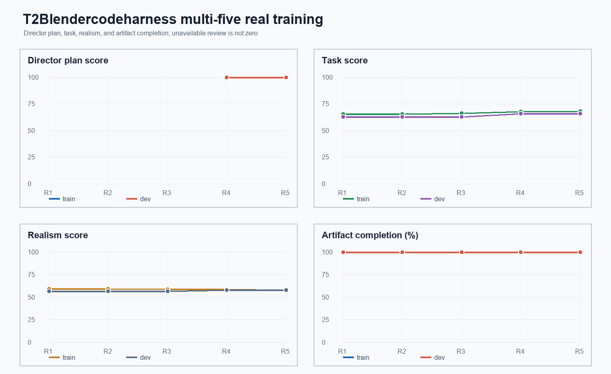

# T2Blendercodeharness 多实体真实训练实验报告

## 实验状态

本报告记录 `trajectory-v4-multi` 数据集上的真实 Blender 外循环训练。当前使用
`D:\blender\blender.exe`、12 个 Blender CLI worker、每案例最多 2 次渲染重试；
外部 `gpt-5.6-luna` / `gpt-5.6-terra` endpoint 的图像请求返回 HTTP 403，因此视觉
审阅由 Codex 本地逐案例检查 evaluator 选出的 8 帧完成，来源明确记录为
`assistant_local_review`，没有把 unavailable 转成数值分数。

训练只允许修改 Harness 组件；Blender 生成器、数据集标签、Director plan 和 evaluator
在训练候选比较中不作为可修改对象。task 分数和 realism 分数始终分开，不相加。

## 外循环协议

- 数据集：50 train / 60 dev / 30 frozen test，指纹见 `dataset/trajectory-v4-multi/metadata.json`。
- 每轮最多 5 次 attempt；每次 10 个新 train + 10 个 paired dev。
- 每轮末尾评估累计 train + 全 60 dev；仅复用 fingerprint-identical 的真实 artifact。
- 只有至少两个 train 案例出现同一 Harness 根因，并且 train 严格提升、paired dev 不下降、整体 dev 不下降时，才允许提交一个单组件 patch。
- 没有内循环反复修复视频；渲染失败才在同一案例内最多重试 2 次。

## evaluator 口径

### task 通道

确定性检查先验证 artifact、telemetry、DirectorPlan、交互生命周期、相机覆盖和轨迹约束。
通过后，本地视觉审阅对 prompt compliance、physical plausibility、camera coverage、
camera innovation、character/object trajectory、event timing、temporal smoothness 和
visual clarity 逐维打 0–100 分。相关维度先用几何平均，再按：

```text
semantic      = GM(prompt_compliance, physical_plausibility,
                   object_trajectory, event_timing)
choreography  = GM(camera_coverage, camera_innovation,
                   character_trajectory, temporal_smoothness)
task_vlm      = 0.45 * semantic + 0.45 * choreography + 0.10 * visual_clarity
task_final    = 0.20 * deterministic + 0.80 * task_vlm
```

### realism 通道

realism 独立检查 geometry、PNG evidence 以及五个视觉维度：appearance detail、physical
realism、spatial consistency、motion naturalness、visual presentation。五个视觉维度取
几何平均，再按 `0.15 * geometry + 0.15 * frame_evidence + 0.70 * independent_review`
融合。低多边形灰模、统一材质和后段近景造成的可见证据不足会降低 realism；当前结果没有
出现 100 分真实性。

## 轮次结果

| Round | Scope | Real videos | Deterministic | Task mean | Realism mean | Harness patch |
|---:|---|---:|---:|---:|---:|---|
| 1 | 10 train + 60 all-dev overall | 70 | 100% pass | train 65.6393 / dev 62.8292 | train 59.2108 / dev 56.6084 | none |
| 2 | 20 cumulative train + 60 all-dev overall | 80 | 100% pass | train 65.6393 / dev 62.8292 | train 59.2157 / dev 56.6084 | none |
| 3 | 30 cumulative train + 60 all-dev overall | 90 | 100% pass | train 66.2084 / dev 62.8292 | train 58.9371 / dev 56.6084 | none |
| 4 | 40 cumulative train + 60 all-dev overall | 100 | 100% pass | train 67.8926 / dev 65.7122 | train 58.7411 / dev 57.6930 | accepted: elliptical reveal/carry/handoff parser |
| 5 | 50 cumulative train + 60 all-dev overall | 110 | 100% pass | train 67.9486 / dev 65.7122 | train 58.0018 / dev 57.6992 | accepted: prompt-span ordering + subjectless return |

### 训练曲线



曲线中的 task 与 realism 是两个独立通道；realism 没有被加到 task，也没有把不可用的视觉审查转换成 0。Round 4/5 的累计 train realism 受到新增样本组成影响，因此 patch 接受只使用 paired train strict gain、paired dev non-regression 和 all-dev non-regression 三个门禁，并单独报告 realism 变化。

Round 2 attempt 1 的新 paired dev task 均值为 67.3466，较其 fingerprint-identical
Round 1 artifact 基线不变；因此没有可归因于 Harness 的提升。详细逐案例表格、prompt、
真实 proxy 视频地址、task/realism 分数、问题和处理说明位于：

[t2blendercodeharness-multi-training-memory-v1.md](t2blendercodeharness-multi-training-memory-v1.md)

Round 3 attempt 1 同样没有重复的 train-side Harness 根因；新 train task 均值为
67.3466，paired dev 为 65.6253，整体 dev 仍为 62.8292。累计 train 均值因加入
`concurrent_independent_work` 家族下降到 66.2084，但这不是可接受的 patch 证据。

## evaluator 误报修正

Round 1 初始诊断发现 evaluator 把独立 carry 也要求成 transfer/detach 生命周期。随后发现
第二个同类误报：carry-only 生命周期虽然没有 transfer，但合法地以 `final_support_id`
结束，仍被判定为 handoff 不完整。两次修正都通过回归测试，并在相同真实 artifact 上重评；
它们属于 `pretraining_evaluator_gate`，不是 Harness patch，也没有据此修改 Blender 或
生成计划。

Round 4 的 attempt-01 暴露出 subject-elliptical reveal/carry/handoff 被压成 place-only；attempt-02 将隐含 carry 与 hands-to receiver 补回，paired train task 为 56.0451→72.9452，paired dev task 为 60.5325→64.4411，累计 all-dev task 为 62.8292→65.7122，因此接受 parser patch。

Round 5 的 attempt-01 暴露出 `hands`、`pauses`、`returns` 混合句被固定代码块重排；attempt-02 按 evidence span 排序并解析省略主语，paired train task 为 56.3597→68.1726，paired dev task 为 69.4343→69.4343，累计 all-dev task 为 65.7122→65.7122，因此接受第二个 parser patch。两轮的 attempt 与 overall 视频均由真实 Blender CLI 生成，未修改 Blender 或 evaluator。

## 当前结论

前两轮证明流水线可以并行生成真实视频、完成 deterministic 与视觉双通道评分、保留每个
artifact 和 memory，但没有产生满足 anti-overfit gate 的 Harness 候选。当前主要可见瓶颈
是灰色低多边形 proxy 的真实性和相机后段丢失上下文；这些问题会作为后续 Harness 训练的
候选证据，但仍须先在至少两个 train 案例中重复出现，再只选择一个 Harness owner 修复。
