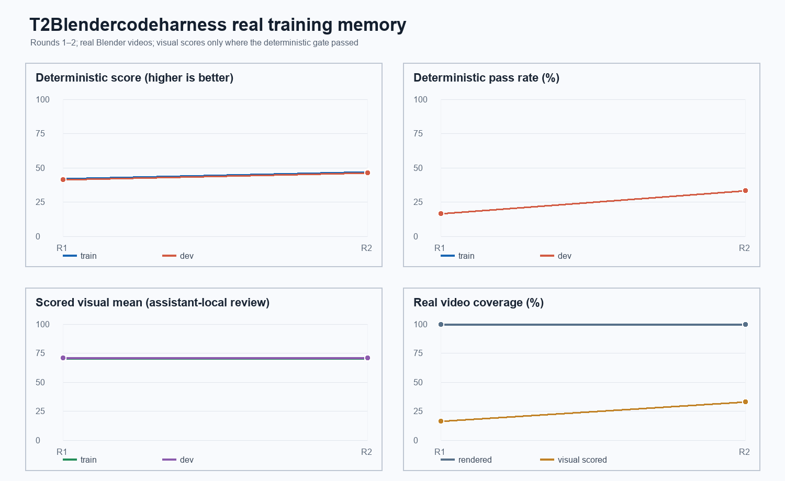
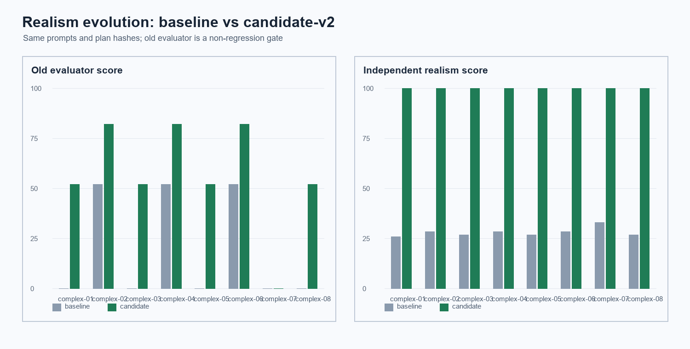

# T2Blendercodeharness 训练记忆表

本表只接收真实 Blender 生成的 proxy 视频和真实 evaluator/视觉复核结果；每行保留 round、prompt、视频地址、分数、问题、修复和自然语言处理结论。

| 轮数 | Prompt | Proxy 视频地址 | 分数 | 评审来源/置信度 | Severity/Root cause | 渲染重试 | 检测出的 Harness 问题 | 修复位置/方法 | 修复后提升或下降 | 自然语言处理 |
|---:|---|---|---:|---|---|---:|---|---|---:|---|
| round-01/attempt-01/real | Begin behind the table. The actor advances in a shallow arc, extends toward the green ball, snatches it, elevates it without penetration, conveys it along an S-curve to the drop zone, lowers it onto the mark, and uncouples the grip. Track the arc, rotate around the handoff, and move in for a close release. Variant 1: begin from the left side, use a brief anticipation, and preserve a wide final composition. | [proxy.mp4](C:/Users/sy/Desktop/T2BlenderCode/out/training/six-rounds-real-v6/round-01/attempt-01/real/dev/hard-07-01/proxy.mp4) | 70.8834 | assistant_local_review / 0.68 | none | 0 | All 10 train cases repeatedly report camera_grasp_closeup_missing because the dolly action shot covers grasp/release but its shot_id is not labeled closeup. | none (baseline evidence; patch not yet applied)：No Harness change in attempt 1. Preserve this immutable before score as the comparison point for one camera_planner patch. | baseline; no before/after delta | Keep the 20 real videos and local frame reviews as the baseline. Cluster the repeated root cause, patch only camera_planner, then rerun the same 10 train and 10 paired dev cases. The conservative visual score remains valid evidence even though the external VLM was unavailable. |
| round-01/attempt-01/real | Begin behind the worktable. The actor advances in a shallow arc, extends toward the yellow book, snatches it, elevates it without penetration, conveys it along an S-curve to the drop platform, lowers it onto the mark, and uncouples the grip. Track the arc, rotate around the handoff, and move in for a close release. Variant 2: begin from the right side, use a measured anticipation, and preserve a medium final composition. | [proxy.mp4](C:/Users/sy/Desktop/T2BlenderCode/out/training/six-rounds-real-v6/round-01/attempt-01/real/dev/hard-07-02/proxy.mp4) | 70.8834 | assistant_local_review / 0.68 | none | 0 | All 10 train cases repeatedly report camera_grasp_closeup_missing because the dolly action shot covers grasp/release but its shot_id is not labeled closeup. | none (baseline evidence; patch not yet applied)：No Harness change in attempt 1. Preserve this immutable before score as the comparison point for one camera_planner patch. | baseline; no before/after delta | Keep the 20 real videos and local frame reviews as the baseline. Cluster the repeated root cause, patch only camera_planner, then rerun the same 10 train and 10 paired dev cases. The conservative visual score remains valid evidence even though the external VLM was unavailable. |
| round-01/attempt-01/real | Begin behind the platform. The actor advances in a shallow arc, extends toward the red cup, snatches it, elevates it without penetration, conveys it along an S-curve to the marked destination, lowers it onto the mark, and uncouples the grip. Track the arc, rotate around the handoff, and move in for a close release. Variant 3: begin from the left side, use a delayed anticipation, and preserve a tight final composition. | [proxy.mp4](C:/Users/sy/Desktop/T2BlenderCode/out/training/six-rounds-real-v6/round-01/attempt-01/real/dev/hard-07-03/proxy.mp4) | 70.8834 | assistant_local_review / 0.68 | none | 0 | All 10 train cases repeatedly report camera_grasp_closeup_missing because the dolly action shot covers grasp/release but its shot_id is not labeled closeup. | none (baseline evidence; patch not yet applied)：No Harness change in attempt 1. Preserve this immutable before score as the comparison point for one camera_planner patch. | baseline; no before/after delta | Keep the 20 real videos and local frame reviews as the baseline. Cluster the repeated root cause, patch only camera_planner, then rerun the same 10 train and 10 paired dev cases. The conservative visual score remains valid evidence even though the external VLM was unavailable. |
| round-01/attempt-01/real | Begin behind the support surface. The actor advances in a shallow arc, extends toward the blue cube, snatches it, elevates it without penetration, conveys it along an S-curve to the drop zone, lowers it onto the mark, and uncouples the grip. Track the arc, rotate around the handoff, and move in for a close release. Variant 4: begin from the right side, use a brief anticipation, and preserve a wide final composition. | [proxy.mp4](C:/Users/sy/Desktop/T2BlenderCode/out/training/six-rounds-real-v6/round-01/attempt-01/real/dev/hard-07-04/proxy.mp4) | 70.8834 | assistant_local_review / 0.68 | none | 0 | All 10 train cases repeatedly report camera_grasp_closeup_missing because the dolly action shot covers grasp/release but its shot_id is not labeled closeup. | none (baseline evidence; patch not yet applied)：No Harness change in attempt 1. Preserve this immutable before score as the comparison point for one camera_planner patch. | baseline; no before/after delta | Keep the 20 real videos and local frame reviews as the baseline. Cluster the repeated root cause, patch only camera_planner, then rerun the same 10 train and 10 paired dev cases. The conservative visual score remains valid evidence even though the external VLM was unavailable. |
| round-01/attempt-01/real | Begin behind the table. The actor advances in a shallow arc, extends toward the green ball, snatches it, elevates it without penetration, conveys it along an S-curve to the drop platform, lowers it onto the mark, and uncouples the grip. Track the arc, rotate around the handoff, and move in for a close release. Variant 5: begin from the left side, use a measured anticipation, and preserve a medium final composition. | [proxy.mp4](C:/Users/sy/Desktop/T2BlenderCode/out/training/six-rounds-real-v6/round-01/attempt-01/real/dev/hard-07-05/proxy.mp4) | 70.8834 | assistant_local_review / 0.68 | none | 0 | All 10 train cases repeatedly report camera_grasp_closeup_missing because the dolly action shot covers grasp/release but its shot_id is not labeled closeup. | none (baseline evidence; patch not yet applied)：No Harness change in attempt 1. Preserve this immutable before score as the comparison point for one camera_planner patch. | baseline; no before/after delta | Keep the 20 real videos and local frame reviews as the baseline. Cluster the repeated root cause, patch only camera_planner, then rerun the same 10 train and 10 paired dev cases. The conservative visual score remains valid evidence even though the external VLM was unavailable. |
| round-01/attempt-01/real | Begin behind the worktable. The actor advances in a shallow arc, extends toward the yellow book, snatches it, elevates it without penetration, conveys it along an S-curve to the marked destination, lowers it onto the mark, and uncouples the grip. Track the arc, rotate around the handoff, and move in for a close release. Variant 6: begin from the right side, use a delayed anticipation, and preserve a tight final composition. | [proxy.mp4](C:/Users/sy/Desktop/T2BlenderCode/out/training/six-rounds-real-v6/round-01/attempt-01/real/dev/hard-07-06/proxy.mp4) | 70.8834 | assistant_local_review / 0.68 | none | 0 | All 10 train cases repeatedly report camera_grasp_closeup_missing because the dolly action shot covers grasp/release but its shot_id is not labeled closeup. | none (baseline evidence; patch not yet applied)：No Harness change in attempt 1. Preserve this immutable before score as the comparison point for one camera_planner patch. | baseline; no before/after delta | Keep the 20 real videos and local frame reviews as the baseline. Cluster the repeated root cause, patch only camera_planner, then rerun the same 10 train and 10 paired dev cases. The conservative visual score remains valid evidence even though the external VLM was unavailable. |
| round-01/attempt-01/real | Begin behind the platform. The actor advances in a shallow arc, extends toward the red cup, snatches it, elevates it without penetration, conveys it along an S-curve to the drop zone, lowers it onto the mark, and uncouples the grip. Track the arc, rotate around the handoff, and move in for a close release. Variant 7: begin from the left side, use a brief anticipation, and preserve a wide final composition. | [proxy.mp4](C:/Users/sy/Desktop/T2BlenderCode/out/training/six-rounds-real-v6/round-01/attempt-01/real/dev/hard-07-07/proxy.mp4) | 70.8834 | assistant_local_review / 0.68 | none | 0 | All 10 train cases repeatedly report camera_grasp_closeup_missing because the dolly action shot covers grasp/release but its shot_id is not labeled closeup. | none (baseline evidence; patch not yet applied)：No Harness change in attempt 1. Preserve this immutable before score as the comparison point for one camera_planner patch. | baseline; no before/after delta | Keep the 20 real videos and local frame reviews as the baseline. Cluster the repeated root cause, patch only camera_planner, then rerun the same 10 train and 10 paired dev cases. The conservative visual score remains valid evidence even though the external VLM was unavailable. |
| round-01/attempt-01/real | Begin behind the support surface. The actor advances in a shallow arc, extends toward the blue cube, snatches it, elevates it without penetration, conveys it along an S-curve to the drop platform, lowers it onto the mark, and uncouples the grip. Track the arc, rotate around the handoff, and move in for a close release. Variant 8: begin from the right side, use a measured anticipation, and preserve a medium final composition. | [proxy.mp4](C:/Users/sy/Desktop/T2BlenderCode/out/training/six-rounds-real-v6/round-01/attempt-01/real/dev/hard-07-08/proxy.mp4) | 70.8834 | assistant_local_review / 0.68 | none | 0 | All 10 train cases repeatedly report camera_grasp_closeup_missing because the dolly action shot covers grasp/release but its shot_id is not labeled closeup. | none (baseline evidence; patch not yet applied)：No Harness change in attempt 1. Preserve this immutable before score as the comparison point for one camera_planner patch. | baseline; no before/after delta | Keep the 20 real videos and local frame reviews as the baseline. Cluster the repeated root cause, patch only camera_planner, then rerun the same 10 train and 10 paired dev cases. The conservative visual score remains valid evidence even though the external VLM was unavailable. |
| round-01/attempt-01/real | Begin behind the table. The actor advances in a shallow arc, extends toward the green ball, snatches it, elevates it without penetration, conveys it along an S-curve to the marked destination, lowers it onto the mark, and uncouples the grip. Track the arc, rotate around the handoff, and move in for a close release. Variant 9: begin from the left side, use a delayed anticipation, and preserve a tight final composition. | [proxy.mp4](C:/Users/sy/Desktop/T2BlenderCode/out/training/six-rounds-real-v6/round-01/attempt-01/real/dev/hard-07-09/proxy.mp4) | 70.8834 | assistant_local_review / 0.68 | none | 0 | All 10 train cases repeatedly report camera_grasp_closeup_missing because the dolly action shot covers grasp/release but its shot_id is not labeled closeup. | none (baseline evidence; patch not yet applied)：No Harness change in attempt 1. Preserve this immutable before score as the comparison point for one camera_planner patch. | baseline; no before/after delta | Keep the 20 real videos and local frame reviews as the baseline. Cluster the repeated root cause, patch only camera_planner, then rerun the same 10 train and 10 paired dev cases. The conservative visual score remains valid evidence even though the external VLM was unavailable. |
| round-01/attempt-01/real | Begin behind the worktable. The actor advances in a shallow arc, extends toward the yellow book, snatches it, elevates it without penetration, conveys it along an S-curve to the drop zone, lowers it onto the mark, and uncouples the grip. Track the arc, rotate around the handoff, and move in for a close release. Variant 10: begin from the right side, use a brief anticipation, and preserve a wide final composition. | [proxy.mp4](C:/Users/sy/Desktop/T2BlenderCode/out/training/six-rounds-real-v6/round-01/attempt-01/real/dev/hard-07-10/proxy.mp4) | 70.8834 | assistant_local_review / 0.68 | none | 0 | All 10 train cases repeatedly report camera_grasp_closeup_missing because the dolly action shot covers grasp/release but its shot_id is not labeled closeup. | none (baseline evidence; patch not yet applied)：No Harness change in attempt 1. Preserve this immutable before score as the comparison point for one camera_planner patch. | baseline; no before/after delta | Keep the 20 real videos and local frame reviews as the baseline. Cluster the repeated root cause, patch only camera_planner, then rerun the same 10 train and 10 paired dev cases. The conservative visual score remains valid evidence even though the external VLM was unavailable. |
| round-01/attempt-01/real | Establish the table and red cup. The character walks to the support, reaches for the object, grasps it, lifts it clear, carries it to the drop zone, places it, and releases it. Follow the approach, orbit during carry, and dolly into the release close-up. Variant 1: begin from the left side, use a brief anticipation, and preserve a wide final composition. | [proxy.mp4](C:/Users/sy/Desktop/T2BlenderCode/out/training/six-rounds-real-v6/round-01/attempt-01/real/train/hard-01-01/proxy.mp4) | 67.1195 | assistant_local_review / 0.68 | error:camera_required_closeup | 0 | camera_grasp_closeup_missing | none (baseline evidence; patch not yet applied)：No Harness change in attempt 1. Preserve this immutable before score as the comparison point for one camera_planner patch. | baseline; no before/after delta | Keep the 20 real videos and local frame reviews as the baseline. Cluster the repeated root cause, patch only camera_planner, then rerun the same 10 train and 10 paired dev cases. The conservative visual score remains valid evidence even though the external VLM was unavailable. |
| round-01/attempt-01/real | Establish the worktable and blue cube. The character walks to the support, reaches for the object, grasps it, lifts it clear, carries it to the drop platform, places it, and releases it. Follow the approach, orbit during carry, and dolly into the release close-up. Variant 2: begin from the right side, use a measured anticipation, and preserve a medium final composition. | [proxy.mp4](C:/Users/sy/Desktop/T2BlenderCode/out/training/six-rounds-real-v6/round-01/attempt-01/real/train/hard-01-02/proxy.mp4) | 67.1195 | assistant_local_review / 0.68 | error:camera_required_closeup | 0 | camera_grasp_closeup_missing | none (baseline evidence; patch not yet applied)：No Harness change in attempt 1. Preserve this immutable before score as the comparison point for one camera_planner patch. | baseline; no before/after delta | Keep the 20 real videos and local frame reviews as the baseline. Cluster the repeated root cause, patch only camera_planner, then rerun the same 10 train and 10 paired dev cases. The conservative visual score remains valid evidence even though the external VLM was unavailable. |
| round-01/attempt-01/real | Establish the platform and green ball. The character walks to the support, reaches for the object, grasps it, lifts it clear, carries it to the marked destination, places it, and releases it. Follow the approach, orbit during carry, and dolly into the release close-up. Variant 3: begin from the left side, use a delayed anticipation, and preserve a tight final composition. | [proxy.mp4](C:/Users/sy/Desktop/T2BlenderCode/out/training/six-rounds-real-v6/round-01/attempt-01/real/train/hard-01-03/proxy.mp4) | 67.1195 | assistant_local_review / 0.68 | error:camera_required_closeup | 0 | camera_grasp_closeup_missing | none (baseline evidence; patch not yet applied)：No Harness change in attempt 1. Preserve this immutable before score as the comparison point for one camera_planner patch. | baseline; no before/after delta | Keep the 20 real videos and local frame reviews as the baseline. Cluster the repeated root cause, patch only camera_planner, then rerun the same 10 train and 10 paired dev cases. The conservative visual score remains valid evidence even though the external VLM was unavailable. |
| round-01/attempt-01/real | Establish the support surface and yellow book. The character walks to the support, reaches for the object, grasps it, lifts it clear, carries it to the drop zone, places it, and releases it. Follow the approach, orbit during carry, and dolly into the release close-up. Variant 4: begin from the right side, use a brief anticipation, and preserve a wide final composition. | [proxy.mp4](C:/Users/sy/Desktop/T2BlenderCode/out/training/six-rounds-real-v6/round-01/attempt-01/real/train/hard-01-04/proxy.mp4) | 67.1195 | assistant_local_review / 0.68 | error:camera_required_closeup | 0 | camera_grasp_closeup_missing | none (baseline evidence; patch not yet applied)：No Harness change in attempt 1. Preserve this immutable before score as the comparison point for one camera_planner patch. | baseline; no before/after delta | Keep the 20 real videos and local frame reviews as the baseline. Cluster the repeated root cause, patch only camera_planner, then rerun the same 10 train and 10 paired dev cases. The conservative visual score remains valid evidence even though the external VLM was unavailable. |
| round-01/attempt-01/real | Establish the table and red cup. The character walks to the support, reaches for the object, grasps it, lifts it clear, carries it to the drop platform, places it, and releases it. Follow the approach, orbit during carry, and dolly into the release close-up. Variant 5: begin from the left side, use a measured anticipation, and preserve a medium final composition. | [proxy.mp4](C:/Users/sy/Desktop/T2BlenderCode/out/training/six-rounds-real-v6/round-01/attempt-01/real/train/hard-01-05/proxy.mp4) | 67.1195 | assistant_local_review / 0.68 | error:camera_required_closeup | 0 | camera_grasp_closeup_missing | none (baseline evidence; patch not yet applied)：No Harness change in attempt 1. Preserve this immutable before score as the comparison point for one camera_planner patch. | baseline; no before/after delta | Keep the 20 real videos and local frame reviews as the baseline. Cluster the repeated root cause, patch only camera_planner, then rerun the same 10 train and 10 paired dev cases. The conservative visual score remains valid evidence even though the external VLM was unavailable. |
| round-01/attempt-01/real | Establish the worktable and blue cube. The character walks to the support, reaches for the object, grasps it, lifts it clear, carries it to the marked destination, places it, and releases it. Follow the approach, orbit during carry, and dolly into the release close-up. Variant 6: begin from the right side, use a delayed anticipation, and preserve a tight final composition. | [proxy.mp4](C:/Users/sy/Desktop/T2BlenderCode/out/training/six-rounds-real-v6/round-01/attempt-01/real/train/hard-01-06/proxy.mp4) | 67.1195 | assistant_local_review / 0.68 | error:camera_required_closeup | 0 | camera_grasp_closeup_missing | none (baseline evidence; patch not yet applied)：No Harness change in attempt 1. Preserve this immutable before score as the comparison point for one camera_planner patch. | baseline; no before/after delta | Keep the 20 real videos and local frame reviews as the baseline. Cluster the repeated root cause, patch only camera_planner, then rerun the same 10 train and 10 paired dev cases. The conservative visual score remains valid evidence even though the external VLM was unavailable. |
| round-01/attempt-01/real | Establish the platform and green ball. The character walks to the support, reaches for the object, grasps it, lifts it clear, carries it to the drop zone, places it, and releases it. Follow the approach, orbit during carry, and dolly into the release close-up. Variant 7: begin from the left side, use a brief anticipation, and preserve a wide final composition. | [proxy.mp4](C:/Users/sy/Desktop/T2BlenderCode/out/training/six-rounds-real-v6/round-01/attempt-01/real/train/hard-01-07/proxy.mp4) | 67.1195 | assistant_local_review / 0.68 | error:camera_required_closeup | 0 | camera_grasp_closeup_missing | none (baseline evidence; patch not yet applied)：No Harness change in attempt 1. Preserve this immutable before score as the comparison point for one camera_planner patch. | baseline; no before/after delta | Keep the 20 real videos and local frame reviews as the baseline. Cluster the repeated root cause, patch only camera_planner, then rerun the same 10 train and 10 paired dev cases. The conservative visual score remains valid evidence even though the external VLM was unavailable. |
| round-01/attempt-01/real | Establish the support surface and yellow book. The character walks to the support, reaches for the object, grasps it, lifts it clear, carries it to the drop platform, places it, and releases it. Follow the approach, orbit during carry, and dolly into the release close-up. Variant 8: begin from the right side, use a measured anticipation, and preserve a medium final composition. | [proxy.mp4](C:/Users/sy/Desktop/T2BlenderCode/out/training/six-rounds-real-v6/round-01/attempt-01/real/train/hard-01-08/proxy.mp4) | 67.1195 | assistant_local_review / 0.68 | error:camera_required_closeup | 0 | camera_grasp_closeup_missing | none (baseline evidence; patch not yet applied)：No Harness change in attempt 1. Preserve this immutable before score as the comparison point for one camera_planner patch. | baseline; no before/after delta | Keep the 20 real videos and local frame reviews as the baseline. Cluster the repeated root cause, patch only camera_planner, then rerun the same 10 train and 10 paired dev cases. The conservative visual score remains valid evidence even though the external VLM was unavailable. |
| round-01/attempt-01/real | Establish the table and red cup. The character walks to the support, reaches for the object, grasps it, lifts it clear, carries it to the marked destination, places it, and releases it. Follow the approach, orbit during carry, and dolly into the release close-up. Variant 9: begin from the left side, use a delayed anticipation, and preserve a tight final composition. | [proxy.mp4](C:/Users/sy/Desktop/T2BlenderCode/out/training/six-rounds-real-v6/round-01/attempt-01/real/train/hard-01-09/proxy.mp4) | 67.1195 | assistant_local_review / 0.68 | error:camera_required_closeup | 0 | camera_grasp_closeup_missing | none (baseline evidence; patch not yet applied)：No Harness change in attempt 1. Preserve this immutable before score as the comparison point for one camera_planner patch. | baseline; no before/after delta | Keep the 20 real videos and local frame reviews as the baseline. Cluster the repeated root cause, patch only camera_planner, then rerun the same 10 train and 10 paired dev cases. The conservative visual score remains valid evidence even though the external VLM was unavailable. |
| round-01/attempt-01/real | Establish the worktable and blue cube. The character walks to the support, reaches for the object, grasps it, lifts it clear, carries it to the drop zone, places it, and releases it. Follow the approach, orbit during carry, and dolly into the release close-up. Variant 10: begin from the right side, use a brief anticipation, and preserve a wide final composition. | [proxy.mp4](C:/Users/sy/Desktop/T2BlenderCode/out/training/six-rounds-real-v6/round-01/attempt-01/real/train/hard-01-10/proxy.mp4) | 67.1195 | assistant_local_review / 0.68 | error:camera_required_closeup | 0 | camera_grasp_closeup_missing | none (baseline evidence; patch not yet applied)：No Harness change in attempt 1. Preserve this immutable before score as the comparison point for one camera_planner patch. | baseline; no before/after delta | Keep the 20 real videos and local frame reviews as the baseline. Cluster the repeated root cause, patch only camera_planner, then rerun the same 10 train and 10 paired dev cases. The conservative visual score remains valid evidence even though the external VLM was unavailable. |
| round-01/attempt-02/real | Begin behind the table. The actor advances in a shallow arc, extends toward the green ball, snatches it, elevates it without penetration, conveys it along an S-curve to the drop zone, lowers it onto the mark, and uncouples the grip. Track the arc, rotate around the handoff, and move in for a close release. Variant 1: begin from the left side, use a brief anticipation, and preserve a wide final composition. | [proxy.mp4](C:/Users/sy/Desktop/T2BlenderCode/out/training/six-rounds-real-v6/round-01/attempt-02/real/dev/hard-07-01/proxy.mp4) | 70.8834 | assistant_local_review / 0.68 | none | 0 | The train family repeatedly declared grasp_in_closeup but the complex camera planner emitted a dolly shot without a closeup label, causing camera_required_closeup findings. | src/videoact/camera.py: CameraPlanner._plan_complex：Append -closeup to the action shot ID when grasp_in_closeup is declared; preserve the existing trajectory type and camera motion. | {'train': 3.6, 'dev': 0.0} | Accepted under the anti-overfit gate: one owner, train strict gain, paired dev non-regression. Full 120-case round evaluation is still required. |
| round-01/attempt-02/real | Begin behind the worktable. The actor advances in a shallow arc, extends toward the yellow book, snatches it, elevates it without penetration, conveys it along an S-curve to the drop platform, lowers it onto the mark, and uncouples the grip. Track the arc, rotate around the handoff, and move in for a close release. Variant 2: begin from the right side, use a measured anticipation, and preserve a medium final composition. | [proxy.mp4](C:/Users/sy/Desktop/T2BlenderCode/out/training/six-rounds-real-v6/round-01/attempt-02/real/dev/hard-07-02/proxy.mp4) | 70.8834 | assistant_local_review / 0.68 | none | 0 | The train family repeatedly declared grasp_in_closeup but the complex camera planner emitted a dolly shot without a closeup label, causing camera_required_closeup findings. | src/videoact/camera.py: CameraPlanner._plan_complex：Append -closeup to the action shot ID when grasp_in_closeup is declared; preserve the existing trajectory type and camera motion. | {'train': 3.6, 'dev': 0.0} | Accepted under the anti-overfit gate: one owner, train strict gain, paired dev non-regression. Full 120-case round evaluation is still required. |
| round-01/attempt-02/real | Begin behind the platform. The actor advances in a shallow arc, extends toward the red cup, snatches it, elevates it without penetration, conveys it along an S-curve to the marked destination, lowers it onto the mark, and uncouples the grip. Track the arc, rotate around the handoff, and move in for a close release. Variant 3: begin from the left side, use a delayed anticipation, and preserve a tight final composition. | [proxy.mp4](C:/Users/sy/Desktop/T2BlenderCode/out/training/six-rounds-real-v6/round-01/attempt-02/real/dev/hard-07-03/proxy.mp4) | 70.8834 | assistant_local_review / 0.68 | none | 0 | The train family repeatedly declared grasp_in_closeup but the complex camera planner emitted a dolly shot without a closeup label, causing camera_required_closeup findings. | src/videoact/camera.py: CameraPlanner._plan_complex：Append -closeup to the action shot ID when grasp_in_closeup is declared; preserve the existing trajectory type and camera motion. | {'train': 3.6, 'dev': 0.0} | Accepted under the anti-overfit gate: one owner, train strict gain, paired dev non-regression. Full 120-case round evaluation is still required. |
| round-01/attempt-02/real | Begin behind the support surface. The actor advances in a shallow arc, extends toward the blue cube, snatches it, elevates it without penetration, conveys it along an S-curve to the drop zone, lowers it onto the mark, and uncouples the grip. Track the arc, rotate around the handoff, and move in for a close release. Variant 4: begin from the right side, use a brief anticipation, and preserve a wide final composition. | [proxy.mp4](C:/Users/sy/Desktop/T2BlenderCode/out/training/six-rounds-real-v6/round-01/attempt-02/real/dev/hard-07-04/proxy.mp4) | 70.8834 | assistant_local_review / 0.68 | none | 0 | The train family repeatedly declared grasp_in_closeup but the complex camera planner emitted a dolly shot without a closeup label, causing camera_required_closeup findings. | src/videoact/camera.py: CameraPlanner._plan_complex：Append -closeup to the action shot ID when grasp_in_closeup is declared; preserve the existing trajectory type and camera motion. | {'train': 3.6, 'dev': 0.0} | Accepted under the anti-overfit gate: one owner, train strict gain, paired dev non-regression. Full 120-case round evaluation is still required. |
| round-01/attempt-02/real | Begin behind the table. The actor advances in a shallow arc, extends toward the green ball, snatches it, elevates it without penetration, conveys it along an S-curve to the drop platform, lowers it onto the mark, and uncouples the grip. Track the arc, rotate around the handoff, and move in for a close release. Variant 5: begin from the left side, use a measured anticipation, and preserve a medium final composition. | [proxy.mp4](C:/Users/sy/Desktop/T2BlenderCode/out/training/six-rounds-real-v6/round-01/attempt-02/real/dev/hard-07-05/proxy.mp4) | 70.8834 | assistant_local_review / 0.68 | none | 0 | The train family repeatedly declared grasp_in_closeup but the complex camera planner emitted a dolly shot without a closeup label, causing camera_required_closeup findings. | src/videoact/camera.py: CameraPlanner._plan_complex：Append -closeup to the action shot ID when grasp_in_closeup is declared; preserve the existing trajectory type and camera motion. | {'train': 3.6, 'dev': 0.0} | Accepted under the anti-overfit gate: one owner, train strict gain, paired dev non-regression. Full 120-case round evaluation is still required. |
| round-01/attempt-02/real | Begin behind the worktable. The actor advances in a shallow arc, extends toward the yellow book, snatches it, elevates it without penetration, conveys it along an S-curve to the marked destination, lowers it onto the mark, and uncouples the grip. Track the arc, rotate around the handoff, and move in for a close release. Variant 6: begin from the right side, use a delayed anticipation, and preserve a tight final composition. | [proxy.mp4](C:/Users/sy/Desktop/T2BlenderCode/out/training/six-rounds-real-v6/round-01/attempt-02/real/dev/hard-07-06/proxy.mp4) | 70.8834 | assistant_local_review / 0.68 | none | 0 | The train family repeatedly declared grasp_in_closeup but the complex camera planner emitted a dolly shot without a closeup label, causing camera_required_closeup findings. | src/videoact/camera.py: CameraPlanner._plan_complex：Append -closeup to the action shot ID when grasp_in_closeup is declared; preserve the existing trajectory type and camera motion. | {'train': 3.6, 'dev': 0.0} | Accepted under the anti-overfit gate: one owner, train strict gain, paired dev non-regression. Full 120-case round evaluation is still required. |
| round-01/attempt-02/real | Begin behind the platform. The actor advances in a shallow arc, extends toward the red cup, snatches it, elevates it without penetration, conveys it along an S-curve to the drop zone, lowers it onto the mark, and uncouples the grip. Track the arc, rotate around the handoff, and move in for a close release. Variant 7: begin from the left side, use a brief anticipation, and preserve a wide final composition. | [proxy.mp4](C:/Users/sy/Desktop/T2BlenderCode/out/training/six-rounds-real-v6/round-01/attempt-02/real/dev/hard-07-07/proxy.mp4) | 70.8834 | assistant_local_review / 0.68 | none | 0 | The train family repeatedly declared grasp_in_closeup but the complex camera planner emitted a dolly shot without a closeup label, causing camera_required_closeup findings. | src/videoact/camera.py: CameraPlanner._plan_complex：Append -closeup to the action shot ID when grasp_in_closeup is declared; preserve the existing trajectory type and camera motion. | {'train': 3.6, 'dev': 0.0} | Accepted under the anti-overfit gate: one owner, train strict gain, paired dev non-regression. Full 120-case round evaluation is still required. |
| round-01/attempt-02/real | Begin behind the support surface. The actor advances in a shallow arc, extends toward the blue cube, snatches it, elevates it without penetration, conveys it along an S-curve to the drop platform, lowers it onto the mark, and uncouples the grip. Track the arc, rotate around the handoff, and move in for a close release. Variant 8: begin from the right side, use a measured anticipation, and preserve a medium final composition. | [proxy.mp4](C:/Users/sy/Desktop/T2BlenderCode/out/training/six-rounds-real-v6/round-01/attempt-02/real/dev/hard-07-08/proxy.mp4) | 70.8834 | assistant_local_review / 0.68 | none | 0 | The train family repeatedly declared grasp_in_closeup but the complex camera planner emitted a dolly shot without a closeup label, causing camera_required_closeup findings. | src/videoact/camera.py: CameraPlanner._plan_complex：Append -closeup to the action shot ID when grasp_in_closeup is declared; preserve the existing trajectory type and camera motion. | {'train': 3.6, 'dev': 0.0} | Accepted under the anti-overfit gate: one owner, train strict gain, paired dev non-regression. Full 120-case round evaluation is still required. |
| round-01/attempt-02/real | Begin behind the table. The actor advances in a shallow arc, extends toward the green ball, snatches it, elevates it without penetration, conveys it along an S-curve to the marked destination, lowers it onto the mark, and uncouples the grip. Track the arc, rotate around the handoff, and move in for a close release. Variant 9: begin from the left side, use a delayed anticipation, and preserve a tight final composition. | [proxy.mp4](C:/Users/sy/Desktop/T2BlenderCode/out/training/six-rounds-real-v6/round-01/attempt-02/real/dev/hard-07-09/proxy.mp4) | 70.8834 | assistant_local_review / 0.68 | none | 0 | The train family repeatedly declared grasp_in_closeup but the complex camera planner emitted a dolly shot without a closeup label, causing camera_required_closeup findings. | src/videoact/camera.py: CameraPlanner._plan_complex：Append -closeup to the action shot ID when grasp_in_closeup is declared; preserve the existing trajectory type and camera motion. | {'train': 3.6, 'dev': 0.0} | Accepted under the anti-overfit gate: one owner, train strict gain, paired dev non-regression. Full 120-case round evaluation is still required. |
| round-01/attempt-02/real | Begin behind the worktable. The actor advances in a shallow arc, extends toward the yellow book, snatches it, elevates it without penetration, conveys it along an S-curve to the drop zone, lowers it onto the mark, and uncouples the grip. Track the arc, rotate around the handoff, and move in for a close release. Variant 10: begin from the right side, use a brief anticipation, and preserve a wide final composition. | [proxy.mp4](C:/Users/sy/Desktop/T2BlenderCode/out/training/six-rounds-real-v6/round-01/attempt-02/real/dev/hard-07-10/proxy.mp4) | 70.8834 | assistant_local_review / 0.68 | none | 0 | The train family repeatedly declared grasp_in_closeup but the complex camera planner emitted a dolly shot without a closeup label, causing camera_required_closeup findings. | src/videoact/camera.py: CameraPlanner._plan_complex：Append -closeup to the action shot ID when grasp_in_closeup is declared; preserve the existing trajectory type and camera motion. | {'train': 3.6, 'dev': 0.0} | Accepted under the anti-overfit gate: one owner, train strict gain, paired dev non-regression. Full 120-case round evaluation is still required. |
| round-01/attempt-02/real | Establish the table and red cup. The character walks to the support, reaches for the object, grasps it, lifts it clear, carries it to the drop zone, places it, and releases it. Follow the approach, orbit during carry, and dolly into the release close-up. Variant 1: begin from the left side, use a brief anticipation, and preserve a wide final composition. | [proxy.mp4](C:/Users/sy/Desktop/T2BlenderCode/out/training/six-rounds-real-v6/round-01/attempt-02/real/train/hard-01-01/proxy.mp4) | 70.7195 | assistant_local_review / 0.68 | none | 0 | The train family repeatedly declared grasp_in_closeup but the complex camera planner emitted a dolly shot without a closeup label, causing camera_required_closeup findings. | src/videoact/camera.py: CameraPlanner._plan_complex：Append -closeup to the action shot ID when grasp_in_closeup is declared; preserve the existing trajectory type and camera motion. | {'train': 3.6, 'dev': 0.0} | Accepted under the anti-overfit gate: one owner, train strict gain, paired dev non-regression. Full 120-case round evaluation is still required. |
| round-01/attempt-02/real | Establish the worktable and blue cube. The character walks to the support, reaches for the object, grasps it, lifts it clear, carries it to the drop platform, places it, and releases it. Follow the approach, orbit during carry, and dolly into the release close-up. Variant 2: begin from the right side, use a measured anticipation, and preserve a medium final composition. | [proxy.mp4](C:/Users/sy/Desktop/T2BlenderCode/out/training/six-rounds-real-v6/round-01/attempt-02/real/train/hard-01-02/proxy.mp4) | 70.7195 | assistant_local_review / 0.68 | none | 0 | The train family repeatedly declared grasp_in_closeup but the complex camera planner emitted a dolly shot without a closeup label, causing camera_required_closeup findings. | src/videoact/camera.py: CameraPlanner._plan_complex：Append -closeup to the action shot ID when grasp_in_closeup is declared; preserve the existing trajectory type and camera motion. | {'train': 3.6, 'dev': 0.0} | Accepted under the anti-overfit gate: one owner, train strict gain, paired dev non-regression. Full 120-case round evaluation is still required. |
| round-01/attempt-02/real | Establish the platform and green ball. The character walks to the support, reaches for the object, grasps it, lifts it clear, carries it to the marked destination, places it, and releases it. Follow the approach, orbit during carry, and dolly into the release close-up. Variant 3: begin from the left side, use a delayed anticipation, and preserve a tight final composition. | [proxy.mp4](C:/Users/sy/Desktop/T2BlenderCode/out/training/six-rounds-real-v6/round-01/attempt-02/real/train/hard-01-03/proxy.mp4) | 70.7195 | assistant_local_review / 0.68 | none | 0 | The train family repeatedly declared grasp_in_closeup but the complex camera planner emitted a dolly shot without a closeup label, causing camera_required_closeup findings. | src/videoact/camera.py: CameraPlanner._plan_complex：Append -closeup to the action shot ID when grasp_in_closeup is declared; preserve the existing trajectory type and camera motion. | {'train': 3.6, 'dev': 0.0} | Accepted under the anti-overfit gate: one owner, train strict gain, paired dev non-regression. Full 120-case round evaluation is still required. |
| round-01/attempt-02/real | Establish the support surface and yellow book. The character walks to the support, reaches for the object, grasps it, lifts it clear, carries it to the drop zone, places it, and releases it. Follow the approach, orbit during carry, and dolly into the release close-up. Variant 4: begin from the right side, use a brief anticipation, and preserve a wide final composition. | [proxy.mp4](C:/Users/sy/Desktop/T2BlenderCode/out/training/six-rounds-real-v6/round-01/attempt-02/real/train/hard-01-04/proxy.mp4) | 70.7195 | assistant_local_review / 0.68 | none | 0 | The train family repeatedly declared grasp_in_closeup but the complex camera planner emitted a dolly shot without a closeup label, causing camera_required_closeup findings. | src/videoact/camera.py: CameraPlanner._plan_complex：Append -closeup to the action shot ID when grasp_in_closeup is declared; preserve the existing trajectory type and camera motion. | {'train': 3.6, 'dev': 0.0} | Accepted under the anti-overfit gate: one owner, train strict gain, paired dev non-regression. Full 120-case round evaluation is still required. |
| round-01/attempt-02/real | Establish the table and red cup. The character walks to the support, reaches for the object, grasps it, lifts it clear, carries it to the drop platform, places it, and releases it. Follow the approach, orbit during carry, and dolly into the release close-up. Variant 5: begin from the left side, use a measured anticipation, and preserve a medium final composition. | [proxy.mp4](C:/Users/sy/Desktop/T2BlenderCode/out/training/six-rounds-real-v6/round-01/attempt-02/real/train/hard-01-05/proxy.mp4) | 70.7195 | assistant_local_review / 0.68 | none | 0 | The train family repeatedly declared grasp_in_closeup but the complex camera planner emitted a dolly shot without a closeup label, causing camera_required_closeup findings. | src/videoact/camera.py: CameraPlanner._plan_complex：Append -closeup to the action shot ID when grasp_in_closeup is declared; preserve the existing trajectory type and camera motion. | {'train': 3.6, 'dev': 0.0} | Accepted under the anti-overfit gate: one owner, train strict gain, paired dev non-regression. Full 120-case round evaluation is still required. |
| round-01/attempt-02/real | Establish the worktable and blue cube. The character walks to the support, reaches for the object, grasps it, lifts it clear, carries it to the marked destination, places it, and releases it. Follow the approach, orbit during carry, and dolly into the release close-up. Variant 6: begin from the right side, use a delayed anticipation, and preserve a tight final composition. | [proxy.mp4](C:/Users/sy/Desktop/T2BlenderCode/out/training/six-rounds-real-v6/round-01/attempt-02/real/train/hard-01-06/proxy.mp4) | 70.7195 | assistant_local_review / 0.68 | none | 0 | The train family repeatedly declared grasp_in_closeup but the complex camera planner emitted a dolly shot without a closeup label, causing camera_required_closeup findings. | src/videoact/camera.py: CameraPlanner._plan_complex：Append -closeup to the action shot ID when grasp_in_closeup is declared; preserve the existing trajectory type and camera motion. | {'train': 3.6, 'dev': 0.0} | Accepted under the anti-overfit gate: one owner, train strict gain, paired dev non-regression. Full 120-case round evaluation is still required. |
| round-01/attempt-02/real | Establish the platform and green ball. The character walks to the support, reaches for the object, grasps it, lifts it clear, carries it to the drop zone, places it, and releases it. Follow the approach, orbit during carry, and dolly into the release close-up. Variant 7: begin from the left side, use a brief anticipation, and preserve a wide final composition. | [proxy.mp4](C:/Users/sy/Desktop/T2BlenderCode/out/training/six-rounds-real-v6/round-01/attempt-02/real/train/hard-01-07/proxy.mp4) | 70.7195 | assistant_local_review / 0.68 | none | 0 | The train family repeatedly declared grasp_in_closeup but the complex camera planner emitted a dolly shot without a closeup label, causing camera_required_closeup findings. | src/videoact/camera.py: CameraPlanner._plan_complex：Append -closeup to the action shot ID when grasp_in_closeup is declared; preserve the existing trajectory type and camera motion. | {'train': 3.6, 'dev': 0.0} | Accepted under the anti-overfit gate: one owner, train strict gain, paired dev non-regression. Full 120-case round evaluation is still required. |
| round-01/attempt-02/real | Establish the support surface and yellow book. The character walks to the support, reaches for the object, grasps it, lifts it clear, carries it to the drop platform, places it, and releases it. Follow the approach, orbit during carry, and dolly into the release close-up. Variant 8: begin from the right side, use a measured anticipation, and preserve a medium final composition. | [proxy.mp4](C:/Users/sy/Desktop/T2BlenderCode/out/training/six-rounds-real-v6/round-01/attempt-02/real/train/hard-01-08/proxy.mp4) | 70.7195 | assistant_local_review / 0.68 | none | 0 | The train family repeatedly declared grasp_in_closeup but the complex camera planner emitted a dolly shot without a closeup label, causing camera_required_closeup findings. | src/videoact/camera.py: CameraPlanner._plan_complex：Append -closeup to the action shot ID when grasp_in_closeup is declared; preserve the existing trajectory type and camera motion. | {'train': 3.6, 'dev': 0.0} | Accepted under the anti-overfit gate: one owner, train strict gain, paired dev non-regression. Full 120-case round evaluation is still required. |
| round-01/attempt-02/real | Establish the table and red cup. The character walks to the support, reaches for the object, grasps it, lifts it clear, carries it to the marked destination, places it, and releases it. Follow the approach, orbit during carry, and dolly into the release close-up. Variant 9: begin from the left side, use a delayed anticipation, and preserve a tight final composition. | [proxy.mp4](C:/Users/sy/Desktop/T2BlenderCode/out/training/six-rounds-real-v6/round-01/attempt-02/real/train/hard-01-09/proxy.mp4) | 70.7195 | assistant_local_review / 0.68 | none | 0 | The train family repeatedly declared grasp_in_closeup but the complex camera planner emitted a dolly shot without a closeup label, causing camera_required_closeup findings. | src/videoact/camera.py: CameraPlanner._plan_complex：Append -closeup to the action shot ID when grasp_in_closeup is declared; preserve the existing trajectory type and camera motion. | {'train': 3.6, 'dev': 0.0} | Accepted under the anti-overfit gate: one owner, train strict gain, paired dev non-regression. Full 120-case round evaluation is still required. |
| round-01/attempt-02/real | Establish the worktable and blue cube. The character walks to the support, reaches for the object, grasps it, lifts it clear, carries it to the drop zone, places it, and releases it. Follow the approach, orbit during carry, and dolly into the release close-up. Variant 10: begin from the right side, use a brief anticipation, and preserve a wide final composition. | [proxy.mp4](C:/Users/sy/Desktop/T2BlenderCode/out/training/six-rounds-real-v6/round-01/attempt-02/real/train/hard-01-10/proxy.mp4) | 70.7195 | assistant_local_review / 0.68 | none | 0 | The train family repeatedly declared grasp_in_closeup but the complex camera planner emitted a dolly shot without a closeup label, causing camera_required_closeup findings. | src/videoact/camera.py: CameraPlanner._plan_complex：Append -closeup to the action shot ID when grasp_in_closeup is declared; preserve the existing trajectory type and camera motion. | {'train': 3.6, 'dev': 0.0} | Accepted under the anti-overfit gate: one owner, train strict gain, paired dev non-regression. Full 120-case round evaluation is still required. |
| round-01/overall/real | Begin behind the table. The actor advances in a shallow arc, extends toward the green ball, snatches it, elevates it without penetration, conveys it along an S-curve to the drop zone, lowers it onto the mark, and uncouples the grip. Track the arc, rotate around the handoff, and move in for a close release. Variant 1: begin from the left side, use a brief anticipation, and preserve a wide final composition. | [proxy.mp4](C:/Users/sy/Desktop/T2BlenderCode/out/training/six-rounds-real-v6/round-01/overall/real/dev/hard-07-01/proxy.mp4) | 70.8834 | assistant_local_review / 0.68 | none | 0 | patch metadata not recorded | not recorded：no patch metadata; preserve evidence and do not infer a fix | not available until paired before/after attempt | This case is retained as evidence. No unrecorded Harness change is accepted. |
| round-01/overall/real | Begin behind the worktable. The actor advances in a shallow arc, extends toward the yellow book, snatches it, elevates it without penetration, conveys it along an S-curve to the drop platform, lowers it onto the mark, and uncouples the grip. Track the arc, rotate around the handoff, and move in for a close release. Variant 2: begin from the right side, use a measured anticipation, and preserve a medium final composition. | [proxy.mp4](C:/Users/sy/Desktop/T2BlenderCode/out/training/six-rounds-real-v6/round-01/overall/real/dev/hard-07-02/proxy.mp4) | 70.8834 | assistant_local_review / 0.68 | none | 0 | patch metadata not recorded | not recorded：no patch metadata; preserve evidence and do not infer a fix | not available until paired before/after attempt | This case is retained as evidence. No unrecorded Harness change is accepted. |
| round-01/overall/real | Begin behind the platform. The actor advances in a shallow arc, extends toward the red cup, snatches it, elevates it without penetration, conveys it along an S-curve to the marked destination, lowers it onto the mark, and uncouples the grip. Track the arc, rotate around the handoff, and move in for a close release. Variant 3: begin from the left side, use a delayed anticipation, and preserve a tight final composition. | [proxy.mp4](C:/Users/sy/Desktop/T2BlenderCode/out/training/six-rounds-real-v6/round-01/overall/real/dev/hard-07-03/proxy.mp4) | 70.8834 | assistant_local_review / 0.68 | none | 0 | patch metadata not recorded | not recorded：no patch metadata; preserve evidence and do not infer a fix | not available until paired before/after attempt | This case is retained as evidence. No unrecorded Harness change is accepted. |
| round-01/overall/real | Begin behind the support surface. The actor advances in a shallow arc, extends toward the blue cube, snatches it, elevates it without penetration, conveys it along an S-curve to the drop zone, lowers it onto the mark, and uncouples the grip. Track the arc, rotate around the handoff, and move in for a close release. Variant 4: begin from the right side, use a brief anticipation, and preserve a wide final composition. | [proxy.mp4](C:/Users/sy/Desktop/T2BlenderCode/out/training/six-rounds-real-v6/round-01/overall/real/dev/hard-07-04/proxy.mp4) | 70.8834 | assistant_local_review / 0.68 | none | 0 | patch metadata not recorded | not recorded：no patch metadata; preserve evidence and do not infer a fix | not available until paired before/after attempt | This case is retained as evidence. No unrecorded Harness change is accepted. |
| round-01/overall/real | Begin behind the table. The actor advances in a shallow arc, extends toward the green ball, snatches it, elevates it without penetration, conveys it along an S-curve to the drop platform, lowers it onto the mark, and uncouples the grip. Track the arc, rotate around the handoff, and move in for a close release. Variant 5: begin from the left side, use a measured anticipation, and preserve a medium final composition. | [proxy.mp4](C:/Users/sy/Desktop/T2BlenderCode/out/training/six-rounds-real-v6/round-01/overall/real/dev/hard-07-05/proxy.mp4) | 70.8834 | assistant_local_review / 0.68 | none | 0 | patch metadata not recorded | not recorded：no patch metadata; preserve evidence and do not infer a fix | not available until paired before/after attempt | This case is retained as evidence. No unrecorded Harness change is accepted. |
| round-01/overall/real | Begin behind the worktable. The actor advances in a shallow arc, extends toward the yellow book, snatches it, elevates it without penetration, conveys it along an S-curve to the marked destination, lowers it onto the mark, and uncouples the grip. Track the arc, rotate around the handoff, and move in for a close release. Variant 6: begin from the right side, use a delayed anticipation, and preserve a tight final composition. | [proxy.mp4](C:/Users/sy/Desktop/T2BlenderCode/out/training/six-rounds-real-v6/round-01/overall/real/dev/hard-07-06/proxy.mp4) | 70.8834 | assistant_local_review / 0.68 | none | 0 | patch metadata not recorded | not recorded：no patch metadata; preserve evidence and do not infer a fix | not available until paired before/after attempt | This case is retained as evidence. No unrecorded Harness change is accepted. |
| round-01/overall/real | Begin behind the platform. The actor advances in a shallow arc, extends toward the red cup, snatches it, elevates it without penetration, conveys it along an S-curve to the drop zone, lowers it onto the mark, and uncouples the grip. Track the arc, rotate around the handoff, and move in for a close release. Variant 7: begin from the left side, use a brief anticipation, and preserve a wide final composition. | [proxy.mp4](C:/Users/sy/Desktop/T2BlenderCode/out/training/six-rounds-real-v6/round-01/overall/real/dev/hard-07-07/proxy.mp4) | 70.8834 | assistant_local_review / 0.68 | none | 0 | patch metadata not recorded | not recorded：no patch metadata; preserve evidence and do not infer a fix | not available until paired before/after attempt | This case is retained as evidence. No unrecorded Harness change is accepted. |
| round-01/overall/real | Begin behind the support surface. The actor advances in a shallow arc, extends toward the blue cube, snatches it, elevates it without penetration, conveys it along an S-curve to the drop platform, lowers it onto the mark, and uncouples the grip. Track the arc, rotate around the handoff, and move in for a close release. Variant 8: begin from the right side, use a measured anticipation, and preserve a medium final composition. | [proxy.mp4](C:/Users/sy/Desktop/T2BlenderCode/out/training/six-rounds-real-v6/round-01/overall/real/dev/hard-07-08/proxy.mp4) | 70.8834 | assistant_local_review / 0.68 | none | 0 | patch metadata not recorded | not recorded：no patch metadata; preserve evidence and do not infer a fix | not available until paired before/after attempt | This case is retained as evidence. No unrecorded Harness change is accepted. |
| round-01/overall/real | Begin behind the table. The actor advances in a shallow arc, extends toward the green ball, snatches it, elevates it without penetration, conveys it along an S-curve to the marked destination, lowers it onto the mark, and uncouples the grip. Track the arc, rotate around the handoff, and move in for a close release. Variant 9: begin from the left side, use a delayed anticipation, and preserve a tight final composition. | [proxy.mp4](C:/Users/sy/Desktop/T2BlenderCode/out/training/six-rounds-real-v6/round-01/overall/real/dev/hard-07-09/proxy.mp4) | 70.8834 | assistant_local_review / 0.68 | none | 0 | patch metadata not recorded | not recorded：no patch metadata; preserve evidence and do not infer a fix | not available until paired before/after attempt | This case is retained as evidence. No unrecorded Harness change is accepted. |
| round-01/overall/real | Begin behind the worktable. The actor advances in a shallow arc, extends toward the yellow book, snatches it, elevates it without penetration, conveys it along an S-curve to the drop zone, lowers it onto the mark, and uncouples the grip. Track the arc, rotate around the handoff, and move in for a close release. Variant 10: begin from the right side, use a brief anticipation, and preserve a wide final composition. | [proxy.mp4](C:/Users/sy/Desktop/T2BlenderCode/out/training/six-rounds-real-v6/round-01/overall/real/dev/hard-07-10/proxy.mp4) | 70.8834 | assistant_local_review / 0.68 | none | 0 | patch metadata not recorded | not recorded：no patch metadata; preserve evidence and do not infer a fix | not available until paired before/after attempt | This case is retained as evidence. No unrecorded Harness change is accepted. |
| round-01/overall/real | Open on the yellow book resting on the platform. The actor approaches from the far side, reaches across, grasps and lifts the object, carries it through a reverse zigzag to the drop platform, settles it, and releases only after the object is stable. Follow the approach, arc against the travel direction, and push in for the final placement. Variant 1: begin from the left side, use a brief anticipation, and preserve a wide final composition. | [proxy.mp4](C:/Users/sy/Desktop/T2BlenderCode/out/training/six-rounds-real-v6/round-01/overall/real/dev/hard-08-01/proxy.mp4) | None | None / None | hard:prompt_required_constraints | 0 | oracle_constraint_missing | not recorded：no patch metadata; preserve evidence and do not infer a fix | not available until paired before/after attempt | This case is retained as evidence. No unrecorded Harness change is accepted. |
| round-01/overall/real | Open on the red cup resting on the support surface. The actor approaches from the far side, reaches across, grasps and lifts the object, carries it through a reverse zigzag to the marked destination, settles it, and releases only after the object is stable. Follow the approach, arc against the travel direction, and push in for the final placement. Variant 2: begin from the right side, use a measured anticipation, and preserve a medium final composition. | [proxy.mp4](C:/Users/sy/Desktop/T2BlenderCode/out/training/six-rounds-real-v6/round-01/overall/real/dev/hard-08-02/proxy.mp4) | None | None / None | hard:prompt_required_constraints | 0 | oracle_constraint_missing | not recorded：no patch metadata; preserve evidence and do not infer a fix | not available until paired before/after attempt | This case is retained as evidence. No unrecorded Harness change is accepted. |
| round-01/overall/real | Open on the blue cube resting on the table. The actor approaches from the far side, reaches across, grasps and lifts the object, carries it through a reverse zigzag to the drop zone, settles it, and releases only after the object is stable. Follow the approach, arc against the travel direction, and push in for the final placement. Variant 3: begin from the left side, use a delayed anticipation, and preserve a tight final composition. | [proxy.mp4](C:/Users/sy/Desktop/T2BlenderCode/out/training/six-rounds-real-v6/round-01/overall/real/dev/hard-08-03/proxy.mp4) | None | None / None | hard:prompt_required_constraints | 0 | oracle_constraint_missing | not recorded：no patch metadata; preserve evidence and do not infer a fix | not available until paired before/after attempt | This case is retained as evidence. No unrecorded Harness change is accepted. |
| round-01/overall/real | Open on the green ball resting on the worktable. The actor approaches from the far side, reaches across, grasps and lifts the object, carries it through a reverse zigzag to the drop platform, settles it, and releases only after the object is stable. Follow the approach, arc against the travel direction, and push in for the final placement. Variant 4: begin from the right side, use a brief anticipation, and preserve a wide final composition. | [proxy.mp4](C:/Users/sy/Desktop/T2BlenderCode/out/training/six-rounds-real-v6/round-01/overall/real/dev/hard-08-04/proxy.mp4) | None | None / None | hard:prompt_required_constraints | 0 | oracle_constraint_missing | not recorded：no patch metadata; preserve evidence and do not infer a fix | not available until paired before/after attempt | This case is retained as evidence. No unrecorded Harness change is accepted. |
| round-01/overall/real | Open on the yellow book resting on the platform. The actor approaches from the far side, reaches across, grasps and lifts the object, carries it through a reverse zigzag to the marked destination, settles it, and releases only after the object is stable. Follow the approach, arc against the travel direction, and push in for the final placement. Variant 5: begin from the left side, use a measured anticipation, and preserve a medium final composition. | [proxy.mp4](C:/Users/sy/Desktop/T2BlenderCode/out/training/six-rounds-real-v6/round-01/overall/real/dev/hard-08-05/proxy.mp4) | None | None / None | hard:prompt_required_constraints | 0 | oracle_constraint_missing | not recorded：no patch metadata; preserve evidence and do not infer a fix | not available until paired before/after attempt | This case is retained as evidence. No unrecorded Harness change is accepted. |
| round-01/overall/real | Open on the red cup resting on the support surface. The actor approaches from the far side, reaches across, grasps and lifts the object, carries it through a reverse zigzag to the drop zone, settles it, and releases only after the object is stable. Follow the approach, arc against the travel direction, and push in for the final placement. Variant 6: begin from the right side, use a delayed anticipation, and preserve a tight final composition. | [proxy.mp4](C:/Users/sy/Desktop/T2BlenderCode/out/training/six-rounds-real-v6/round-01/overall/real/dev/hard-08-06/proxy.mp4) | None | None / None | hard:prompt_required_constraints | 0 | oracle_constraint_missing | not recorded：no patch metadata; preserve evidence and do not infer a fix | not available until paired before/after attempt | This case is retained as evidence. No unrecorded Harness change is accepted. |
| round-01/overall/real | Open on the blue cube resting on the table. The actor approaches from the far side, reaches across, grasps and lifts the object, carries it through a reverse zigzag to the drop platform, settles it, and releases only after the object is stable. Follow the approach, arc against the travel direction, and push in for the final placement. Variant 7: begin from the left side, use a brief anticipation, and preserve a wide final composition. | [proxy.mp4](C:/Users/sy/Desktop/T2BlenderCode/out/training/six-rounds-real-v6/round-01/overall/real/dev/hard-08-07/proxy.mp4) | None | None / None | hard:prompt_required_constraints | 0 | oracle_constraint_missing | not recorded：no patch metadata; preserve evidence and do not infer a fix | not available until paired before/after attempt | This case is retained as evidence. No unrecorded Harness change is accepted. |
| round-01/overall/real | Open on the green ball resting on the worktable. The actor approaches from the far side, reaches across, grasps and lifts the object, carries it through a reverse zigzag to the marked destination, settles it, and releases only after the object is stable. Follow the approach, arc against the travel direction, and push in for the final placement. Variant 8: begin from the right side, use a measured anticipation, and preserve a medium final composition. | [proxy.mp4](C:/Users/sy/Desktop/T2BlenderCode/out/training/six-rounds-real-v6/round-01/overall/real/dev/hard-08-08/proxy.mp4) | None | None / None | hard:prompt_required_constraints | 0 | oracle_constraint_missing | not recorded：no patch metadata; preserve evidence and do not infer a fix | not available until paired before/after attempt | This case is retained as evidence. No unrecorded Harness change is accepted. |
| round-01/overall/real | Open on the yellow book resting on the platform. The actor approaches from the far side, reaches across, grasps and lifts the object, carries it through a reverse zigzag to the drop zone, settles it, and releases only after the object is stable. Follow the approach, arc against the travel direction, and push in for the final placement. Variant 9: begin from the left side, use a delayed anticipation, and preserve a tight final composition. | [proxy.mp4](C:/Users/sy/Desktop/T2BlenderCode/out/training/six-rounds-real-v6/round-01/overall/real/dev/hard-08-09/proxy.mp4) | None | None / None | hard:prompt_required_constraints | 0 | oracle_constraint_missing | not recorded：no patch metadata; preserve evidence and do not infer a fix | not available until paired before/after attempt | This case is retained as evidence. No unrecorded Harness change is accepted. |
| round-01/overall/real | Open on the red cup resting on the support surface. The actor approaches from the far side, reaches across, grasps and lifts the object, carries it through a reverse zigzag to the drop platform, settles it, and releases only after the object is stable. Follow the approach, arc against the travel direction, and push in for the final placement. Variant 10: begin from the right side, use a brief anticipation, and preserve a wide final composition. | [proxy.mp4](C:/Users/sy/Desktop/T2BlenderCode/out/training/six-rounds-real-v6/round-01/overall/real/dev/hard-08-10/proxy.mp4) | None | None / None | hard:prompt_required_constraints | 0 | oracle_constraint_missing | not recorded：no patch metadata; preserve evidence and do not infer a fix | not available until paired before/after attempt | This case is retained as evidence. No unrecorded Harness change is accepted. |
| round-01/overall/real | Hold on an empty table, then reveal the red cup from the side before the actor advances. The actor reaches, grips, raises, transports the object to the marked destination, lowers it onto the mark, and lets go. Keep the reveal observable, track the handoff, orbit during transport, and move in without cutting away. Variant 1: begin from the left side, use a brief anticipation, and preserve a wide final composition. | [proxy.mp4](C:/Users/sy/Desktop/T2BlenderCode/out/training/six-rounds-real-v6/round-01/overall/real/dev/hard-09-01/proxy.mp4) | None | None / None | hard:prompt_event_order, error:camera_authored_intent, error:trajectory_authored_primitives, hard:attachment_lifecycle:character | 0 | oracle_event_order_mismatch, oracle_camera_intent_missing, oracle_motion_primitive_missing, oracle_attachment_lifecycle_mismatch | not recorded：no patch metadata; preserve evidence and do not infer a fix | not available until paired before/after attempt | This case is retained as evidence. No unrecorded Harness change is accepted. |
| round-01/overall/real | Hold on an empty worktable, then reveal the blue cube from the side before the actor advances. The actor reaches, grips, raises, transports the object to the drop zone, lowers it onto the mark, and lets go. Keep the reveal observable, track the handoff, orbit during transport, and move in without cutting away. Variant 2: begin from the right side, use a measured anticipation, and preserve a medium final composition. | [proxy.mp4](C:/Users/sy/Desktop/T2BlenderCode/out/training/six-rounds-real-v6/round-01/overall/real/dev/hard-09-02/proxy.mp4) | None | None / None | hard:prompt_event_order, error:camera_authored_intent, error:trajectory_authored_primitives, hard:attachment_lifecycle:character | 0 | oracle_event_order_mismatch, oracle_camera_intent_missing, oracle_motion_primitive_missing, oracle_attachment_lifecycle_mismatch | not recorded：no patch metadata; preserve evidence and do not infer a fix | not available until paired before/after attempt | This case is retained as evidence. No unrecorded Harness change is accepted. |
| round-01/overall/real | Hold on an empty platform, then reveal the green ball from the side before the actor advances. The actor reaches, grips, raises, transports the object to the drop platform, lowers it onto the mark, and lets go. Keep the reveal observable, track the handoff, orbit during transport, and move in without cutting away. Variant 3: begin from the left side, use a delayed anticipation, and preserve a tight final composition. | [proxy.mp4](C:/Users/sy/Desktop/T2BlenderCode/out/training/six-rounds-real-v6/round-01/overall/real/dev/hard-09-03/proxy.mp4) | None | None / None | hard:prompt_event_order, error:camera_authored_intent, error:trajectory_authored_primitives, hard:attachment_lifecycle:character | 0 | oracle_event_order_mismatch, oracle_camera_intent_missing, oracle_motion_primitive_missing, oracle_attachment_lifecycle_mismatch | not recorded：no patch metadata; preserve evidence and do not infer a fix | not available until paired before/after attempt | This case is retained as evidence. No unrecorded Harness change is accepted. |
| round-01/overall/real | Hold on an empty support surface, then reveal the yellow book from the side before the actor advances. The actor reaches, grips, raises, transports the object to the marked destination, lowers it onto the mark, and lets go. Keep the reveal observable, track the handoff, orbit during transport, and move in without cutting away. Variant 4: begin from the right side, use a brief anticipation, and preserve a wide final composition. | [proxy.mp4](C:/Users/sy/Desktop/T2BlenderCode/out/training/six-rounds-real-v6/round-01/overall/real/dev/hard-09-04/proxy.mp4) | None | None / None | hard:prompt_event_order, error:camera_authored_intent, error:trajectory_authored_primitives, hard:attachment_lifecycle:character | 0 | oracle_event_order_mismatch, oracle_camera_intent_missing, oracle_motion_primitive_missing, oracle_attachment_lifecycle_mismatch | not recorded：no patch metadata; preserve evidence and do not infer a fix | not available until paired before/after attempt | This case is retained as evidence. No unrecorded Harness change is accepted. |
| round-01/overall/real | Hold on an empty table, then reveal the red cup from the side before the actor advances. The actor reaches, grips, raises, transports the object to the drop zone, lowers it onto the mark, and lets go. Keep the reveal observable, track the handoff, orbit during transport, and move in without cutting away. Variant 5: begin from the left side, use a measured anticipation, and preserve a medium final composition. | [proxy.mp4](C:/Users/sy/Desktop/T2BlenderCode/out/training/six-rounds-real-v6/round-01/overall/real/dev/hard-09-05/proxy.mp4) | None | None / None | hard:prompt_event_order, error:camera_authored_intent, error:trajectory_authored_primitives, hard:attachment_lifecycle:character | 0 | oracle_event_order_mismatch, oracle_camera_intent_missing, oracle_motion_primitive_missing, oracle_attachment_lifecycle_mismatch | not recorded：no patch metadata; preserve evidence and do not infer a fix | not available until paired before/after attempt | This case is retained as evidence. No unrecorded Harness change is accepted. |
| round-01/overall/real | Hold on an empty worktable, then reveal the blue cube from the side before the actor advances. The actor reaches, grips, raises, transports the object to the drop platform, lowers it onto the mark, and lets go. Keep the reveal observable, track the handoff, orbit during transport, and move in without cutting away. Variant 6: begin from the right side, use a delayed anticipation, and preserve a tight final composition. | [proxy.mp4](C:/Users/sy/Desktop/T2BlenderCode/out/training/six-rounds-real-v6/round-01/overall/real/dev/hard-09-06/proxy.mp4) | None | None / None | hard:prompt_event_order, error:camera_authored_intent, error:trajectory_authored_primitives, hard:attachment_lifecycle:character | 0 | oracle_event_order_mismatch, oracle_camera_intent_missing, oracle_motion_primitive_missing, oracle_attachment_lifecycle_mismatch | not recorded：no patch metadata; preserve evidence and do not infer a fix | not available until paired before/after attempt | This case is retained as evidence. No unrecorded Harness change is accepted. |
| round-01/overall/real | Hold on an empty platform, then reveal the green ball from the side before the actor advances. The actor reaches, grips, raises, transports the object to the marked destination, lowers it onto the mark, and lets go. Keep the reveal observable, track the handoff, orbit during transport, and move in without cutting away. Variant 7: begin from the left side, use a brief anticipation, and preserve a wide final composition. | [proxy.mp4](C:/Users/sy/Desktop/T2BlenderCode/out/training/six-rounds-real-v6/round-01/overall/real/dev/hard-09-07/proxy.mp4) | None | None / None | hard:prompt_event_order, error:camera_authored_intent, error:trajectory_authored_primitives, hard:attachment_lifecycle:character | 0 | oracle_event_order_mismatch, oracle_camera_intent_missing, oracle_motion_primitive_missing, oracle_attachment_lifecycle_mismatch | not recorded：no patch metadata; preserve evidence and do not infer a fix | not available until paired before/after attempt | This case is retained as evidence. No unrecorded Harness change is accepted. |
| round-01/overall/real | Hold on an empty support surface, then reveal the yellow book from the side before the actor advances. The actor reaches, grips, raises, transports the object to the drop zone, lowers it onto the mark, and lets go. Keep the reveal observable, track the handoff, orbit during transport, and move in without cutting away. Variant 8: begin from the right side, use a measured anticipation, and preserve a medium final composition. | [proxy.mp4](C:/Users/sy/Desktop/T2BlenderCode/out/training/six-rounds-real-v6/round-01/overall/real/dev/hard-09-08/proxy.mp4) | None | None / None | hard:prompt_event_order, error:camera_authored_intent, error:trajectory_authored_primitives, hard:attachment_lifecycle:character | 0 | oracle_event_order_mismatch, oracle_camera_intent_missing, oracle_motion_primitive_missing, oracle_attachment_lifecycle_mismatch | not recorded：no patch metadata; preserve evidence and do not infer a fix | not available until paired before/after attempt | This case is retained as evidence. No unrecorded Harness change is accepted. |
| round-01/overall/real | Hold on an empty table, then reveal the red cup from the side before the actor advances. The actor reaches, grips, raises, transports the object to the drop platform, lowers it onto the mark, and lets go. Keep the reveal observable, track the handoff, orbit during transport, and move in without cutting away. Variant 9: begin from the left side, use a delayed anticipation, and preserve a tight final composition. | [proxy.mp4](C:/Users/sy/Desktop/T2BlenderCode/out/training/six-rounds-real-v6/round-01/overall/real/dev/hard-09-09/proxy.mp4) | None | None / None | hard:prompt_event_order, error:camera_authored_intent, error:trajectory_authored_primitives, hard:attachment_lifecycle:character | 0 | oracle_event_order_mismatch, oracle_camera_intent_missing, oracle_motion_primitive_missing, oracle_attachment_lifecycle_mismatch | not recorded：no patch metadata; preserve evidence and do not infer a fix | not available until paired before/after attempt | This case is retained as evidence. No unrecorded Harness change is accepted. |
| round-01/overall/real | Hold on an empty worktable, then reveal the blue cube from the side before the actor advances. The actor reaches, grips, raises, transports the object to the marked destination, lowers it onto the mark, and lets go. Keep the reveal observable, track the handoff, orbit during transport, and move in without cutting away. Variant 10: begin from the right side, use a brief anticipation, and preserve a wide final composition. | [proxy.mp4](C:/Users/sy/Desktop/T2BlenderCode/out/training/six-rounds-real-v6/round-01/overall/real/dev/hard-09-10/proxy.mp4) | None | None / None | hard:prompt_event_order, error:camera_authored_intent, error:trajectory_authored_primitives, hard:attachment_lifecycle:character | 0 | oracle_event_order_mismatch, oracle_camera_intent_missing, oracle_motion_primitive_missing, oracle_attachment_lifecycle_mismatch | not recorded：no patch metadata; preserve evidence and do not infer a fix | not available until paired before/after attempt | This case is retained as evidence. No unrecorded Harness change is accepted. |
| round-01/overall/real | The actor walks to the platform, reaches for the blue cube, grasps and lifts it, carries it to the drop zone, pauses while holding it above the mark, places it, releases, and returns to the start. Use a following approach, a circular carry shot, a release dolly, and a final held composition. Variant 1: begin from the left side, use a brief anticipation, and preserve a wide final composition. | [proxy.mp4](C:/Users/sy/Desktop/T2BlenderCode/out/training/six-rounds-real-v6/round-01/overall/real/dev/hard-10-01/proxy.mp4) | None | None / None | hard:prompt_event_order, hard:prompt_required_constraints, error:camera_authored_intent, error:trajectory_authored_primitives | 0 | oracle_event_order_mismatch, oracle_constraint_missing, oracle_camera_intent_missing, oracle_motion_primitive_missing | not recorded：no patch metadata; preserve evidence and do not infer a fix | not available until paired before/after attempt | This case is retained as evidence. No unrecorded Harness change is accepted. |
| round-01/overall/real | The actor walks to the support surface, reaches for the green ball, grasps and lifts it, carries it to the drop platform, pauses while holding it above the mark, places it, releases, and returns to the start. Use a following approach, a circular carry shot, a release dolly, and a final held composition. Variant 2: begin from the right side, use a measured anticipation, and preserve a medium final composition. | [proxy.mp4](C:/Users/sy/Desktop/T2BlenderCode/out/training/six-rounds-real-v6/round-01/overall/real/dev/hard-10-02/proxy.mp4) | None | None / None | hard:prompt_event_order, hard:prompt_required_constraints, error:camera_authored_intent, error:trajectory_authored_primitives | 0 | oracle_event_order_mismatch, oracle_constraint_missing, oracle_camera_intent_missing, oracle_motion_primitive_missing | not recorded：no patch metadata; preserve evidence and do not infer a fix | not available until paired before/after attempt | This case is retained as evidence. No unrecorded Harness change is accepted. |
| round-01/overall/real | The actor walks to the table, reaches for the yellow book, grasps and lifts it, carries it to the marked destination, pauses while holding it above the mark, places it, releases, and returns to the start. Use a following approach, a circular carry shot, a release dolly, and a final held composition. Variant 3: begin from the left side, use a delayed anticipation, and preserve a tight final composition. | [proxy.mp4](C:/Users/sy/Desktop/T2BlenderCode/out/training/six-rounds-real-v6/round-01/overall/real/dev/hard-10-03/proxy.mp4) | None | None / None | hard:prompt_event_order, hard:prompt_required_constraints, error:camera_authored_intent, error:trajectory_authored_primitives | 0 | oracle_event_order_mismatch, oracle_constraint_missing, oracle_camera_intent_missing, oracle_motion_primitive_missing | not recorded：no patch metadata; preserve evidence and do not infer a fix | not available until paired before/after attempt | This case is retained as evidence. No unrecorded Harness change is accepted. |
| round-01/overall/real | The actor walks to the worktable, reaches for the red cup, grasps and lifts it, carries it to the drop zone, pauses while holding it above the mark, places it, releases, and returns to the start. Use a following approach, a circular carry shot, a release dolly, and a final held composition. Variant 4: begin from the right side, use a brief anticipation, and preserve a wide final composition. | [proxy.mp4](C:/Users/sy/Desktop/T2BlenderCode/out/training/six-rounds-real-v6/round-01/overall/real/dev/hard-10-04/proxy.mp4) | None | None / None | hard:prompt_event_order, hard:prompt_required_constraints, error:camera_authored_intent, error:trajectory_authored_primitives | 0 | oracle_event_order_mismatch, oracle_constraint_missing, oracle_camera_intent_missing, oracle_motion_primitive_missing | not recorded：no patch metadata; preserve evidence and do not infer a fix | not available until paired before/after attempt | This case is retained as evidence. No unrecorded Harness change is accepted. |
| round-01/overall/real | The actor walks to the platform, reaches for the blue cube, grasps and lifts it, carries it to the drop platform, pauses while holding it above the mark, places it, releases, and returns to the start. Use a following approach, a circular carry shot, a release dolly, and a final held composition. Variant 5: begin from the left side, use a measured anticipation, and preserve a medium final composition. | [proxy.mp4](C:/Users/sy/Desktop/T2BlenderCode/out/training/six-rounds-real-v6/round-01/overall/real/dev/hard-10-05/proxy.mp4) | None | None / None | hard:prompt_event_order, hard:prompt_required_constraints, error:camera_authored_intent, error:trajectory_authored_primitives | 0 | oracle_event_order_mismatch, oracle_constraint_missing, oracle_camera_intent_missing, oracle_motion_primitive_missing | not recorded：no patch metadata; preserve evidence and do not infer a fix | not available until paired before/after attempt | This case is retained as evidence. No unrecorded Harness change is accepted. |
| round-01/overall/real | The actor walks to the support surface, reaches for the green ball, grasps and lifts it, carries it to the marked destination, pauses while holding it above the mark, places it, releases, and returns to the start. Use a following approach, a circular carry shot, a release dolly, and a final held composition. Variant 6: begin from the right side, use a delayed anticipation, and preserve a tight final composition. | [proxy.mp4](C:/Users/sy/Desktop/T2BlenderCode/out/training/six-rounds-real-v6/round-01/overall/real/dev/hard-10-06/proxy.mp4) | None | None / None | hard:prompt_event_order, hard:prompt_required_constraints, error:camera_authored_intent, error:trajectory_authored_primitives | 0 | oracle_event_order_mismatch, oracle_constraint_missing, oracle_camera_intent_missing, oracle_motion_primitive_missing | not recorded：no patch metadata; preserve evidence and do not infer a fix | not available until paired before/after attempt | This case is retained as evidence. No unrecorded Harness change is accepted. |
| round-01/overall/real | The actor walks to the table, reaches for the yellow book, grasps and lifts it, carries it to the drop zone, pauses while holding it above the mark, places it, releases, and returns to the start. Use a following approach, a circular carry shot, a release dolly, and a final held composition. Variant 7: begin from the left side, use a brief anticipation, and preserve a wide final composition. | [proxy.mp4](C:/Users/sy/Desktop/T2BlenderCode/out/training/six-rounds-real-v6/round-01/overall/real/dev/hard-10-07/proxy.mp4) | None | None / None | hard:prompt_event_order, hard:prompt_required_constraints, error:camera_authored_intent, error:trajectory_authored_primitives | 0 | oracle_event_order_mismatch, oracle_constraint_missing, oracle_camera_intent_missing, oracle_motion_primitive_missing | not recorded：no patch metadata; preserve evidence and do not infer a fix | not available until paired before/after attempt | This case is retained as evidence. No unrecorded Harness change is accepted. |
| round-01/overall/real | The actor walks to the worktable, reaches for the red cup, grasps and lifts it, carries it to the drop platform, pauses while holding it above the mark, places it, releases, and returns to the start. Use a following approach, a circular carry shot, a release dolly, and a final held composition. Variant 8: begin from the right side, use a measured anticipation, and preserve a medium final composition. | [proxy.mp4](C:/Users/sy/Desktop/T2BlenderCode/out/training/six-rounds-real-v6/round-01/overall/real/dev/hard-10-08/proxy.mp4) | None | None / None | hard:prompt_event_order, hard:prompt_required_constraints, error:camera_authored_intent, error:trajectory_authored_primitives | 0 | oracle_event_order_mismatch, oracle_constraint_missing, oracle_camera_intent_missing, oracle_motion_primitive_missing | not recorded：no patch metadata; preserve evidence and do not infer a fix | not available until paired before/after attempt | This case is retained as evidence. No unrecorded Harness change is accepted. |
| round-01/overall/real | The actor walks to the platform, reaches for the blue cube, grasps and lifts it, carries it to the marked destination, pauses while holding it above the mark, places it, releases, and returns to the start. Use a following approach, a circular carry shot, a release dolly, and a final held composition. Variant 9: begin from the left side, use a delayed anticipation, and preserve a tight final composition. | [proxy.mp4](C:/Users/sy/Desktop/T2BlenderCode/out/training/six-rounds-real-v6/round-01/overall/real/dev/hard-10-09/proxy.mp4) | None | None / None | hard:prompt_event_order, hard:prompt_required_constraints, error:camera_authored_intent, error:trajectory_authored_primitives | 0 | oracle_event_order_mismatch, oracle_constraint_missing, oracle_camera_intent_missing, oracle_motion_primitive_missing | not recorded：no patch metadata; preserve evidence and do not infer a fix | not available until paired before/after attempt | This case is retained as evidence. No unrecorded Harness change is accepted. |
| round-01/overall/real | The actor walks to the support surface, reaches for the green ball, grasps and lifts it, carries it to the drop zone, pauses while holding it above the mark, places it, releases, and returns to the start. Use a following approach, a circular carry shot, a release dolly, and a final held composition. Variant 10: begin from the right side, use a brief anticipation, and preserve a wide final composition. | [proxy.mp4](C:/Users/sy/Desktop/T2BlenderCode/out/training/six-rounds-real-v6/round-01/overall/real/dev/hard-10-10/proxy.mp4) | None | None / None | hard:prompt_event_order, hard:prompt_required_constraints, error:camera_authored_intent, error:trajectory_authored_primitives | 0 | oracle_event_order_mismatch, oracle_constraint_missing, oracle_camera_intent_missing, oracle_motion_primitive_missing | not recorded：no patch metadata; preserve evidence and do not infer a fix | not available until paired before/after attempt | This case is retained as evidence. No unrecorded Harness change is accepted. |
| round-01/overall/real | Keep the green ball and the drop platform visible as the actor approaches the table on a diagonal. Reach without collision, grasp, lift clear of the surface, carry across the frame, place on the destination, and detach. Preserve continuous coverage with follow, orbit, and dolly shots around the diagonal transfer. Variant 1: begin from the left side, use a brief anticipation, and preserve a wide final composition. | [proxy.mp4](C:/Users/sy/Desktop/T2BlenderCode/out/training/six-rounds-real-v6/round-01/overall/real/dev/hard-11-01/proxy.mp4) | None | None / None | hard:prompt_required_constraints | 0 | oracle_constraint_missing | not recorded：no patch metadata; preserve evidence and do not infer a fix | not available until paired before/after attempt | This case is retained as evidence. No unrecorded Harness change is accepted. |
| round-01/overall/real | Keep the yellow book and the marked destination visible as the actor approaches the worktable on a diagonal. Reach without collision, grasp, lift clear of the surface, carry across the frame, place on the destination, and detach. Preserve continuous coverage with follow, orbit, and dolly shots around the diagonal transfer. Variant 2: begin from the right side, use a measured anticipation, and preserve a medium final composition. | [proxy.mp4](C:/Users/sy/Desktop/T2BlenderCode/out/training/six-rounds-real-v6/round-01/overall/real/dev/hard-11-02/proxy.mp4) | None | None / None | hard:prompt_required_constraints | 0 | oracle_constraint_missing | not recorded：no patch metadata; preserve evidence and do not infer a fix | not available until paired before/after attempt | This case is retained as evidence. No unrecorded Harness change is accepted. |
| round-01/overall/real | Keep the red cup and the drop zone visible as the actor approaches the platform on a diagonal. Reach without collision, grasp, lift clear of the surface, carry across the frame, place on the destination, and detach. Preserve continuous coverage with follow, orbit, and dolly shots around the diagonal transfer. Variant 3: begin from the left side, use a delayed anticipation, and preserve a tight final composition. | [proxy.mp4](C:/Users/sy/Desktop/T2BlenderCode/out/training/six-rounds-real-v6/round-01/overall/real/dev/hard-11-03/proxy.mp4) | None | None / None | hard:prompt_required_constraints | 0 | oracle_constraint_missing | not recorded：no patch metadata; preserve evidence and do not infer a fix | not available until paired before/after attempt | This case is retained as evidence. No unrecorded Harness change is accepted. |
| round-01/overall/real | Keep the blue cube and the drop platform visible as the actor approaches the support surface on a diagonal. Reach without collision, grasp, lift clear of the surface, carry across the frame, place on the destination, and detach. Preserve continuous coverage with follow, orbit, and dolly shots around the diagonal transfer. Variant 4: begin from the right side, use a brief anticipation, and preserve a wide final composition. | [proxy.mp4](C:/Users/sy/Desktop/T2BlenderCode/out/training/six-rounds-real-v6/round-01/overall/real/dev/hard-11-04/proxy.mp4) | None | None / None | hard:prompt_required_constraints | 0 | oracle_constraint_missing | not recorded：no patch metadata; preserve evidence and do not infer a fix | not available until paired before/after attempt | This case is retained as evidence. No unrecorded Harness change is accepted. |
| round-01/overall/real | Keep the green ball and the marked destination visible as the actor approaches the table on a diagonal. Reach without collision, grasp, lift clear of the surface, carry across the frame, place on the destination, and detach. Preserve continuous coverage with follow, orbit, and dolly shots around the diagonal transfer. Variant 5: begin from the left side, use a measured anticipation, and preserve a medium final composition. | [proxy.mp4](C:/Users/sy/Desktop/T2BlenderCode/out/training/six-rounds-real-v6/round-01/overall/real/dev/hard-11-05/proxy.mp4) | None | None / None | hard:prompt_required_constraints | 0 | oracle_constraint_missing | not recorded：no patch metadata; preserve evidence and do not infer a fix | not available until paired before/after attempt | This case is retained as evidence. No unrecorded Harness change is accepted. |
| round-01/overall/real | Keep the yellow book and the drop zone visible as the actor approaches the worktable on a diagonal. Reach without collision, grasp, lift clear of the surface, carry across the frame, place on the destination, and detach. Preserve continuous coverage with follow, orbit, and dolly shots around the diagonal transfer. Variant 6: begin from the right side, use a delayed anticipation, and preserve a tight final composition. | [proxy.mp4](C:/Users/sy/Desktop/T2BlenderCode/out/training/six-rounds-real-v6/round-01/overall/real/dev/hard-11-06/proxy.mp4) | None | None / None | hard:prompt_required_constraints | 0 | oracle_constraint_missing | not recorded：no patch metadata; preserve evidence and do not infer a fix | not available until paired before/after attempt | This case is retained as evidence. No unrecorded Harness change is accepted. |
| round-01/overall/real | Keep the red cup and the drop platform visible as the actor approaches the platform on a diagonal. Reach without collision, grasp, lift clear of the surface, carry across the frame, place on the destination, and detach. Preserve continuous coverage with follow, orbit, and dolly shots around the diagonal transfer. Variant 7: begin from the left side, use a brief anticipation, and preserve a wide final composition. | [proxy.mp4](C:/Users/sy/Desktop/T2BlenderCode/out/training/six-rounds-real-v6/round-01/overall/real/dev/hard-11-07/proxy.mp4) | None | None / None | hard:prompt_required_constraints | 0 | oracle_constraint_missing | not recorded：no patch metadata; preserve evidence and do not infer a fix | not available until paired before/after attempt | This case is retained as evidence. No unrecorded Harness change is accepted. |
| round-01/overall/real | Keep the blue cube and the marked destination visible as the actor approaches the support surface on a diagonal. Reach without collision, grasp, lift clear of the surface, carry across the frame, place on the destination, and detach. Preserve continuous coverage with follow, orbit, and dolly shots around the diagonal transfer. Variant 8: begin from the right side, use a measured anticipation, and preserve a medium final composition. | [proxy.mp4](C:/Users/sy/Desktop/T2BlenderCode/out/training/six-rounds-real-v6/round-01/overall/real/dev/hard-11-08/proxy.mp4) | None | None / None | hard:prompt_required_constraints | 0 | oracle_constraint_missing | not recorded：no patch metadata; preserve evidence and do not infer a fix | not available until paired before/after attempt | This case is retained as evidence. No unrecorded Harness change is accepted. |
| round-01/overall/real | Keep the green ball and the drop zone visible as the actor approaches the table on a diagonal. Reach without collision, grasp, lift clear of the surface, carry across the frame, place on the destination, and detach. Preserve continuous coverage with follow, orbit, and dolly shots around the diagonal transfer. Variant 9: begin from the left side, use a delayed anticipation, and preserve a tight final composition. | [proxy.mp4](C:/Users/sy/Desktop/T2BlenderCode/out/training/six-rounds-real-v6/round-01/overall/real/dev/hard-11-09/proxy.mp4) | None | None / None | hard:prompt_required_constraints | 0 | oracle_constraint_missing | not recorded：no patch metadata; preserve evidence and do not infer a fix | not available until paired before/after attempt | This case is retained as evidence. No unrecorded Harness change is accepted. |
| round-01/overall/real | Keep the yellow book and the drop platform visible as the actor approaches the worktable on a diagonal. Reach without collision, grasp, lift clear of the surface, carry across the frame, place on the destination, and detach. Preserve continuous coverage with follow, orbit, and dolly shots around the diagonal transfer. Variant 10: begin from the right side, use a brief anticipation, and preserve a wide final composition. | [proxy.mp4](C:/Users/sy/Desktop/T2BlenderCode/out/training/six-rounds-real-v6/round-01/overall/real/dev/hard-11-10/proxy.mp4) | None | None / None | hard:prompt_required_constraints | 0 | oracle_constraint_missing | not recorded：no patch metadata; preserve evidence and do not infer a fix | not available until paired before/after attempt | This case is retained as evidence. No unrecorded Harness change is accepted. |
| round-01/overall/real | The primary actor walks to the platform, reaches for and grasps the yellow book, lifts it, and carries it to the assistant at the marked destination. The assistant receives it, holds it briefly, and places it down before release. Keep both actors and the object visible, with follow, orbit, and dolly coverage. Variant 1: begin from the left side, use a brief anticipation, and preserve a wide final composition. | [proxy.mp4](C:/Users/sy/Desktop/T2BlenderCode/out/training/six-rounds-real-v6/round-01/overall/real/dev/hard-12-01/proxy.mp4) | None | None / None | error:trajectory_requirement:assistant, hard:scene_entity_kind:assistant, hard:prompt_event_order, hard:prompt_required_constraints, error:trajectory_authored_primitives, hard:attachment_lifecycle:character | 0 | trajectory_state_evidence_insufficient, telemetry_entity_kind_mismatch, oracle_event_order_mismatch, oracle_constraint_missing, oracle_motion_primitive_missing, oracle_attachment_lifecycle_mismatch | not recorded：no patch metadata; preserve evidence and do not infer a fix | not available until paired before/after attempt | This case is retained as evidence. No unrecorded Harness change is accepted. |
| round-01/overall/real | The primary actor walks to the support surface, reaches for and grasps the red cup, lifts it, and carries it to the assistant at the drop zone. The assistant receives it, holds it briefly, and places it down before release. Keep both actors and the object visible, with follow, orbit, and dolly coverage. Variant 2: begin from the right side, use a measured anticipation, and preserve a medium final composition. | [proxy.mp4](C:/Users/sy/Desktop/T2BlenderCode/out/training/six-rounds-real-v6/round-01/overall/real/dev/hard-12-02/proxy.mp4) | None | None / None | error:trajectory_requirement:assistant, hard:scene_entity_kind:assistant, hard:prompt_event_order, hard:prompt_required_constraints, error:trajectory_authored_primitives, hard:attachment_lifecycle:character | 0 | trajectory_state_evidence_insufficient, telemetry_entity_kind_mismatch, oracle_event_order_mismatch, oracle_constraint_missing, oracle_motion_primitive_missing, oracle_attachment_lifecycle_mismatch | not recorded：no patch metadata; preserve evidence and do not infer a fix | not available until paired before/after attempt | This case is retained as evidence. No unrecorded Harness change is accepted. |
| round-01/overall/real | The primary actor walks to the table, reaches for and grasps the blue cube, lifts it, and carries it to the assistant at the drop platform. The assistant receives it, holds it briefly, and places it down before release. Keep both actors and the object visible, with follow, orbit, and dolly coverage. Variant 3: begin from the left side, use a delayed anticipation, and preserve a tight final composition. | [proxy.mp4](C:/Users/sy/Desktop/T2BlenderCode/out/training/six-rounds-real-v6/round-01/overall/real/dev/hard-12-03/proxy.mp4) | None | None / None | error:trajectory_requirement:assistant, hard:scene_entity_kind:assistant, hard:prompt_event_order, hard:prompt_required_constraints, error:trajectory_authored_primitives, hard:attachment_lifecycle:character | 0 | trajectory_state_evidence_insufficient, telemetry_entity_kind_mismatch, oracle_event_order_mismatch, oracle_constraint_missing, oracle_motion_primitive_missing, oracle_attachment_lifecycle_mismatch | not recorded：no patch metadata; preserve evidence and do not infer a fix | not available until paired before/after attempt | This case is retained as evidence. No unrecorded Harness change is accepted. |
| round-01/overall/real | The primary actor walks to the worktable, reaches for and grasps the green ball, lifts it, and carries it to the assistant at the marked destination. The assistant receives it, holds it briefly, and places it down before release. Keep both actors and the object visible, with follow, orbit, and dolly coverage. Variant 4: begin from the right side, use a brief anticipation, and preserve a wide final composition. | [proxy.mp4](C:/Users/sy/Desktop/T2BlenderCode/out/training/six-rounds-real-v6/round-01/overall/real/dev/hard-12-04/proxy.mp4) | None | None / None | error:trajectory_requirement:assistant, hard:scene_entity_kind:assistant, hard:prompt_event_order, hard:prompt_required_constraints, error:trajectory_authored_primitives, hard:attachment_lifecycle:character | 0 | trajectory_state_evidence_insufficient, telemetry_entity_kind_mismatch, oracle_event_order_mismatch, oracle_constraint_missing, oracle_motion_primitive_missing, oracle_attachment_lifecycle_mismatch | not recorded：no patch metadata; preserve evidence and do not infer a fix | not available until paired before/after attempt | This case is retained as evidence. No unrecorded Harness change is accepted. |
| round-01/overall/real | The primary actor walks to the platform, reaches for and grasps the yellow book, lifts it, and carries it to the assistant at the drop zone. The assistant receives it, holds it briefly, and places it down before release. Keep both actors and the object visible, with follow, orbit, and dolly coverage. Variant 5: begin from the left side, use a measured anticipation, and preserve a medium final composition. | [proxy.mp4](C:/Users/sy/Desktop/T2BlenderCode/out/training/six-rounds-real-v6/round-01/overall/real/dev/hard-12-05/proxy.mp4) | None | None / None | error:trajectory_requirement:assistant, hard:scene_entity_kind:assistant, hard:prompt_event_order, hard:prompt_required_constraints, error:trajectory_authored_primitives, hard:attachment_lifecycle:character | 0 | trajectory_state_evidence_insufficient, telemetry_entity_kind_mismatch, oracle_event_order_mismatch, oracle_constraint_missing, oracle_motion_primitive_missing, oracle_attachment_lifecycle_mismatch | not recorded：no patch metadata; preserve evidence and do not infer a fix | not available until paired before/after attempt | This case is retained as evidence. No unrecorded Harness change is accepted. |
| round-01/overall/real | The primary actor walks to the support surface, reaches for and grasps the red cup, lifts it, and carries it to the assistant at the drop platform. The assistant receives it, holds it briefly, and places it down before release. Keep both actors and the object visible, with follow, orbit, and dolly coverage. Variant 6: begin from the right side, use a delayed anticipation, and preserve a tight final composition. | [proxy.mp4](C:/Users/sy/Desktop/T2BlenderCode/out/training/six-rounds-real-v6/round-01/overall/real/dev/hard-12-06/proxy.mp4) | None | None / None | error:trajectory_requirement:assistant, hard:scene_entity_kind:assistant, hard:prompt_event_order, hard:prompt_required_constraints, error:trajectory_authored_primitives, hard:attachment_lifecycle:character | 0 | trajectory_state_evidence_insufficient, telemetry_entity_kind_mismatch, oracle_event_order_mismatch, oracle_constraint_missing, oracle_motion_primitive_missing, oracle_attachment_lifecycle_mismatch | not recorded：no patch metadata; preserve evidence and do not infer a fix | not available until paired before/after attempt | This case is retained as evidence. No unrecorded Harness change is accepted. |
| round-01/overall/real | The primary actor walks to the table, reaches for and grasps the blue cube, lifts it, and carries it to the assistant at the marked destination. The assistant receives it, holds it briefly, and places it down before release. Keep both actors and the object visible, with follow, orbit, and dolly coverage. Variant 7: begin from the left side, use a brief anticipation, and preserve a wide final composition. | [proxy.mp4](C:/Users/sy/Desktop/T2BlenderCode/out/training/six-rounds-real-v6/round-01/overall/real/dev/hard-12-07/proxy.mp4) | None | None / None | error:trajectory_requirement:assistant, hard:scene_entity_kind:assistant, hard:prompt_event_order, hard:prompt_required_constraints, error:trajectory_authored_primitives, hard:attachment_lifecycle:character | 0 | trajectory_state_evidence_insufficient, telemetry_entity_kind_mismatch, oracle_event_order_mismatch, oracle_constraint_missing, oracle_motion_primitive_missing, oracle_attachment_lifecycle_mismatch | not recorded：no patch metadata; preserve evidence and do not infer a fix | not available until paired before/after attempt | This case is retained as evidence. No unrecorded Harness change is accepted. |
| round-01/overall/real | The primary actor walks to the worktable, reaches for and grasps the green ball, lifts it, and carries it to the assistant at the drop zone. The assistant receives it, holds it briefly, and places it down before release. Keep both actors and the object visible, with follow, orbit, and dolly coverage. Variant 8: begin from the right side, use a measured anticipation, and preserve a medium final composition. | [proxy.mp4](C:/Users/sy/Desktop/T2BlenderCode/out/training/six-rounds-real-v6/round-01/overall/real/dev/hard-12-08/proxy.mp4) | None | None / None | error:trajectory_requirement:assistant, hard:scene_entity_kind:assistant, hard:prompt_event_order, hard:prompt_required_constraints, error:trajectory_authored_primitives, hard:attachment_lifecycle:character | 0 | trajectory_state_evidence_insufficient, telemetry_entity_kind_mismatch, oracle_event_order_mismatch, oracle_constraint_missing, oracle_motion_primitive_missing, oracle_attachment_lifecycle_mismatch | not recorded：no patch metadata; preserve evidence and do not infer a fix | not available until paired before/after attempt | This case is retained as evidence. No unrecorded Harness change is accepted. |
| round-01/overall/real | The primary actor walks to the platform, reaches for and grasps the yellow book, lifts it, and carries it to the assistant at the drop platform. The assistant receives it, holds it briefly, and places it down before release. Keep both actors and the object visible, with follow, orbit, and dolly coverage. Variant 9: begin from the left side, use a delayed anticipation, and preserve a tight final composition. | [proxy.mp4](C:/Users/sy/Desktop/T2BlenderCode/out/training/six-rounds-real-v6/round-01/overall/real/dev/hard-12-09/proxy.mp4) | None | None / None | error:trajectory_requirement:assistant, hard:scene_entity_kind:assistant, hard:prompt_event_order, hard:prompt_required_constraints, error:trajectory_authored_primitives, hard:attachment_lifecycle:character | 0 | trajectory_state_evidence_insufficient, telemetry_entity_kind_mismatch, oracle_event_order_mismatch, oracle_constraint_missing, oracle_motion_primitive_missing, oracle_attachment_lifecycle_mismatch | not recorded：no patch metadata; preserve evidence and do not infer a fix | not available until paired before/after attempt | This case is retained as evidence. No unrecorded Harness change is accepted. |
| round-01/overall/real | The primary actor walks to the support surface, reaches for and grasps the red cup, lifts it, and carries it to the assistant at the marked destination. The assistant receives it, holds it briefly, and places it down before release. Keep both actors and the object visible, with follow, orbit, and dolly coverage. Variant 10: begin from the right side, use a brief anticipation, and preserve a wide final composition. | [proxy.mp4](C:/Users/sy/Desktop/T2BlenderCode/out/training/six-rounds-real-v6/round-01/overall/real/dev/hard-12-10/proxy.mp4) | None | None / None | error:trajectory_requirement:assistant, hard:scene_entity_kind:assistant, hard:prompt_event_order, hard:prompt_required_constraints, error:trajectory_authored_primitives, hard:attachment_lifecycle:character | 0 | trajectory_state_evidence_insufficient, telemetry_entity_kind_mismatch, oracle_event_order_mismatch, oracle_constraint_missing, oracle_motion_primitive_missing, oracle_attachment_lifecycle_mismatch | not recorded：no patch metadata; preserve evidence and do not infer a fix | not available until paired before/after attempt | This case is retained as evidence. No unrecorded Harness change is accepted. |
| round-01/overall/real | Establish the table and red cup. The character walks to the support, reaches for the object, grasps it, lifts it clear, carries it to the drop zone, places it, and releases it. Follow the approach, orbit during carry, and dolly into the release close-up. Variant 1: begin from the left side, use a brief anticipation, and preserve a wide final composition. | [proxy.mp4](C:/Users/sy/Desktop/T2BlenderCode/out/training/six-rounds-real-v6/round-01/overall/real/train/hard-01-01/proxy.mp4) | 70.7195 | assistant_local_review / 0.68 | none | 0 | patch metadata not recorded | not recorded：no patch metadata; preserve evidence and do not infer a fix | not available until paired before/after attempt | This case is retained as evidence. No unrecorded Harness change is accepted. |
| round-01/overall/real | Establish the worktable and blue cube. The character walks to the support, reaches for the object, grasps it, lifts it clear, carries it to the drop platform, places it, and releases it. Follow the approach, orbit during carry, and dolly into the release close-up. Variant 2: begin from the right side, use a measured anticipation, and preserve a medium final composition. | [proxy.mp4](C:/Users/sy/Desktop/T2BlenderCode/out/training/six-rounds-real-v6/round-01/overall/real/train/hard-01-02/proxy.mp4) | 70.7195 | assistant_local_review / 0.68 | none | 0 | patch metadata not recorded | not recorded：no patch metadata; preserve evidence and do not infer a fix | not available until paired before/after attempt | This case is retained as evidence. No unrecorded Harness change is accepted. |
| round-01/overall/real | Establish the platform and green ball. The character walks to the support, reaches for the object, grasps it, lifts it clear, carries it to the marked destination, places it, and releases it. Follow the approach, orbit during carry, and dolly into the release close-up. Variant 3: begin from the left side, use a delayed anticipation, and preserve a tight final composition. | [proxy.mp4](C:/Users/sy/Desktop/T2BlenderCode/out/training/six-rounds-real-v6/round-01/overall/real/train/hard-01-03/proxy.mp4) | 70.7195 | assistant_local_review / 0.68 | none | 0 | patch metadata not recorded | not recorded：no patch metadata; preserve evidence and do not infer a fix | not available until paired before/after attempt | This case is retained as evidence. No unrecorded Harness change is accepted. |
| round-01/overall/real | Establish the support surface and yellow book. The character walks to the support, reaches for the object, grasps it, lifts it clear, carries it to the drop zone, places it, and releases it. Follow the approach, orbit during carry, and dolly into the release close-up. Variant 4: begin from the right side, use a brief anticipation, and preserve a wide final composition. | [proxy.mp4](C:/Users/sy/Desktop/T2BlenderCode/out/training/six-rounds-real-v6/round-01/overall/real/train/hard-01-04/proxy.mp4) | 70.7195 | assistant_local_review / 0.68 | none | 0 | patch metadata not recorded | not recorded：no patch metadata; preserve evidence and do not infer a fix | not available until paired before/after attempt | This case is retained as evidence. No unrecorded Harness change is accepted. |
| round-01/overall/real | Establish the table and red cup. The character walks to the support, reaches for the object, grasps it, lifts it clear, carries it to the drop platform, places it, and releases it. Follow the approach, orbit during carry, and dolly into the release close-up. Variant 5: begin from the left side, use a measured anticipation, and preserve a medium final composition. | [proxy.mp4](C:/Users/sy/Desktop/T2BlenderCode/out/training/six-rounds-real-v6/round-01/overall/real/train/hard-01-05/proxy.mp4) | 70.7195 | assistant_local_review / 0.68 | none | 0 | patch metadata not recorded | not recorded：no patch metadata; preserve evidence and do not infer a fix | not available until paired before/after attempt | This case is retained as evidence. No unrecorded Harness change is accepted. |
| round-01/overall/real | Establish the worktable and blue cube. The character walks to the support, reaches for the object, grasps it, lifts it clear, carries it to the marked destination, places it, and releases it. Follow the approach, orbit during carry, and dolly into the release close-up. Variant 6: begin from the right side, use a delayed anticipation, and preserve a tight final composition. | [proxy.mp4](C:/Users/sy/Desktop/T2BlenderCode/out/training/six-rounds-real-v6/round-01/overall/real/train/hard-01-06/proxy.mp4) | 70.7195 | assistant_local_review / 0.68 | none | 0 | patch metadata not recorded | not recorded：no patch metadata; preserve evidence and do not infer a fix | not available until paired before/after attempt | This case is retained as evidence. No unrecorded Harness change is accepted. |
| round-01/overall/real | Establish the platform and green ball. The character walks to the support, reaches for the object, grasps it, lifts it clear, carries it to the drop zone, places it, and releases it. Follow the approach, orbit during carry, and dolly into the release close-up. Variant 7: begin from the left side, use a brief anticipation, and preserve a wide final composition. | [proxy.mp4](C:/Users/sy/Desktop/T2BlenderCode/out/training/six-rounds-real-v6/round-01/overall/real/train/hard-01-07/proxy.mp4) | 70.7195 | assistant_local_review / 0.68 | none | 0 | patch metadata not recorded | not recorded：no patch metadata; preserve evidence and do not infer a fix | not available until paired before/after attempt | This case is retained as evidence. No unrecorded Harness change is accepted. |
| round-01/overall/real | Establish the support surface and yellow book. The character walks to the support, reaches for the object, grasps it, lifts it clear, carries it to the drop platform, places it, and releases it. Follow the approach, orbit during carry, and dolly into the release close-up. Variant 8: begin from the right side, use a measured anticipation, and preserve a medium final composition. | [proxy.mp4](C:/Users/sy/Desktop/T2BlenderCode/out/training/six-rounds-real-v6/round-01/overall/real/train/hard-01-08/proxy.mp4) | 70.7195 | assistant_local_review / 0.68 | none | 0 | patch metadata not recorded | not recorded：no patch metadata; preserve evidence and do not infer a fix | not available until paired before/after attempt | This case is retained as evidence. No unrecorded Harness change is accepted. |
| round-01/overall/real | Establish the table and red cup. The character walks to the support, reaches for the object, grasps it, lifts it clear, carries it to the marked destination, places it, and releases it. Follow the approach, orbit during carry, and dolly into the release close-up. Variant 9: begin from the left side, use a delayed anticipation, and preserve a tight final composition. | [proxy.mp4](C:/Users/sy/Desktop/T2BlenderCode/out/training/six-rounds-real-v6/round-01/overall/real/train/hard-01-09/proxy.mp4) | 70.7195 | assistant_local_review / 0.68 | none | 0 | patch metadata not recorded | not recorded：no patch metadata; preserve evidence and do not infer a fix | not available until paired before/after attempt | This case is retained as evidence. No unrecorded Harness change is accepted. |
| round-01/overall/real | Establish the worktable and blue cube. The character walks to the support, reaches for the object, grasps it, lifts it clear, carries it to the drop zone, places it, and releases it. Follow the approach, orbit during carry, and dolly into the release close-up. Variant 10: begin from the right side, use a brief anticipation, and preserve a wide final composition. | [proxy.mp4](C:/Users/sy/Desktop/T2BlenderCode/out/training/six-rounds-real-v6/round-01/overall/real/train/hard-01-10/proxy.mp4) | 70.7195 | assistant_local_review / 0.68 | none | 0 | patch metadata not recorded | not recorded：no patch metadata; preserve evidence and do not infer a fix | not available until paired before/after attempt | This case is retained as evidence. No unrecorded Harness change is accepted. |
| round-01/overall/real | Open on the platform. The actor strolls toward it, extends an arm to the blue cube, seizes the object, hoists it above the surface, transports it to the drop platform, sets it down, and lets go. Track the approach, circle the handoff, and push in for the final release. Variant 1: begin from the left side, use a brief anticipation, and preserve a wide final composition. | [proxy.mp4](C:/Users/sy/Desktop/T2BlenderCode/out/training/six-rounds-real-v6/round-01/overall/real/train/hard-02-01/proxy.mp4) | None | None / None | hard:prompt_event_order | 0 | oracle_event_order_mismatch | not recorded：no patch metadata; preserve evidence and do not infer a fix | not available until paired before/after attempt | This case is retained as evidence. No unrecorded Harness change is accepted. |
| round-01/overall/real | Open on the support surface. The actor strolls toward it, extends an arm to the green ball, seizes the object, hoists it above the surface, transports it to the marked destination, sets it down, and lets go. Track the approach, circle the handoff, and push in for the final release. Variant 2: begin from the right side, use a measured anticipation, and preserve a medium final composition. | [proxy.mp4](C:/Users/sy/Desktop/T2BlenderCode/out/training/six-rounds-real-v6/round-01/overall/real/train/hard-02-02/proxy.mp4) | None | None / None | hard:prompt_event_order | 0 | oracle_event_order_mismatch | not recorded：no patch metadata; preserve evidence and do not infer a fix | not available until paired before/after attempt | This case is retained as evidence. No unrecorded Harness change is accepted. |
| round-01/overall/real | Open on the table. The actor strolls toward it, extends an arm to the yellow book, seizes the object, hoists it above the surface, transports it to the drop zone, sets it down, and lets go. Track the approach, circle the handoff, and push in for the final release. Variant 3: begin from the left side, use a delayed anticipation, and preserve a tight final composition. | [proxy.mp4](C:/Users/sy/Desktop/T2BlenderCode/out/training/six-rounds-real-v6/round-01/overall/real/train/hard-02-03/proxy.mp4) | None | None / None | hard:prompt_event_order | 0 | oracle_event_order_mismatch | not recorded：no patch metadata; preserve evidence and do not infer a fix | not available until paired before/after attempt | This case is retained as evidence. No unrecorded Harness change is accepted. |
| round-01/overall/real | Open on the worktable. The actor strolls toward it, extends an arm to the red cup, seizes the object, hoists it above the surface, transports it to the drop platform, sets it down, and lets go. Track the approach, circle the handoff, and push in for the final release. Variant 4: begin from the right side, use a brief anticipation, and preserve a wide final composition. | [proxy.mp4](C:/Users/sy/Desktop/T2BlenderCode/out/training/six-rounds-real-v6/round-01/overall/real/train/hard-02-04/proxy.mp4) | None | None / None | hard:prompt_event_order | 0 | oracle_event_order_mismatch | not recorded：no patch metadata; preserve evidence and do not infer a fix | not available until paired before/after attempt | This case is retained as evidence. No unrecorded Harness change is accepted. |
| round-01/overall/real | Open on the platform. The actor strolls toward it, extends an arm to the blue cube, seizes the object, hoists it above the surface, transports it to the marked destination, sets it down, and lets go. Track the approach, circle the handoff, and push in for the final release. Variant 5: begin from the left side, use a measured anticipation, and preserve a medium final composition. | [proxy.mp4](C:/Users/sy/Desktop/T2BlenderCode/out/training/six-rounds-real-v6/round-01/overall/real/train/hard-02-05/proxy.mp4) | None | None / None | hard:prompt_event_order | 0 | oracle_event_order_mismatch | not recorded：no patch metadata; preserve evidence and do not infer a fix | not available until paired before/after attempt | This case is retained as evidence. No unrecorded Harness change is accepted. |
| round-01/overall/real | Open on the support surface. The actor strolls toward it, extends an arm to the green ball, seizes the object, hoists it above the surface, transports it to the drop zone, sets it down, and lets go. Track the approach, circle the handoff, and push in for the final release. Variant 6: begin from the right side, use a delayed anticipation, and preserve a tight final composition. | [proxy.mp4](C:/Users/sy/Desktop/T2BlenderCode/out/training/six-rounds-real-v6/round-01/overall/real/train/hard-02-06/proxy.mp4) | None | None / None | hard:prompt_event_order | 0 | oracle_event_order_mismatch | not recorded：no patch metadata; preserve evidence and do not infer a fix | not available until paired before/after attempt | This case is retained as evidence. No unrecorded Harness change is accepted. |
| round-01/overall/real | Open on the table. The actor strolls toward it, extends an arm to the yellow book, seizes the object, hoists it above the surface, transports it to the drop platform, sets it down, and lets go. Track the approach, circle the handoff, and push in for the final release. Variant 7: begin from the left side, use a brief anticipation, and preserve a wide final composition. | [proxy.mp4](C:/Users/sy/Desktop/T2BlenderCode/out/training/six-rounds-real-v6/round-01/overall/real/train/hard-02-07/proxy.mp4) | None | None / None | hard:prompt_event_order | 0 | oracle_event_order_mismatch | not recorded：no patch metadata; preserve evidence and do not infer a fix | not available until paired before/after attempt | This case is retained as evidence. No unrecorded Harness change is accepted. |
| round-01/overall/real | Open on the worktable. The actor strolls toward it, extends an arm to the red cup, seizes the object, hoists it above the surface, transports it to the marked destination, sets it down, and lets go. Track the approach, circle the handoff, and push in for the final release. Variant 8: begin from the right side, use a measured anticipation, and preserve a medium final composition. | [proxy.mp4](C:/Users/sy/Desktop/T2BlenderCode/out/training/six-rounds-real-v6/round-01/overall/real/train/hard-02-08/proxy.mp4) | None | None / None | hard:prompt_event_order | 0 | oracle_event_order_mismatch | not recorded：no patch metadata; preserve evidence and do not infer a fix | not available until paired before/after attempt | This case is retained as evidence. No unrecorded Harness change is accepted. |
| round-01/overall/real | Open on the platform. The actor strolls toward it, extends an arm to the blue cube, seizes the object, hoists it above the surface, transports it to the drop zone, sets it down, and lets go. Track the approach, circle the handoff, and push in for the final release. Variant 9: begin from the left side, use a delayed anticipation, and preserve a tight final composition. | [proxy.mp4](C:/Users/sy/Desktop/T2BlenderCode/out/training/six-rounds-real-v6/round-01/overall/real/train/hard-02-09/proxy.mp4) | None | None / None | hard:prompt_event_order | 0 | oracle_event_order_mismatch | not recorded：no patch metadata; preserve evidence and do not infer a fix | not available until paired before/after attempt | This case is retained as evidence. No unrecorded Harness change is accepted. |
| round-01/overall/real | Open on the support surface. The actor strolls toward it, extends an arm to the green ball, seizes the object, hoists it above the surface, transports it to the drop platform, sets it down, and lets go. Track the approach, circle the handoff, and push in for the final release. Variant 10: begin from the right side, use a brief anticipation, and preserve a wide final composition. | [proxy.mp4](C:/Users/sy/Desktop/T2BlenderCode/out/training/six-rounds-real-v6/round-01/overall/real/train/hard-02-10/proxy.mp4) | None | None / None | hard:prompt_event_order | 0 | oracle_event_order_mismatch | not recorded：no patch metadata; preserve evidence and do not infer a fix | not available until paired before/after attempt | This case is retained as evidence. No unrecorded Harness change is accepted. |
| round-01/overall/real | Show a red cup and a blue cube on the table. The character walks in, reaches for the cup, grasps and lifts it, carries it to the marked destination, places and releases it, then repeats the same handoff for the cube. Keep both objects visible during the two attachment lifecycles; use follow, orbit, and dolly shots. Variant 1: begin from the left side, use a brief anticipation, and preserve a wide final composition. | [proxy.mp4](C:/Users/sy/Desktop/T2BlenderCode/out/training/six-rounds-real-v6/round-01/overall/real/train/hard-03-01/proxy.mp4) | None | None / None | hard:prompt_event_order, hard:prompt_required_constraints, hard:attachment_lifecycle:character, hard:scene_authored_entities | 0 | oracle_event_order_mismatch, oracle_constraint_missing, oracle_attachment_lifecycle_mismatch, oracle_proxy_entity_mismatch | not recorded：no patch metadata; preserve evidence and do not infer a fix | not available until paired before/after attempt | This case is retained as evidence. No unrecorded Harness change is accepted. |
| round-01/overall/real | Show a red cup and a blue cube on the worktable. The character walks in, reaches for the cup, grasps and lifts it, carries it to the drop zone, places and releases it, then repeats the same handoff for the cube. Keep both objects visible during the two attachment lifecycles; use follow, orbit, and dolly shots. Variant 2: begin from the right side, use a measured anticipation, and preserve a medium final composition. | [proxy.mp4](C:/Users/sy/Desktop/T2BlenderCode/out/training/six-rounds-real-v6/round-01/overall/real/train/hard-03-02/proxy.mp4) | None | None / None | hard:prompt_event_order, hard:prompt_required_constraints, hard:attachment_lifecycle:character, hard:scene_authored_entities | 0 | oracle_event_order_mismatch, oracle_constraint_missing, oracle_attachment_lifecycle_mismatch, oracle_proxy_entity_mismatch | not recorded：no patch metadata; preserve evidence and do not infer a fix | not available until paired before/after attempt | This case is retained as evidence. No unrecorded Harness change is accepted. |
| round-01/overall/real | Show a red cup and a blue cube on the platform. The character walks in, reaches for the cup, grasps and lifts it, carries it to the drop platform, places and releases it, then repeats the same handoff for the cube. Keep both objects visible during the two attachment lifecycles; use follow, orbit, and dolly shots. Variant 3: begin from the left side, use a delayed anticipation, and preserve a tight final composition. | [proxy.mp4](C:/Users/sy/Desktop/T2BlenderCode/out/training/six-rounds-real-v6/round-01/overall/real/train/hard-03-03/proxy.mp4) | None | None / None | hard:prompt_event_order, hard:prompt_required_constraints, hard:attachment_lifecycle:character | 0 | oracle_event_order_mismatch, oracle_constraint_missing, oracle_attachment_lifecycle_mismatch | not recorded：no patch metadata; preserve evidence and do not infer a fix | not available until paired before/after attempt | This case is retained as evidence. No unrecorded Harness change is accepted. |
| round-01/overall/real | Show a red cup and a blue cube on the support surface. The character walks in, reaches for the cup, grasps and lifts it, carries it to the marked destination, places and releases it, then repeats the same handoff for the cube. Keep both objects visible during the two attachment lifecycles; use follow, orbit, and dolly shots. Variant 4: begin from the right side, use a brief anticipation, and preserve a wide final composition. | [proxy.mp4](C:/Users/sy/Desktop/T2BlenderCode/out/training/six-rounds-real-v6/round-01/overall/real/train/hard-03-04/proxy.mp4) | None | None / None | hard:prompt_event_order, hard:prompt_required_constraints, hard:attachment_lifecycle:character | 0 | oracle_event_order_mismatch, oracle_constraint_missing, oracle_attachment_lifecycle_mismatch | not recorded：no patch metadata; preserve evidence and do not infer a fix | not available until paired before/after attempt | This case is retained as evidence. No unrecorded Harness change is accepted. |
| round-01/overall/real | Show a red cup and a blue cube on the table. The character walks in, reaches for the cup, grasps and lifts it, carries it to the drop zone, places and releases it, then repeats the same handoff for the cube. Keep both objects visible during the two attachment lifecycles; use follow, orbit, and dolly shots. Variant 5: begin from the left side, use a measured anticipation, and preserve a medium final composition. | [proxy.mp4](C:/Users/sy/Desktop/T2BlenderCode/out/training/six-rounds-real-v6/round-01/overall/real/train/hard-03-05/proxy.mp4) | None | None / None | hard:prompt_event_order, hard:prompt_required_constraints, hard:attachment_lifecycle:character, hard:scene_authored_entities | 0 | oracle_event_order_mismatch, oracle_constraint_missing, oracle_attachment_lifecycle_mismatch, oracle_proxy_entity_mismatch | not recorded：no patch metadata; preserve evidence and do not infer a fix | not available until paired before/after attempt | This case is retained as evidence. No unrecorded Harness change is accepted. |
| round-01/overall/real | Show a red cup and a blue cube on the worktable. The character walks in, reaches for the cup, grasps and lifts it, carries it to the drop platform, places and releases it, then repeats the same handoff for the cube. Keep both objects visible during the two attachment lifecycles; use follow, orbit, and dolly shots. Variant 6: begin from the right side, use a delayed anticipation, and preserve a tight final composition. | [proxy.mp4](C:/Users/sy/Desktop/T2BlenderCode/out/training/six-rounds-real-v6/round-01/overall/real/train/hard-03-06/proxy.mp4) | None | None / None | hard:prompt_event_order, hard:prompt_required_constraints, hard:attachment_lifecycle:character, hard:scene_authored_entities | 0 | oracle_event_order_mismatch, oracle_constraint_missing, oracle_attachment_lifecycle_mismatch, oracle_proxy_entity_mismatch | not recorded：no patch metadata; preserve evidence and do not infer a fix | not available until paired before/after attempt | This case is retained as evidence. No unrecorded Harness change is accepted. |
| round-01/overall/real | Show a red cup and a blue cube on the platform. The character walks in, reaches for the cup, grasps and lifts it, carries it to the marked destination, places and releases it, then repeats the same handoff for the cube. Keep both objects visible during the two attachment lifecycles; use follow, orbit, and dolly shots. Variant 7: begin from the left side, use a brief anticipation, and preserve a wide final composition. | [proxy.mp4](C:/Users/sy/Desktop/T2BlenderCode/out/training/six-rounds-real-v6/round-01/overall/real/train/hard-03-07/proxy.mp4) | None | None / None | hard:prompt_event_order, hard:prompt_required_constraints, hard:attachment_lifecycle:character | 0 | oracle_event_order_mismatch, oracle_constraint_missing, oracle_attachment_lifecycle_mismatch | not recorded：no patch metadata; preserve evidence and do not infer a fix | not available until paired before/after attempt | This case is retained as evidence. No unrecorded Harness change is accepted. |
| round-01/overall/real | Show a red cup and a blue cube on the support surface. The character walks in, reaches for the cup, grasps and lifts it, carries it to the drop zone, places and releases it, then repeats the same handoff for the cube. Keep both objects visible during the two attachment lifecycles; use follow, orbit, and dolly shots. Variant 8: begin from the right side, use a measured anticipation, and preserve a medium final composition. | [proxy.mp4](C:/Users/sy/Desktop/T2BlenderCode/out/training/six-rounds-real-v6/round-01/overall/real/train/hard-03-08/proxy.mp4) | None | None / None | hard:prompt_event_order, hard:prompt_required_constraints, hard:attachment_lifecycle:character | 0 | oracle_event_order_mismatch, oracle_constraint_missing, oracle_attachment_lifecycle_mismatch | not recorded：no patch metadata; preserve evidence and do not infer a fix | not available until paired before/after attempt | This case is retained as evidence. No unrecorded Harness change is accepted. |
| round-01/overall/real | Show a red cup and a blue cube on the table. The character walks in, reaches for the cup, grasps and lifts it, carries it to the drop platform, places and releases it, then repeats the same handoff for the cube. Keep both objects visible during the two attachment lifecycles; use follow, orbit, and dolly shots. Variant 9: begin from the left side, use a delayed anticipation, and preserve a tight final composition. | [proxy.mp4](C:/Users/sy/Desktop/T2BlenderCode/out/training/six-rounds-real-v6/round-01/overall/real/train/hard-03-09/proxy.mp4) | None | None / None | hard:prompt_event_order, hard:prompt_required_constraints, hard:attachment_lifecycle:character, hard:scene_authored_entities | 0 | oracle_event_order_mismatch, oracle_constraint_missing, oracle_attachment_lifecycle_mismatch, oracle_proxy_entity_mismatch | not recorded：no patch metadata; preserve evidence and do not infer a fix | not available until paired before/after attempt | This case is retained as evidence. No unrecorded Harness change is accepted. |
| round-01/overall/real | Show a red cup and a blue cube on the worktable. The character walks in, reaches for the cup, grasps and lifts it, carries it to the marked destination, places and releases it, then repeats the same handoff for the cube. Keep both objects visible during the two attachment lifecycles; use follow, orbit, and dolly shots. Variant 10: begin from the right side, use a brief anticipation, and preserve a wide final composition. | [proxy.mp4](C:/Users/sy/Desktop/T2BlenderCode/out/training/six-rounds-real-v6/round-01/overall/real/train/hard-03-10/proxy.mp4) | None | None / None | hard:prompt_event_order, hard:prompt_required_constraints, hard:attachment_lifecycle:character, hard:scene_authored_entities | 0 | oracle_event_order_mismatch, oracle_constraint_missing, oracle_attachment_lifecycle_mismatch, oracle_proxy_entity_mismatch | not recorded：no patch metadata; preserve evidence and do not infer a fix | not available until paired before/after attempt | This case is retained as evidence. No unrecorded Harness change is accepted. |
| round-01/overall/real | A foreground blocker hides the yellow book at first. Reveal the object before the character walks to the platform; the character reaches, grasps, lifts, carries, places, and releases it at the drop zone. Orbit around the blocker, follow the carry, and dolly to the release while the object remains observable. Variant 1: begin from the left side, use a brief anticipation, and preserve a wide final composition. | [proxy.mp4](C:/Users/sy/Desktop/T2BlenderCode/out/training/six-rounds-real-v6/round-01/overall/real/train/hard-04-01/proxy.mp4) | None | None / None | hard:scene_entity_kind:foreground_blocker, hard:prompt_event_order, error:trajectory_authored_primitives | 0 | telemetry_entity_kind_mismatch, oracle_event_order_mismatch, oracle_motion_primitive_missing | not recorded：no patch metadata; preserve evidence and do not infer a fix | not available until paired before/after attempt | This case is retained as evidence. No unrecorded Harness change is accepted. |
| round-01/overall/real | A foreground blocker hides the red cup at first. Reveal the object before the character walks to the support surface; the character reaches, grasps, lifts, carries, places, and releases it at the drop platform. Orbit around the blocker, follow the carry, and dolly to the release while the object remains observable. Variant 2: begin from the right side, use a measured anticipation, and preserve a medium final composition. | [proxy.mp4](C:/Users/sy/Desktop/T2BlenderCode/out/training/six-rounds-real-v6/round-01/overall/real/train/hard-04-02/proxy.mp4) | None | None / None | hard:scene_entity_kind:foreground_blocker, hard:prompt_event_order, error:trajectory_authored_primitives | 0 | telemetry_entity_kind_mismatch, oracle_event_order_mismatch, oracle_motion_primitive_missing | not recorded：no patch metadata; preserve evidence and do not infer a fix | not available until paired before/after attempt | This case is retained as evidence. No unrecorded Harness change is accepted. |
| round-01/overall/real | A foreground blocker hides the blue cube at first. Reveal the object before the character walks to the table; the character reaches, grasps, lifts, carries, places, and releases it at the marked destination. Orbit around the blocker, follow the carry, and dolly to the release while the object remains observable. Variant 3: begin from the left side, use a delayed anticipation, and preserve a tight final composition. | [proxy.mp4](C:/Users/sy/Desktop/T2BlenderCode/out/training/six-rounds-real-v6/round-01/overall/real/train/hard-04-03/proxy.mp4) | None | None / None | hard:scene_entity_kind:foreground_blocker, hard:prompt_event_order, error:trajectory_authored_primitives | 0 | telemetry_entity_kind_mismatch, oracle_event_order_mismatch, oracle_motion_primitive_missing | not recorded：no patch metadata; preserve evidence and do not infer a fix | not available until paired before/after attempt | This case is retained as evidence. No unrecorded Harness change is accepted. |
| round-01/overall/real | A foreground blocker hides the green ball at first. Reveal the object before the character walks to the worktable; the character reaches, grasps, lifts, carries, places, and releases it at the drop zone. Orbit around the blocker, follow the carry, and dolly to the release while the object remains observable. Variant 4: begin from the right side, use a brief anticipation, and preserve a wide final composition. | [proxy.mp4](C:/Users/sy/Desktop/T2BlenderCode/out/training/six-rounds-real-v6/round-01/overall/real/train/hard-04-04/proxy.mp4) | None | None / None | hard:scene_entity_kind:foreground_blocker, hard:prompt_event_order, error:trajectory_authored_primitives | 0 | telemetry_entity_kind_mismatch, oracle_event_order_mismatch, oracle_motion_primitive_missing | not recorded：no patch metadata; preserve evidence and do not infer a fix | not available until paired before/after attempt | This case is retained as evidence. No unrecorded Harness change is accepted. |
| round-01/overall/real | A foreground blocker hides the yellow book at first. Reveal the object before the character walks to the platform; the character reaches, grasps, lifts, carries, places, and releases it at the drop platform. Orbit around the blocker, follow the carry, and dolly to the release while the object remains observable. Variant 5: begin from the left side, use a measured anticipation, and preserve a medium final composition. | [proxy.mp4](C:/Users/sy/Desktop/T2BlenderCode/out/training/six-rounds-real-v6/round-01/overall/real/train/hard-04-05/proxy.mp4) | None | None / None | hard:scene_entity_kind:foreground_blocker, hard:prompt_event_order, error:trajectory_authored_primitives | 0 | telemetry_entity_kind_mismatch, oracle_event_order_mismatch, oracle_motion_primitive_missing | not recorded：no patch metadata; preserve evidence and do not infer a fix | not available until paired before/after attempt | This case is retained as evidence. No unrecorded Harness change is accepted. |
| round-01/overall/real | A foreground blocker hides the red cup at first. Reveal the object before the character walks to the support surface; the character reaches, grasps, lifts, carries, places, and releases it at the marked destination. Orbit around the blocker, follow the carry, and dolly to the release while the object remains observable. Variant 6: begin from the right side, use a delayed anticipation, and preserve a tight final composition. | [proxy.mp4](C:/Users/sy/Desktop/T2BlenderCode/out/training/six-rounds-real-v6/round-01/overall/real/train/hard-04-06/proxy.mp4) | None | None / None | hard:scene_entity_kind:foreground_blocker, hard:prompt_event_order, error:trajectory_authored_primitives | 0 | telemetry_entity_kind_mismatch, oracle_event_order_mismatch, oracle_motion_primitive_missing | not recorded：no patch metadata; preserve evidence and do not infer a fix | not available until paired before/after attempt | This case is retained as evidence. No unrecorded Harness change is accepted. |
| round-01/overall/real | A foreground blocker hides the blue cube at first. Reveal the object before the character walks to the table; the character reaches, grasps, lifts, carries, places, and releases it at the drop zone. Orbit around the blocker, follow the carry, and dolly to the release while the object remains observable. Variant 7: begin from the left side, use a brief anticipation, and preserve a wide final composition. | [proxy.mp4](C:/Users/sy/Desktop/T2BlenderCode/out/training/six-rounds-real-v6/round-01/overall/real/train/hard-04-07/proxy.mp4) | None | None / None | hard:scene_entity_kind:foreground_blocker, hard:prompt_event_order, error:trajectory_authored_primitives | 0 | telemetry_entity_kind_mismatch, oracle_event_order_mismatch, oracle_motion_primitive_missing | not recorded：no patch metadata; preserve evidence and do not infer a fix | not available until paired before/after attempt | This case is retained as evidence. No unrecorded Harness change is accepted. |
| round-01/overall/real | A foreground blocker hides the green ball at first. Reveal the object before the character walks to the worktable; the character reaches, grasps, lifts, carries, places, and releases it at the drop platform. Orbit around the blocker, follow the carry, and dolly to the release while the object remains observable. Variant 8: begin from the right side, use a measured anticipation, and preserve a medium final composition. | [proxy.mp4](C:/Users/sy/Desktop/T2BlenderCode/out/training/six-rounds-real-v6/round-01/overall/real/train/hard-04-08/proxy.mp4) | None | None / None | hard:scene_entity_kind:foreground_blocker, hard:prompt_event_order, error:trajectory_authored_primitives | 0 | telemetry_entity_kind_mismatch, oracle_event_order_mismatch, oracle_motion_primitive_missing | not recorded：no patch metadata; preserve evidence and do not infer a fix | not available until paired before/after attempt | This case is retained as evidence. No unrecorded Harness change is accepted. |
| round-01/overall/real | A foreground blocker hides the yellow book at first. Reveal the object before the character walks to the platform; the character reaches, grasps, lifts, carries, places, and releases it at the marked destination. Orbit around the blocker, follow the carry, and dolly to the release while the object remains observable. Variant 9: begin from the left side, use a delayed anticipation, and preserve a tight final composition. | [proxy.mp4](C:/Users/sy/Desktop/T2BlenderCode/out/training/six-rounds-real-v6/round-01/overall/real/train/hard-04-09/proxy.mp4) | None | None / None | hard:scene_entity_kind:foreground_blocker, hard:prompt_event_order, error:trajectory_authored_primitives | 0 | telemetry_entity_kind_mismatch, oracle_event_order_mismatch, oracle_motion_primitive_missing | not recorded：no patch metadata; preserve evidence and do not infer a fix | not available until paired before/after attempt | This case is retained as evidence. No unrecorded Harness change is accepted. |
| round-01/overall/real | A foreground blocker hides the red cup at first. Reveal the object before the character walks to the support surface; the character reaches, grasps, lifts, carries, places, and releases it at the drop zone. Orbit around the blocker, follow the carry, and dolly to the release while the object remains observable. Variant 10: begin from the right side, use a brief anticipation, and preserve a wide final composition. | [proxy.mp4](C:/Users/sy/Desktop/T2BlenderCode/out/training/six-rounds-real-v6/round-01/overall/real/train/hard-04-10/proxy.mp4) | None | None / None | hard:scene_entity_kind:foreground_blocker, hard:prompt_event_order, error:trajectory_authored_primitives | 0 | telemetry_entity_kind_mismatch, oracle_event_order_mismatch, oracle_motion_primitive_missing | not recorded：no patch metadata; preserve evidence and do not infer a fix | not available until paired before/after attempt | This case is retained as evidence. No unrecorded Harness change is accepted. |
| round-01/overall/real | The character approaches the table, reaches for and grasps the red cup, lifts and carries it to the drop platform, places it, releases it, pauses for a beat, and returns to the starting mark. Use a follow shot for approach, an orbit for carry, and a final dolly that holds after the return. Variant 1: begin from the left side, use a brief anticipation, and preserve a wide final composition. | [proxy.mp4](C:/Users/sy/Desktop/T2BlenderCode/out/training/six-rounds-real-v6/round-01/overall/real/train/hard-05-01/proxy.mp4) | None | None / None | hard:prompt_event_order, hard:prompt_required_constraints, error:trajectory_authored_primitives | 0 | oracle_event_order_mismatch, oracle_constraint_missing, oracle_motion_primitive_missing | not recorded：no patch metadata; preserve evidence and do not infer a fix | not available until paired before/after attempt | This case is retained as evidence. No unrecorded Harness change is accepted. |
| round-01/overall/real | The character approaches the worktable, reaches for and grasps the blue cube, lifts and carries it to the marked destination, places it, releases it, pauses for a beat, and returns to the starting mark. Use a follow shot for approach, an orbit for carry, and a final dolly that holds after the return. Variant 2: begin from the right side, use a measured anticipation, and preserve a medium final composition. | [proxy.mp4](C:/Users/sy/Desktop/T2BlenderCode/out/training/six-rounds-real-v6/round-01/overall/real/train/hard-05-02/proxy.mp4) | None | None / None | hard:prompt_event_order, hard:prompt_required_constraints, error:trajectory_authored_primitives | 0 | oracle_event_order_mismatch, oracle_constraint_missing, oracle_motion_primitive_missing | not recorded：no patch metadata; preserve evidence and do not infer a fix | not available until paired before/after attempt | This case is retained as evidence. No unrecorded Harness change is accepted. |
| round-01/overall/real | The character approaches the platform, reaches for and grasps the green ball, lifts and carries it to the drop zone, places it, releases it, pauses for a beat, and returns to the starting mark. Use a follow shot for approach, an orbit for carry, and a final dolly that holds after the return. Variant 3: begin from the left side, use a delayed anticipation, and preserve a tight final composition. | [proxy.mp4](C:/Users/sy/Desktop/T2BlenderCode/out/training/six-rounds-real-v6/round-01/overall/real/train/hard-05-03/proxy.mp4) | None | None / None | hard:prompt_event_order, hard:prompt_required_constraints, error:trajectory_authored_primitives | 0 | oracle_event_order_mismatch, oracle_constraint_missing, oracle_motion_primitive_missing | not recorded：no patch metadata; preserve evidence and do not infer a fix | not available until paired before/after attempt | This case is retained as evidence. No unrecorded Harness change is accepted. |
| round-01/overall/real | The character approaches the support surface, reaches for and grasps the yellow book, lifts and carries it to the drop platform, places it, releases it, pauses for a beat, and returns to the starting mark. Use a follow shot for approach, an orbit for carry, and a final dolly that holds after the return. Variant 4: begin from the right side, use a brief anticipation, and preserve a wide final composition. | [proxy.mp4](C:/Users/sy/Desktop/T2BlenderCode/out/training/six-rounds-real-v6/round-01/overall/real/train/hard-05-04/proxy.mp4) | None | None / None | hard:prompt_event_order, hard:prompt_required_constraints, error:trajectory_authored_primitives | 0 | oracle_event_order_mismatch, oracle_constraint_missing, oracle_motion_primitive_missing | not recorded：no patch metadata; preserve evidence and do not infer a fix | not available until paired before/after attempt | This case is retained as evidence. No unrecorded Harness change is accepted. |
| round-01/overall/real | The character approaches the table, reaches for and grasps the red cup, lifts and carries it to the marked destination, places it, releases it, pauses for a beat, and returns to the starting mark. Use a follow shot for approach, an orbit for carry, and a final dolly that holds after the return. Variant 5: begin from the left side, use a measured anticipation, and preserve a medium final composition. | [proxy.mp4](C:/Users/sy/Desktop/T2BlenderCode/out/training/six-rounds-real-v6/round-01/overall/real/train/hard-05-05/proxy.mp4) | None | None / None | hard:prompt_event_order, hard:prompt_required_constraints, error:trajectory_authored_primitives | 0 | oracle_event_order_mismatch, oracle_constraint_missing, oracle_motion_primitive_missing | not recorded：no patch metadata; preserve evidence and do not infer a fix | not available until paired before/after attempt | This case is retained as evidence. No unrecorded Harness change is accepted. |
| round-01/overall/real | The character approaches the worktable, reaches for and grasps the blue cube, lifts and carries it to the drop zone, places it, releases it, pauses for a beat, and returns to the starting mark. Use a follow shot for approach, an orbit for carry, and a final dolly that holds after the return. Variant 6: begin from the right side, use a delayed anticipation, and preserve a tight final composition. | [proxy.mp4](C:/Users/sy/Desktop/T2BlenderCode/out/training/six-rounds-real-v6/round-01/overall/real/train/hard-05-06/proxy.mp4) | None | None / None | hard:prompt_event_order, hard:prompt_required_constraints, error:trajectory_authored_primitives | 0 | oracle_event_order_mismatch, oracle_constraint_missing, oracle_motion_primitive_missing | not recorded：no patch metadata; preserve evidence and do not infer a fix | not available until paired before/after attempt | This case is retained as evidence. No unrecorded Harness change is accepted. |
| round-01/overall/real | The character approaches the platform, reaches for and grasps the green ball, lifts and carries it to the drop platform, places it, releases it, pauses for a beat, and returns to the starting mark. Use a follow shot for approach, an orbit for carry, and a final dolly that holds after the return. Variant 7: begin from the left side, use a brief anticipation, and preserve a wide final composition. | [proxy.mp4](C:/Users/sy/Desktop/T2BlenderCode/out/training/six-rounds-real-v6/round-01/overall/real/train/hard-05-07/proxy.mp4) | None | None / None | hard:prompt_event_order, hard:prompt_required_constraints, error:trajectory_authored_primitives | 0 | oracle_event_order_mismatch, oracle_constraint_missing, oracle_motion_primitive_missing | not recorded：no patch metadata; preserve evidence and do not infer a fix | not available until paired before/after attempt | This case is retained as evidence. No unrecorded Harness change is accepted. |
| round-01/overall/real | The character approaches the support surface, reaches for and grasps the yellow book, lifts and carries it to the marked destination, places it, releases it, pauses for a beat, and returns to the starting mark. Use a follow shot for approach, an orbit for carry, and a final dolly that holds after the return. Variant 8: begin from the right side, use a measured anticipation, and preserve a medium final composition. | [proxy.mp4](C:/Users/sy/Desktop/T2BlenderCode/out/training/six-rounds-real-v6/round-01/overall/real/train/hard-05-08/proxy.mp4) | None | None / None | hard:prompt_event_order, hard:prompt_required_constraints, error:trajectory_authored_primitives | 0 | oracle_event_order_mismatch, oracle_constraint_missing, oracle_motion_primitive_missing | not recorded：no patch metadata; preserve evidence and do not infer a fix | not available until paired before/after attempt | This case is retained as evidence. No unrecorded Harness change is accepted. |
| round-01/overall/real | The character approaches the table, reaches for and grasps the red cup, lifts and carries it to the drop zone, places it, releases it, pauses for a beat, and returns to the starting mark. Use a follow shot for approach, an orbit for carry, and a final dolly that holds after the return. Variant 9: begin from the left side, use a delayed anticipation, and preserve a tight final composition. | [proxy.mp4](C:/Users/sy/Desktop/T2BlenderCode/out/training/six-rounds-real-v6/round-01/overall/real/train/hard-05-09/proxy.mp4) | None | None / None | hard:prompt_event_order, hard:prompt_required_constraints, error:trajectory_authored_primitives | 0 | oracle_event_order_mismatch, oracle_constraint_missing, oracle_motion_primitive_missing | not recorded：no patch metadata; preserve evidence and do not infer a fix | not available until paired before/after attempt | This case is retained as evidence. No unrecorded Harness change is accepted. |
| round-01/overall/real | The character approaches the worktable, reaches for and grasps the blue cube, lifts and carries it to the drop platform, places it, releases it, pauses for a beat, and returns to the starting mark. Use a follow shot for approach, an orbit for carry, and a final dolly that holds after the return. Variant 10: begin from the right side, use a brief anticipation, and preserve a wide final composition. | [proxy.mp4](C:/Users/sy/Desktop/T2BlenderCode/out/training/six-rounds-real-v6/round-01/overall/real/train/hard-05-10/proxy.mp4) | None | None / None | hard:prompt_event_order, hard:prompt_required_constraints, error:trajectory_authored_primitives | 0 | oracle_event_order_mismatch, oracle_constraint_missing, oracle_motion_primitive_missing | not recorded：no patch metadata; preserve evidence and do not infer a fix | not available until paired before/after attempt | This case is retained as evidence. No unrecorded Harness change is accepted. |
| round-01/overall/real | Use a locked establishing hold, then a follow shot as the character walks to the platform. Reach for, grasp, lift, and carry the blue cube; orbit the transport, place and release at the marked destination, then dolly closer and hold the last frame for two seconds. Variant 1: begin from the left side, use a brief anticipation, and preserve a wide final composition. | [proxy.mp4](C:/Users/sy/Desktop/T2BlenderCode/out/training/six-rounds-real-v6/round-01/overall/real/train/hard-06-01/proxy.mp4) | None | None / None | hard:prompt_required_constraints, error:camera_authored_intent, error:trajectory_authored_primitives | 0 | oracle_constraint_missing, oracle_camera_intent_missing, oracle_motion_primitive_missing | not recorded：no patch metadata; preserve evidence and do not infer a fix | not available until paired before/after attempt | This case is retained as evidence. No unrecorded Harness change is accepted. |
| round-01/overall/real | Use a locked establishing hold, then a follow shot as the character walks to the support surface. Reach for, grasp, lift, and carry the green ball; orbit the transport, place and release at the drop zone, then dolly closer and hold the last frame for two seconds. Variant 2: begin from the right side, use a measured anticipation, and preserve a medium final composition. | [proxy.mp4](C:/Users/sy/Desktop/T2BlenderCode/out/training/six-rounds-real-v6/round-01/overall/real/train/hard-06-02/proxy.mp4) | None | None / None | hard:prompt_required_constraints, error:camera_authored_intent, error:trajectory_authored_primitives | 0 | oracle_constraint_missing, oracle_camera_intent_missing, oracle_motion_primitive_missing | not recorded：no patch metadata; preserve evidence and do not infer a fix | not available until paired before/after attempt | This case is retained as evidence. No unrecorded Harness change is accepted. |
| round-01/overall/real | Use a locked establishing hold, then a follow shot as the character walks to the table. Reach for, grasp, lift, and carry the yellow book; orbit the transport, place and release at the drop platform, then dolly closer and hold the last frame for two seconds. Variant 3: begin from the left side, use a delayed anticipation, and preserve a tight final composition. | [proxy.mp4](C:/Users/sy/Desktop/T2BlenderCode/out/training/six-rounds-real-v6/round-01/overall/real/train/hard-06-03/proxy.mp4) | None | None / None | hard:prompt_required_constraints, error:camera_authored_intent, error:trajectory_authored_primitives | 0 | oracle_constraint_missing, oracle_camera_intent_missing, oracle_motion_primitive_missing | not recorded：no patch metadata; preserve evidence and do not infer a fix | not available until paired before/after attempt | This case is retained as evidence. No unrecorded Harness change is accepted. |
| round-01/overall/real | Use a locked establishing hold, then a follow shot as the character walks to the worktable. Reach for, grasp, lift, and carry the red cup; orbit the transport, place and release at the marked destination, then dolly closer and hold the last frame for two seconds. Variant 4: begin from the right side, use a brief anticipation, and preserve a wide final composition. | [proxy.mp4](C:/Users/sy/Desktop/T2BlenderCode/out/training/six-rounds-real-v6/round-01/overall/real/train/hard-06-04/proxy.mp4) | None | None / None | hard:prompt_required_constraints, error:camera_authored_intent, error:trajectory_authored_primitives | 0 | oracle_constraint_missing, oracle_camera_intent_missing, oracle_motion_primitive_missing | not recorded：no patch metadata; preserve evidence and do not infer a fix | not available until paired before/after attempt | This case is retained as evidence. No unrecorded Harness change is accepted. |
| round-01/overall/real | Use a locked establishing hold, then a follow shot as the character walks to the platform. Reach for, grasp, lift, and carry the blue cube; orbit the transport, place and release at the drop zone, then dolly closer and hold the last frame for two seconds. Variant 5: begin from the left side, use a measured anticipation, and preserve a medium final composition. | [proxy.mp4](C:/Users/sy/Desktop/T2BlenderCode/out/training/six-rounds-real-v6/round-01/overall/real/train/hard-06-05/proxy.mp4) | None | None / None | hard:prompt_required_constraints, error:camera_authored_intent, error:trajectory_authored_primitives | 0 | oracle_constraint_missing, oracle_camera_intent_missing, oracle_motion_primitive_missing | not recorded：no patch metadata; preserve evidence and do not infer a fix | not available until paired before/after attempt | This case is retained as evidence. No unrecorded Harness change is accepted. |
| round-01/overall/real | Use a locked establishing hold, then a follow shot as the character walks to the support surface. Reach for, grasp, lift, and carry the green ball; orbit the transport, place and release at the drop platform, then dolly closer and hold the last frame for two seconds. Variant 6: begin from the right side, use a delayed anticipation, and preserve a tight final composition. | [proxy.mp4](C:/Users/sy/Desktop/T2BlenderCode/out/training/six-rounds-real-v6/round-01/overall/real/train/hard-06-06/proxy.mp4) | None | None / None | hard:prompt_required_constraints, error:camera_authored_intent, error:trajectory_authored_primitives | 0 | oracle_constraint_missing, oracle_camera_intent_missing, oracle_motion_primitive_missing | not recorded：no patch metadata; preserve evidence and do not infer a fix | not available until paired before/after attempt | This case is retained as evidence. No unrecorded Harness change is accepted. |
| round-01/overall/real | Use a locked establishing hold, then a follow shot as the character walks to the table. Reach for, grasp, lift, and carry the yellow book; orbit the transport, place and release at the marked destination, then dolly closer and hold the last frame for two seconds. Variant 7: begin from the left side, use a brief anticipation, and preserve a wide final composition. | [proxy.mp4](C:/Users/sy/Desktop/T2BlenderCode/out/training/six-rounds-real-v6/round-01/overall/real/train/hard-06-07/proxy.mp4) | None | None / None | hard:prompt_required_constraints, error:camera_authored_intent, error:trajectory_authored_primitives | 0 | oracle_constraint_missing, oracle_camera_intent_missing, oracle_motion_primitive_missing | not recorded：no patch metadata; preserve evidence and do not infer a fix | not available until paired before/after attempt | This case is retained as evidence. No unrecorded Harness change is accepted. |
| round-01/overall/real | Use a locked establishing hold, then a follow shot as the character walks to the worktable. Reach for, grasp, lift, and carry the red cup; orbit the transport, place and release at the drop zone, then dolly closer and hold the last frame for two seconds. Variant 8: begin from the right side, use a measured anticipation, and preserve a medium final composition. | [proxy.mp4](C:/Users/sy/Desktop/T2BlenderCode/out/training/six-rounds-real-v6/round-01/overall/real/train/hard-06-08/proxy.mp4) | None | None / None | hard:prompt_required_constraints, error:camera_authored_intent, error:trajectory_authored_primitives | 0 | oracle_constraint_missing, oracle_camera_intent_missing, oracle_motion_primitive_missing | not recorded：no patch metadata; preserve evidence and do not infer a fix | not available until paired before/after attempt | This case is retained as evidence. No unrecorded Harness change is accepted. |
| round-01/overall/real | Use a locked establishing hold, then a follow shot as the character walks to the platform. Reach for, grasp, lift, and carry the blue cube; orbit the transport, place and release at the drop platform, then dolly closer and hold the last frame for two seconds. Variant 9: begin from the left side, use a delayed anticipation, and preserve a tight final composition. | [proxy.mp4](C:/Users/sy/Desktop/T2BlenderCode/out/training/six-rounds-real-v6/round-01/overall/real/train/hard-06-09/proxy.mp4) | None | None / None | hard:prompt_required_constraints, error:camera_authored_intent, error:trajectory_authored_primitives | 0 | oracle_constraint_missing, oracle_camera_intent_missing, oracle_motion_primitive_missing | not recorded：no patch metadata; preserve evidence and do not infer a fix | not available until paired before/after attempt | This case is retained as evidence. No unrecorded Harness change is accepted. |
| round-01/overall/real | Use a locked establishing hold, then a follow shot as the character walks to the support surface. Reach for, grasp, lift, and carry the green ball; orbit the transport, place and release at the marked destination, then dolly closer and hold the last frame for two seconds. Variant 10: begin from the right side, use a brief anticipation, and preserve a wide final composition. | [proxy.mp4](C:/Users/sy/Desktop/T2BlenderCode/out/training/six-rounds-real-v6/round-01/overall/real/train/hard-06-10/proxy.mp4) | None | None / None | hard:prompt_required_constraints, error:camera_authored_intent, error:trajectory_authored_primitives | 0 | oracle_constraint_missing, oracle_camera_intent_missing, oracle_motion_primitive_missing | not recorded：no patch metadata; preserve evidence and do not infer a fix | not available until paired before/after attempt | This case is retained as evidence. No unrecorded Harness change is accepted. |
| round-02/attempt-02/real | Open on the yellow book resting on the platform. The actor approaches from the far side, reaches across, grasps and lifts the object, carries it through a reverse zigzag to the drop platform, settles it, and releases only after the object is stable. Follow the approach, arc against the travel direction, and push in for the final placement. Variant 1: begin from the left side, use a brief anticipation, and preserve a wide final composition. | [proxy.mp4](C:/Users/sy/Desktop/T2BlenderCode/out/training/six-rounds-real-v6/round-02/attempt-02/real/dev/hard-08-01/proxy.mp4) | 70.8834 | assistant_local_review / 0.68 | none | 0 | patch metadata not recorded | not recorded：no patch metadata; preserve evidence and do not infer a fix | not available until paired before/after attempt | This case is retained as evidence. No unrecorded Harness change is accepted. |
| round-02/attempt-02/real | Open on the red cup resting on the support surface. The actor approaches from the far side, reaches across, grasps and lifts the object, carries it through a reverse zigzag to the marked destination, settles it, and releases only after the object is stable. Follow the approach, arc against the travel direction, and push in for the final placement. Variant 2: begin from the right side, use a measured anticipation, and preserve a medium final composition. | [proxy.mp4](C:/Users/sy/Desktop/T2BlenderCode/out/training/six-rounds-real-v6/round-02/attempt-02/real/dev/hard-08-02/proxy.mp4) | 70.8834 | assistant_local_review / 0.68 | none | 0 | patch metadata not recorded | not recorded：no patch metadata; preserve evidence and do not infer a fix | not available until paired before/after attempt | This case is retained as evidence. No unrecorded Harness change is accepted. |
| round-02/attempt-02/real | Open on the blue cube resting on the table. The actor approaches from the far side, reaches across, grasps and lifts the object, carries it through a reverse zigzag to the drop zone, settles it, and releases only after the object is stable. Follow the approach, arc against the travel direction, and push in for the final placement. Variant 3: begin from the left side, use a delayed anticipation, and preserve a tight final composition. | [proxy.mp4](C:/Users/sy/Desktop/T2BlenderCode/out/training/six-rounds-real-v6/round-02/attempt-02/real/dev/hard-08-03/proxy.mp4) | 70.8834 | assistant_local_review / 0.68 | none | 0 | patch metadata not recorded | not recorded：no patch metadata; preserve evidence and do not infer a fix | not available until paired before/after attempt | This case is retained as evidence. No unrecorded Harness change is accepted. |
| round-02/attempt-02/real | Open on the green ball resting on the worktable. The actor approaches from the far side, reaches across, grasps and lifts the object, carries it through a reverse zigzag to the drop platform, settles it, and releases only after the object is stable. Follow the approach, arc against the travel direction, and push in for the final placement. Variant 4: begin from the right side, use a brief anticipation, and preserve a wide final composition. | [proxy.mp4](C:/Users/sy/Desktop/T2BlenderCode/out/training/six-rounds-real-v6/round-02/attempt-02/real/dev/hard-08-04/proxy.mp4) | 70.8834 | assistant_local_review / 0.68 | none | 0 | patch metadata not recorded | not recorded：no patch metadata; preserve evidence and do not infer a fix | not available until paired before/after attempt | This case is retained as evidence. No unrecorded Harness change is accepted. |
| round-02/attempt-02/real | Open on the yellow book resting on the platform. The actor approaches from the far side, reaches across, grasps and lifts the object, carries it through a reverse zigzag to the marked destination, settles it, and releases only after the object is stable. Follow the approach, arc against the travel direction, and push in for the final placement. Variant 5: begin from the left side, use a measured anticipation, and preserve a medium final composition. | [proxy.mp4](C:/Users/sy/Desktop/T2BlenderCode/out/training/six-rounds-real-v6/round-02/attempt-02/real/dev/hard-08-05/proxy.mp4) | 70.8834 | assistant_local_review / 0.68 | none | 0 | patch metadata not recorded | not recorded：no patch metadata; preserve evidence and do not infer a fix | not available until paired before/after attempt | This case is retained as evidence. No unrecorded Harness change is accepted. |
| round-02/attempt-02/real | Open on the red cup resting on the support surface. The actor approaches from the far side, reaches across, grasps and lifts the object, carries it through a reverse zigzag to the drop zone, settles it, and releases only after the object is stable. Follow the approach, arc against the travel direction, and push in for the final placement. Variant 6: begin from the right side, use a delayed anticipation, and preserve a tight final composition. | [proxy.mp4](C:/Users/sy/Desktop/T2BlenderCode/out/training/six-rounds-real-v6/round-02/attempt-02/real/dev/hard-08-06/proxy.mp4) | 70.8834 | assistant_local_review / 0.68 | none | 0 | patch metadata not recorded | not recorded：no patch metadata; preserve evidence and do not infer a fix | not available until paired before/after attempt | This case is retained as evidence. No unrecorded Harness change is accepted. |
| round-02/attempt-02/real | Open on the blue cube resting on the table. The actor approaches from the far side, reaches across, grasps and lifts the object, carries it through a reverse zigzag to the drop platform, settles it, and releases only after the object is stable. Follow the approach, arc against the travel direction, and push in for the final placement. Variant 7: begin from the left side, use a brief anticipation, and preserve a wide final composition. | [proxy.mp4](C:/Users/sy/Desktop/T2BlenderCode/out/training/six-rounds-real-v6/round-02/attempt-02/real/dev/hard-08-07/proxy.mp4) | 70.8834 | assistant_local_review / 0.68 | none | 0 | patch metadata not recorded | not recorded：no patch metadata; preserve evidence and do not infer a fix | not available until paired before/after attempt | This case is retained as evidence. No unrecorded Harness change is accepted. |
| round-02/attempt-02/real | Open on the green ball resting on the worktable. The actor approaches from the far side, reaches across, grasps and lifts the object, carries it through a reverse zigzag to the marked destination, settles it, and releases only after the object is stable. Follow the approach, arc against the travel direction, and push in for the final placement. Variant 8: begin from the right side, use a measured anticipation, and preserve a medium final composition. | [proxy.mp4](C:/Users/sy/Desktop/T2BlenderCode/out/training/six-rounds-real-v6/round-02/attempt-02/real/dev/hard-08-08/proxy.mp4) | 70.8834 | assistant_local_review / 0.68 | none | 0 | patch metadata not recorded | not recorded：no patch metadata; preserve evidence and do not infer a fix | not available until paired before/after attempt | This case is retained as evidence. No unrecorded Harness change is accepted. |
| round-02/attempt-02/real | Open on the yellow book resting on the platform. The actor approaches from the far side, reaches across, grasps and lifts the object, carries it through a reverse zigzag to the drop zone, settles it, and releases only after the object is stable. Follow the approach, arc against the travel direction, and push in for the final placement. Variant 9: begin from the left side, use a delayed anticipation, and preserve a tight final composition. | [proxy.mp4](C:/Users/sy/Desktop/T2BlenderCode/out/training/six-rounds-real-v6/round-02/attempt-02/real/dev/hard-08-09/proxy.mp4) | 70.8834 | assistant_local_review / 0.68 | none | 0 | patch metadata not recorded | not recorded：no patch metadata; preserve evidence and do not infer a fix | not available until paired before/after attempt | This case is retained as evidence. No unrecorded Harness change is accepted. |
| round-02/attempt-02/real | Open on the red cup resting on the support surface. The actor approaches from the far side, reaches across, grasps and lifts the object, carries it through a reverse zigzag to the drop platform, settles it, and releases only after the object is stable. Follow the approach, arc against the travel direction, and push in for the final placement. Variant 10: begin from the right side, use a brief anticipation, and preserve a wide final composition. | [proxy.mp4](C:/Users/sy/Desktop/T2BlenderCode/out/training/six-rounds-real-v6/round-02/attempt-02/real/dev/hard-08-10/proxy.mp4) | 70.8834 | assistant_local_review / 0.68 | none | 0 | patch metadata not recorded | not recorded：no patch metadata; preserve evidence and do not infer a fix | not available until paired before/after attempt | This case is retained as evidence. No unrecorded Harness change is accepted. |
| round-02/attempt-02/real | Open on the platform. The actor strolls toward it, extends an arm to the blue cube, seizes the object, hoists it above the surface, transports it to the drop platform, sets it down, and lets go. Track the approach, circle the handoff, and push in for the final release. Variant 1: begin from the left side, use a brief anticipation, and preserve a wide final composition. | [proxy.mp4](C:/Users/sy/Desktop/T2BlenderCode/out/training/six-rounds-real-v6/round-02/attempt-02/real/train/hard-02-01/proxy.mp4) | 70.7195 | assistant_local_review / 0.68 | none | 0 | patch metadata not recorded | not recorded：no patch metadata; preserve evidence and do not infer a fix | not available until paired before/after attempt | This case is retained as evidence. No unrecorded Harness change is accepted. |
| round-02/attempt-02/real | Open on the support surface. The actor strolls toward it, extends an arm to the green ball, seizes the object, hoists it above the surface, transports it to the marked destination, sets it down, and lets go. Track the approach, circle the handoff, and push in for the final release. Variant 2: begin from the right side, use a measured anticipation, and preserve a medium final composition. | [proxy.mp4](C:/Users/sy/Desktop/T2BlenderCode/out/training/six-rounds-real-v6/round-02/attempt-02/real/train/hard-02-02/proxy.mp4) | 70.7195 | assistant_local_review / 0.68 | none | 0 | patch metadata not recorded | not recorded：no patch metadata; preserve evidence and do not infer a fix | not available until paired before/after attempt | This case is retained as evidence. No unrecorded Harness change is accepted. |
| round-02/attempt-02/real | Open on the table. The actor strolls toward it, extends an arm to the yellow book, seizes the object, hoists it above the surface, transports it to the drop zone, sets it down, and lets go. Track the approach, circle the handoff, and push in for the final release. Variant 3: begin from the left side, use a delayed anticipation, and preserve a tight final composition. | [proxy.mp4](C:/Users/sy/Desktop/T2BlenderCode/out/training/six-rounds-real-v6/round-02/attempt-02/real/train/hard-02-03/proxy.mp4) | 70.7195 | assistant_local_review / 0.68 | none | 0 | patch metadata not recorded | not recorded：no patch metadata; preserve evidence and do not infer a fix | not available until paired before/after attempt | This case is retained as evidence. No unrecorded Harness change is accepted. |
| round-02/attempt-02/real | Open on the worktable. The actor strolls toward it, extends an arm to the red cup, seizes the object, hoists it above the surface, transports it to the drop platform, sets it down, and lets go. Track the approach, circle the handoff, and push in for the final release. Variant 4: begin from the right side, use a brief anticipation, and preserve a wide final composition. | [proxy.mp4](C:/Users/sy/Desktop/T2BlenderCode/out/training/six-rounds-real-v6/round-02/attempt-02/real/train/hard-02-04/proxy.mp4) | 70.7195 | assistant_local_review / 0.68 | none | 0 | patch metadata not recorded | not recorded：no patch metadata; preserve evidence and do not infer a fix | not available until paired before/after attempt | This case is retained as evidence. No unrecorded Harness change is accepted. |
| round-02/attempt-02/real | Open on the platform. The actor strolls toward it, extends an arm to the blue cube, seizes the object, hoists it above the surface, transports it to the marked destination, sets it down, and lets go. Track the approach, circle the handoff, and push in for the final release. Variant 5: begin from the left side, use a measured anticipation, and preserve a medium final composition. | [proxy.mp4](C:/Users/sy/Desktop/T2BlenderCode/out/training/six-rounds-real-v6/round-02/attempt-02/real/train/hard-02-05/proxy.mp4) | 70.7195 | assistant_local_review / 0.68 | none | 0 | patch metadata not recorded | not recorded：no patch metadata; preserve evidence and do not infer a fix | not available until paired before/after attempt | This case is retained as evidence. No unrecorded Harness change is accepted. |
| round-02/attempt-02/real | Open on the support surface. The actor strolls toward it, extends an arm to the green ball, seizes the object, hoists it above the surface, transports it to the drop zone, sets it down, and lets go. Track the approach, circle the handoff, and push in for the final release. Variant 6: begin from the right side, use a delayed anticipation, and preserve a tight final composition. | [proxy.mp4](C:/Users/sy/Desktop/T2BlenderCode/out/training/six-rounds-real-v6/round-02/attempt-02/real/train/hard-02-06/proxy.mp4) | 70.7195 | assistant_local_review / 0.68 | none | 0 | patch metadata not recorded | not recorded：no patch metadata; preserve evidence and do not infer a fix | not available until paired before/after attempt | This case is retained as evidence. No unrecorded Harness change is accepted. |
| round-02/attempt-02/real | Open on the table. The actor strolls toward it, extends an arm to the yellow book, seizes the object, hoists it above the surface, transports it to the drop platform, sets it down, and lets go. Track the approach, circle the handoff, and push in for the final release. Variant 7: begin from the left side, use a brief anticipation, and preserve a wide final composition. | [proxy.mp4](C:/Users/sy/Desktop/T2BlenderCode/out/training/six-rounds-real-v6/round-02/attempt-02/real/train/hard-02-07/proxy.mp4) | 70.7195 | assistant_local_review / 0.68 | none | 0 | patch metadata not recorded | not recorded：no patch metadata; preserve evidence and do not infer a fix | not available until paired before/after attempt | This case is retained as evidence. No unrecorded Harness change is accepted. |
| round-02/attempt-02/real | Open on the worktable. The actor strolls toward it, extends an arm to the red cup, seizes the object, hoists it above the surface, transports it to the marked destination, sets it down, and lets go. Track the approach, circle the handoff, and push in for the final release. Variant 8: begin from the right side, use a measured anticipation, and preserve a medium final composition. | [proxy.mp4](C:/Users/sy/Desktop/T2BlenderCode/out/training/six-rounds-real-v6/round-02/attempt-02/real/train/hard-02-08/proxy.mp4) | 70.7195 | assistant_local_review / 0.68 | none | 0 | patch metadata not recorded | not recorded：no patch metadata; preserve evidence and do not infer a fix | not available until paired before/after attempt | This case is retained as evidence. No unrecorded Harness change is accepted. |
| round-02/attempt-02/real | Open on the platform. The actor strolls toward it, extends an arm to the blue cube, seizes the object, hoists it above the surface, transports it to the drop zone, sets it down, and lets go. Track the approach, circle the handoff, and push in for the final release. Variant 9: begin from the left side, use a delayed anticipation, and preserve a tight final composition. | [proxy.mp4](C:/Users/sy/Desktop/T2BlenderCode/out/training/six-rounds-real-v6/round-02/attempt-02/real/train/hard-02-09/proxy.mp4) | 70.7195 | assistant_local_review / 0.68 | none | 0 | patch metadata not recorded | not recorded：no patch metadata; preserve evidence and do not infer a fix | not available until paired before/after attempt | This case is retained as evidence. No unrecorded Harness change is accepted. |
| round-02/attempt-02/real | Open on the support surface. The actor strolls toward it, extends an arm to the green ball, seizes the object, hoists it above the surface, transports it to the drop platform, sets it down, and lets go. Track the approach, circle the handoff, and push in for the final release. Variant 10: begin from the right side, use a brief anticipation, and preserve a wide final composition. | [proxy.mp4](C:/Users/sy/Desktop/T2BlenderCode/out/training/six-rounds-real-v6/round-02/attempt-02/real/train/hard-02-10/proxy.mp4) | 70.7195 | assistant_local_review / 0.68 | none | 0 | patch metadata not recorded | not recorded：no patch metadata; preserve evidence and do not infer a fix | not available until paired before/after attempt | This case is retained as evidence. No unrecorded Harness change is accepted. |

<!-- REAL_TRAINING_CURVES_AND_COMPLEX_REALISM -->
## 已完成轮次的结果曲线与复杂真实性探针

本节由 `scripts/plot_training_curves.py` 根据真实 Blender 产物和 `overall_report.json` 生成；只记录已经完成的 round-01、round-02，不把未跑的 round-03 至 round-06 填成零分。

| 轮数 | train deterministic 均值 | dev deterministic 均值 | train 通过率 | dev 通过率 | 真实视频 | 已视觉评分 | deterministic 失败 |
|---:|---:|---:|---:|---:|---:|---:|---:|
| 1 | 42.0000 | 41.3333 | 16.7% | 16.7% | 120/120 | 20 | 100 |
| 2 | 47.0000 | 46.3333 | 33.3% | 33.3% | 120/120 | 40 | 80 |

round-02 相对 round-01 的 deterministic 均值变化为 train **+5.0000**、dev **+5.0000**。视觉评分仍采用真实视频帧的 assistant-local review；外部 `gpt-5.6-luna` / `gpt-5.6-terra` 当前 endpoint 返回 403/1010，因此没有伪造外部 VLM 分数。

## 复杂故事与真实几何探针（未修改 Harness）

- 数据集：`dataset/complex-realism-v1`，8 个互不相同的复杂 prompt，覆盖多角色交接、双物体并行动作、遮挡 reveal、反向 zigzag、交叉调度和多阶段摄像机轨迹。
- 运行策略：固定当前 Harness 版本 `h-t2-hard-v4-camera-closeup-scene-parser`，使用真实 `D:/blender/blender.exe`，目标 512×512；不修改 scene parser、trajectory planner、camera planner 或 Blender 生成器。
- evaluator 新增 `geometry-realism-v1`：对每个实际 `proxy.blend` 运行 Blender 内 mesh 审计，检查 required entity coverage、entity kind、顶点数、面数和 primitive hint。`detail_required=true` 时，球、UV 球、圆柱、立方体 stand-in、缺失实体或 topology 不足均为 hard failure，禁止进入 VLM 评分。
- 这项硬门是为了避免“计划正确、视频可播放、但人物/物体只是粗粒度球柱体”被误判为成功；白膜材质本身不扣分，扣分证据来自真实 blend geometry。

当前复杂探针的真实视频和几何报告将在本节下方逐案追加；若 deterministic/geometry gate 失败，只记录失败原因与视频地址，不补填视觉分数。

<!-- COMPLEX_REALISM_RESULTS_V1 -->
## 复杂故事真实度探针 v1：冻结 Harness，不修复

这批实验的目的不是提高分数，而是测量当前 Harness 在复杂叙事和真实几何要求下的真实上限。8 个 prompt 全部不同，使用真实 Blender CLI（`D:/blender/blender.exe`）、512×512、18 秒、24 fps、432 帧；当前 Harness 版本固定为 `h-t2-hard-v4-camera-closeup-scene-parser`。这一阶段没有修改 scene parser、trajectory planner、camera planner 或 Blender 生成器。

| case | prompt | proxy video | render artifact | deterministic | geometry | findings | handling |
|---|---|---|---|---:|---:|---|---|
| complex-01 | Inside a sunlit glasshouse, establish the worktable, the foreground blocker, the assistant, and a red cup. The primary character walks around the blocker, reveals the red cup through the opening, reaches, grasps it, lifts it clear, carries it along a curved path, hands it to the assistant, and the assistant carries it to the marked destination, places it, and releases it. Use a continuous follow for the approach, an orbit around the handoff, and a slow dolly close-up for the final release; keep both actors, the cup, the blocker, and the destination legible without a cut. | [proxy.mp4](C:/Users/sy/Desktop/T2BlenderCode/out/complex-realism-v1/real/test/complex-01/proxy.mp4) | 512×512, 432 frames, 1 attempt | 0.0 | 20.0 | proxy_entity_kind_mismatch_in_blend, proxy_coarse_primitive, proxy_geometry_low_complexity | no VLM: geometry hard gate failed; visual inspection confirms primitive white proxy |
| complex-02 | At a crowded workshop bench, the character walks in from the left, reaches across the support, grasps a blue cube, lifts it, carries it through a two-turn zigzag around a green ball, transfers it to the second actor, and the assistant rotates toward the drop zone, places the cube, and releases it. The camera must follow the entrance, orbit the handoff so both faces remain readable, then dolly into the placement while the green ball stays as a visible spatial landmark; preserve the full event order in one continuous take. | [proxy.mp4](C:/Users/sy/Desktop/T2BlenderCode/out/complex-realism-v1/real/test/complex-02/proxy.mp4) | 512×512, 432 frames, 1 attempt | 0.0 | 20.0 | proxy_entity_kind_mismatch_in_blend, proxy_coarse_primitive, proxy_geometry_low_complexity | no VLM: geometry hard gate failed; visual inspection confirms primitive white proxy |
| complex-03 | In a quiet library restoration room, reveal a yellow book behind the partition as the character advances from the far aisle. The character reaches over the support, grasps the book, lifts it slowly, carries it through a reverse zigzag around the assistant, places it on the marked destination, and releases it. Start with a wide reveal, switch to a restrained follow during the reach, orbit the reverse path to show the book staying in the hands, and finish with a gentle dolly close-up that still includes the destination and both actors. | [proxy.mp4](C:/Users/sy/Desktop/T2BlenderCode/out/complex-realism-v1/real/test/complex-03/proxy.mp4) | 512×512, 432 frames, 1 attempt | 0.0 | 20.0 | proxy_entity_kind_mismatch_in_blend, proxy_coarse_primitive, proxy_geometry_low_complexity | no VLM: geometry hard gate failed; visual inspection confirms primitive white proxy |
| complex-04 | On an outdoor film set, the primary character walks from the loading mark to the table, reaches for a red cup, grasps it, lifts it, carries it across the frame, places it at the drop platform, and releases it while the assistant simultaneously walks in carrying a blue cube, reaches, grasps, lifts, carries, places, and releases the cube at a second visible mark. Use a lateral follow for the crossing, an orbit at the synchronized midpoint, and a final dolly that frames both completed placements; the camera must preserve readable relative timing rather than hiding either action. | [proxy.mp4](C:/Users/sy/Desktop/T2BlenderCode/out/complex-realism-v1/real/test/complex-04/proxy.mp4) | 512×512, 432 frames, 1 attempt | 0.0 | 20.0 | proxy_entity_kind_mismatch_in_blend, proxy_coarse_primitive, proxy_geometry_low_complexity | no VLM: geometry hard gate failed; visual inspection confirms primitive white proxy |
| complex-05 | In a narrow museum corridor, begin behind the foreground blocker and reveal the green ball on the surface as the character walks forward. The character reaches, grasps, lifts, carries the ball through an S-shaped path past the assistant, places it at the drop zone, and releases it; then hold the final composition long enough to show the assistant and the empty support. Use a reveal followed by a close follow, orbit around the S-shaped carry, and a measured dolly out after release, with no abrupt camera jumps and no cropped hands or object. | [proxy.mp4](C:/Users/sy/Desktop/T2BlenderCode/out/complex-realism-v1/real/test/complex-05/proxy.mp4) | 512×512, 432 frames, 1 attempt | 0.0 | 20.0 | proxy_entity_kind_mismatch_in_blend, proxy_coarse_primitive, proxy_geometry_low_complexity | no VLM: geometry hard gate failed; visual inspection confirms primitive white proxy |
| complex-06 | For a small stage play, establish the full set with the character, assistant, table, red cup, yellow book, and marked destination. The character walks to the table, reaches, grasps the red cup, lifts it, carries it behind the assistant, places it, and releases it; immediately afterward the assistant walks to the table, reaches for the yellow book, grasps it, lifts it, carries it back along the reverse path, places it, and releases it. Choreograph a follow for the first pass, a high orbit showing the crossing, and a dolly close-up on the second release while keeping the two objects visually distinct. | [proxy.mp4](C:/Users/sy/Desktop/T2BlenderCode/out/complex-realism-v1/real/test/complex-06/proxy.mp4) | 512×512, 432 frames, 1 attempt | 0.0 | 20.0 | proxy_entity_kind_mismatch_in_blend, proxy_coarse_primitive, proxy_geometry_low_complexity | no VLM: geometry hard gate failed; visual inspection confirms primitive white proxy |
| complex-07 | In a kitchen rehearsal, the character walks around the island, reveals a blue cube beside a red cup, reaches for the cube, grasps it, lifts it, carries it in a slow arc, hands it to the assistant, and the assistant places it at the marked destination and releases it. The red cup remains an untouched reference object on the support. Make the camera follow the walk, orbit the handoff with both hands visible, and dolly into the final placement; preserve spatial continuity and a clear final hold. | [proxy.mp4](C:/Users/sy/Desktop/T2BlenderCode/out/complex-realism-v1/real/test/complex-07/proxy.mp4) | 512×512, 432 frames, 1 attempt | 0.0 | 20.0 | proxy_entity_missing_from_blend, proxy_entity_kind_mismatch_in_blend, proxy_coarse_primitive, proxy_geometry_low_complexity | no VLM: geometry hard gate failed; visual inspection confirms primitive white proxy |
| complex-08 | At a robotics demonstration, start with a wide view of the platform and opening. The character advances, reaches through the opening, grasps a yellow book, lifts it, carries it along a reverse zigzag while the assistant tracks beside it, places the book on the drop platform, and releases it. Use a wide reveal, a smooth follow that respects the moving pair, an orbit at the midpoint, and a slow dolly toward the book at the end; every phase must remain observable and the final object must not disappear behind the support. | [proxy.mp4](C:/Users/sy/Desktop/T2BlenderCode/out/complex-realism-v1/real/test/complex-08/proxy.mp4) | 512×512, 432 frames, 1 attempt | 0.0 | 20.0 | proxy_entity_kind_mismatch_in_blend, proxy_coarse_primitive, proxy_geometry_low_complexity | no VLM: geometry hard gate failed; visual inspection confirms primitive white proxy |

结果汇总：8/8 视频可播放并完成渲染，8/8 几何审计 hard fail，0 个进入 VLM/assistant-local 视觉分数。这里的 0 不是“视频不存在”，而是 evaluator 按策略拒绝对已证明为粗粒度代理的内容继续打视觉分。所有 job 的 `render_attempts.json` 均记录首次成功；没有发生需要重试的 Blender 执行失败。

### 代表性视觉证据

- [complex-01 frame 12](C:/Users/sy/Desktop/T2BlenderCode/out/complex-realism-v1/real/test/complex-01/frames/frame_000012.png)：人物呈低面球体，桌面/目标区为立方体，物体为圆柱。
- [complex-04 frame 24](C:/Users/sy/Desktop/T2BlenderCode/out/complex-realism-v1/real/test/complex-04/frames/frame_000024.png)：复杂双角色故事没有得到对应的真实角色几何。
- [complex-06 frame 24](C:/Users/sy/Desktop/T2BlenderCode/out/complex-realism-v1/real/test/complex-06/frames/frame_000024.png)：多阶段场景仍是白膜 primitive 组合。

### evaluator 新增的真实性规则

`geometry-realism-v1` 在 Blender 中打开实际 `proxy.blend` 并审计 mesh，不读取 plan 代替视频证据：

1. `required_entity_ids` 必须都在实际 blend 中出现；
2. `entity_kind` 必须和 proxy scene 语义一致；
3. 每个 required mesh 至少 256 vertices、128 faces；
4. `detail_required=true` 时，sphere、uv sphere、cylinder、cube 等 primitive hint 是 hard failure；
5. 任意 hard failure 都阻止后续 VLM 分数，并将 geometry score 封顶为 20。

这次测试验证了 evaluator 能抓住此前 deterministic/视频可播放检查抓不住的问题：视频存在，但视觉实体仍然是粗粒度 stand-in。下一步若进入 Harness 自进化，应该把这些失败作为一个新的单组件修复候选（proxy renderer/geometry generation），但本轮按要求暂不修改 Harness。

<!-- REALISM_EVOLUTION_V2 -->
## 真实化 Harness 外循环进化 v2（accepted）

本轮把 `complex-realism-v1` 的旧视频作为 baseline，在完全相同的 8 个 prompt、duration、FPS 和 plan hash 上只修改一个 Harness owner：`proxy_renderer`。旧 evaluator 只作为非回退门，独立 realism evaluator 只作为真实化主指标，两者不混合。

| case | prompt | baseline 视频 | candidate 视频 | 旧 evaluator 分数（前 → 后） | 独立 realism 分数（前 → 后） | candidate deterministic | 处理/发现 |
|---|---|---|---|---:|---:|---|---|
| complex-01 | Inside a sunlit glasshouse, establish the worktable, the foreground blocker, the assistant, and a red cup. The primary character walks around the blocker, reveals the red cup through the opening, reaches, grasps it, lifts it clear, carries it along a curved path, hands it to the assistant, and the assistant carries it to the marked destination, places it, and releases it. Use a continuous follow for the approach, an orbit around the handoff, and a slow dolly close-up for the final release; keep both actors, the cup, the blocker, and the destination legible without a cut. | [baseline video](C:/Users/sy/Desktop/T2BlenderCode/out/complex-realism-v1/real/test/complex-01/proxy.mp4) | [candidate video](C:/Users/sy/Desktop/T2BlenderCode/out/complex-realism-v1/evolution-v1/candidate-v2/complex-01/proxy.mp4) | 0.0 → 52.0 (+52.0) | 25.7143 → 100.0000 (+74.2857) | fail | trajectory_state_evidence_insufficient, oracle_event_order_mismatch |
| complex-02 | At a crowded workshop bench, the character walks in from the left, reaches across the support, grasps a blue cube, lifts it, carries it through a two-turn zigzag around a green ball, transfers it to the second actor, and the assistant rotates toward the drop zone, places the cube, and releases it. The camera must follow the entrance, orbit the handoff so both faces remain readable, then dolly into the placement while the green ball stays as a visible spatial landmark; preserve the full event order in one continuous take. | [baseline video](C:/Users/sy/Desktop/T2BlenderCode/out/complex-realism-v1/real/test/complex-02/proxy.mp4) | [candidate video](C:/Users/sy/Desktop/T2BlenderCode/out/complex-realism-v1/evolution-v1/candidate-v2/complex-02/proxy.mp4) | 52.0 → 82.0 (+30.0) | 28.3333 → 100.0000 (+71.6667) | pass | trajectory_state_evidence_insufficient |
| complex-03 | In a quiet library restoration room, reveal a yellow book behind the partition as the character advances from the far aisle. The character reaches over the support, grasps the book, lifts it slowly, carries it through a reverse zigzag around the assistant, places it on the marked destination, and releases it. Start with a wide reveal, switch to a restrained follow during the reach, orbit the reverse path to show the book staying in the hands, and finish with a gentle dolly close-up that still includes the destination and both actors. | [baseline video](C:/Users/sy/Desktop/T2BlenderCode/out/complex-realism-v1/real/test/complex-03/proxy.mp4) | [candidate video](C:/Users/sy/Desktop/T2BlenderCode/out/complex-realism-v1/evolution-v1/candidate-v2/complex-03/proxy.mp4) | 0.0 → 52.0 (+52.0) | 26.6667 → 100.0000 (+73.3333) | fail | trajectory_state_evidence_insufficient, oracle_event_order_mismatch |
| complex-04 | On an outdoor film set, the primary character walks from the loading mark to the table, reaches for a red cup, grasps it, lifts it, carries it across the frame, places it at the drop platform, and releases it while the assistant simultaneously walks in carrying a blue cube, reaches, grasps, lifts, carries, places, and releases the cube at a second visible mark. Use a lateral follow for the crossing, an orbit at the synchronized midpoint, and a final dolly that frames both completed placements; the camera must preserve readable relative timing rather than hiding either action. | [baseline video](C:/Users/sy/Desktop/T2BlenderCode/out/complex-realism-v1/real/test/complex-04/proxy.mp4) | [candidate video](C:/Users/sy/Desktop/T2BlenderCode/out/complex-realism-v1/evolution-v1/candidate-v2/complex-04/proxy.mp4) | 52.0 → 82.0 (+30.0) | 28.3333 → 100.0000 (+71.6667) | pass | trajectory_state_evidence_insufficient |
| complex-05 | In a narrow museum corridor, begin behind the foreground blocker and reveal the green ball on the surface as the character walks forward. The character reaches, grasps, lifts, carries the ball through an S-shaped path past the assistant, places it at the drop zone, and releases it; then hold the final composition long enough to show the assistant and the empty support. Use a reveal followed by a close follow, orbit around the S-shaped carry, and a measured dolly out after release, with no abrupt camera jumps and no cropped hands or object. | [baseline video](C:/Users/sy/Desktop/T2BlenderCode/out/complex-realism-v1/real/test/complex-05/proxy.mp4) | [candidate video](C:/Users/sy/Desktop/T2BlenderCode/out/complex-realism-v1/evolution-v1/candidate-v2/complex-05/proxy.mp4) | 0.0 → 52.0 (+52.0) | 26.6667 → 100.0000 (+73.3333) | fail | trajectory_state_evidence_insufficient, oracle_event_order_mismatch |
| complex-06 | For a small stage play, establish the full set with the character, assistant, table, red cup, yellow book, and marked destination. The character walks to the table, reaches, grasps the red cup, lifts it, carries it behind the assistant, places it, and releases it; immediately afterward the assistant walks to the table, reaches for the yellow book, grasps it, lifts it, carries it back along the reverse path, places it, and releases it. Choreograph a follow for the first pass, a high orbit showing the crossing, and a dolly close-up on the second release while keeping the two objects visually distinct. | [baseline video](C:/Users/sy/Desktop/T2BlenderCode/out/complex-realism-v1/real/test/complex-06/proxy.mp4) | [candidate video](C:/Users/sy/Desktop/T2BlenderCode/out/complex-realism-v1/evolution-v1/candidate-v2/complex-06/proxy.mp4) | 52.0 → 82.0 (+30.0) | 28.3333 → 100.0000 (+71.6667) | pass | trajectory_state_evidence_insufficient |
| complex-07 | In a kitchen rehearsal, the character walks around the island, reveals a blue cube beside a red cup, reaches for the cube, grasps it, lifts it, carries it in a slow arc, hands it to the assistant, and the assistant places it at the marked destination and releases it. The red cup remains an untouched reference object on the support. Make the camera follow the walk, orbit the handoff with both hands visible, and dolly into the final placement; preserve spatial continuity and a clear final hold. | [baseline video](C:/Users/sy/Desktop/T2BlenderCode/out/complex-realism-v1/real/test/complex-07/proxy.mp4) | [candidate video](C:/Users/sy/Desktop/T2BlenderCode/out/complex-realism-v1/evolution-v1/candidate-v2/complex-07/proxy.mp4) | 0.0 → 0.0 (+0.0) | 32.8571 → 100.0000 (+67.1429) | fail | trajectory_state_evidence_insufficient, trajectory_state_evidence_insufficient, support_before_grasp, oracle_event_order_mismatch, oracle_proxy_entity_mismatch |
| complex-08 | At a robotics demonstration, start with a wide view of the platform and opening. The character advances, reaches through the opening, grasps a yellow book, lifts it, carries it along a reverse zigzag while the assistant tracks beside it, places the book on the drop platform, and releases it. Use a wide reveal, a smooth follow that respects the moving pair, an orbit at the midpoint, and a slow dolly toward the book at the end; every phase must remain observable and the final object must not disappear behind the support. | [baseline video](C:/Users/sy/Desktop/T2BlenderCode/out/complex-realism-v1/real/test/complex-08/proxy.mp4) | [candidate video](C:/Users/sy/Desktop/T2BlenderCode/out/complex-realism-v1/evolution-v1/candidate-v2/complex-08/proxy.mp4) | 0.0 → 52.0 (+52.0) | 26.6667 → 100.0000 (+73.3333) | fail | trajectory_state_evidence_insufficient, oracle_event_order_mismatch |

### Paired gate

| 指标 | baseline | candidate | delta | gate |
|---|---:|---:|---:|---|
| 旧 evaluator mean | 19.5000 | 56.7500 | +37.2500 | PASS |
| 独立 realism mean | 27.9464 | 100.0000 | +72.0536 | PASS |
| candidate render success | — | 8/8 | — | PASS |
| candidate geometry hard fail | 8/8 | 0/8 | — | PASS |

最终决定：**accepted**。候选逐 case 旧 evaluator 均未下降；独立 realism 均值提升 72.0536，candidate-v2 全部通过 geometry-realism-v2。candidate deterministic 仍会暴露复杂 prompt 的轨迹/事件问题，这些问题没有被 realism 分数掩盖。

### 单 owner 修改

- Harness owner：`proxy_renderer`
- Harness 修改：`blender/real_proxy_job.py`，用参数化高拓扑 mesh 生成角色、桌面/平台、遮挡物、opening、杯子、书、球和方形道具；mesh 使用稳定的 entity 语义和详细 mesh 名称。
- evaluator 独立增强：`evaluator/geometry_realism.py` 增加实际连通组件审计，`evaluator/realism.py` 输出独立 realism score；这部分不修改旧 deterministic/VLM 公式。
- plan hash：8/8 与 baseline 一致；没有通过改 prompt、改 oracle 或修改 camera/trajectory planner 来换取提升。
- 真实证据：candidate 每个 case 432 帧、18 秒、512×512、Blender 5.1.2，首次执行成功，未发生重试。

该结果证明的是“从球/圆柱/立方体 stand-in 进化到结构化高拓扑 proxy geometry”，不是已经达到照片级材质或人体动作真实性；后续若继续提高视觉真实性，应在新的单 owner 变更中加入材质、面部、手部和动作可见性要求，并继续经过同一 paired gate。

<!-- REALISM_EVOLUTION_V3 -->
## 真实化 evaluator v3 重审（旧 v2 结果 superseded）

本节修正了旧 `realism-v2-independent-geometry` 的饱和问题。旧版 candidate-v2 的 100 分只表示满足 renderer 自己声明的 mesh 门槛，不代表视频真实感；旧报告保留在 `realism_evolution_v2_report.json`，但不再作为接受依据。v3 使用真实 Blender geometry、真实采样 PNG 帧和明确的 artifact-only 不确定性保留。

| case | prompt | baseline 视频/分数 | candidate 视频/分数 | v3 分数变化 | 分数类型 | deterministic 发现 |
|---|---|---|---|---:|---|---|
| complex-01 | Inside a sunlit glasshouse, establish the worktable, the foreground blocker, the assistant, and a red cup. The primary character walks around the blocker, reveals the red cup through the opening, reaches, grasps it, lifts it clear, carries it along a curved path, hands it to the assistant, and the assistant carries it to the marked destination, places it, and releases it. Use a continuous follow for the approach, an orbit around the handoff, and a slow dolly close-up for the final release; keep both actors, the cup, the blocker, and the destination legible without a cut. | [24.9232](C:/Users/sy/Desktop/T2BlenderCode/out/complex-realism-v1/real/test/complex-01/proxy.mp4) | [72.3881](C:/Users/sy/Desktop/T2BlenderCode/out/complex-realism-v1/evolution-v1/candidate-v2/complex-01/proxy.mp4) | 24.9232 → 72.3881 (+47.4649) | artifact_only_proxy / review_required=True | trajectory_state_evidence_insufficient, oracle_event_order_mismatch |
| complex-02 | At a crowded workshop bench, the character walks in from the left, reaches across the support, grasps a blue cube, lifts it, carries it through a two-turn zigzag around a green ball, transfers it to the second actor, and the assistant rotates toward the drop zone, places the cube, and releases it. The camera must follow the entrance, orbit the handoff so both faces remain readable, then dolly into the placement while the green ball stays as a visible spatial landmark; preserve the full event order in one continuous take. | [24.8226](C:/Users/sy/Desktop/T2BlenderCode/out/complex-realism-v1/real/test/complex-02/proxy.mp4) | [70.5748](C:/Users/sy/Desktop/T2BlenderCode/out/complex-realism-v1/evolution-v1/candidate-v2/complex-02/proxy.mp4) | 24.8226 → 70.5748 (+45.7522) | artifact_only_proxy / review_required=True | trajectory_state_evidence_insufficient |
| complex-03 | In a quiet library restoration room, reveal a yellow book behind the partition as the character advances from the far aisle. The character reaches over the support, grasps the book, lifts it slowly, carries it through a reverse zigzag around the assistant, places it on the marked destination, and releases it. Start with a wide reveal, switch to a restrained follow during the reach, orbit the reverse path to show the book staying in the hands, and finish with a gentle dolly close-up that still includes the destination and both actors. | [24.9232](C:/Users/sy/Desktop/T2BlenderCode/out/complex-realism-v1/real/test/complex-03/proxy.mp4) | [72.1186](C:/Users/sy/Desktop/T2BlenderCode/out/complex-realism-v1/evolution-v1/candidate-v2/complex-03/proxy.mp4) | 24.9232 → 72.1186 (+47.1954) | artifact_only_proxy / review_required=True | trajectory_state_evidence_insufficient, oracle_event_order_mismatch |
| complex-04 | On an outdoor film set, the primary character walks from the loading mark to the table, reaches for a red cup, grasps it, lifts it, carries it across the frame, places it at the drop platform, and releases it while the assistant simultaneously walks in carrying a blue cube, reaches, grasps, lifts, carries, places, and releases the cube at a second visible mark. Use a lateral follow for the crossing, an orbit at the synchronized midpoint, and a final dolly that frames both completed placements; the camera must preserve readable relative timing rather than hiding either action. | [24.8226](C:/Users/sy/Desktop/T2BlenderCode/out/complex-realism-v1/real/test/complex-04/proxy.mp4) | [71.1179](C:/Users/sy/Desktop/T2BlenderCode/out/complex-realism-v1/evolution-v1/candidate-v2/complex-04/proxy.mp4) | 24.8226 → 71.1179 (+46.2953) | artifact_only_proxy / review_required=True | trajectory_state_evidence_insufficient |
| complex-05 | In a narrow museum corridor, begin behind the foreground blocker and reveal the green ball on the surface as the character walks forward. The character reaches, grasps, lifts, carries the ball through an S-shaped path past the assistant, places it at the drop zone, and releases it; then hold the final composition long enough to show the assistant and the empty support. Use a reveal followed by a close follow, orbit around the S-shaped carry, and a measured dolly out after release, with no abrupt camera jumps and no cropped hands or object. | [24.8321](C:/Users/sy/Desktop/T2BlenderCode/out/complex-realism-v1/real/test/complex-05/proxy.mp4) | [69.8615](C:/Users/sy/Desktop/T2BlenderCode/out/complex-realism-v1/evolution-v1/candidate-v2/complex-05/proxy.mp4) | 24.8321 → 69.8615 (+45.0294) | artifact_only_proxy / review_required=True | trajectory_state_evidence_insufficient, oracle_event_order_mismatch |
| complex-06 | For a small stage play, establish the full set with the character, assistant, table, red cup, yellow book, and marked destination. The character walks to the table, reaches, grasps the red cup, lifts it, carries it behind the assistant, places it, and releases it; immediately afterward the assistant walks to the table, reaches for the yellow book, grasps it, lifts it, carries it back along the reverse path, places it, and releases it. Choreograph a follow for the first pass, a high orbit showing the crossing, and a dolly close-up on the second release while keeping the two objects visually distinct. | [24.9026](C:/Users/sy/Desktop/T2BlenderCode/out/complex-realism-v1/real/test/complex-06/proxy.mp4) | [71.1091](C:/Users/sy/Desktop/T2BlenderCode/out/complex-realism-v1/evolution-v1/candidate-v2/complex-06/proxy.mp4) | 24.9026 → 71.1091 (+46.2065) | artifact_only_proxy / review_required=True | trajectory_state_evidence_insufficient |
| complex-07 | In a kitchen rehearsal, the character walks around the island, reveals a blue cube beside a red cup, reaches for the cube, grasps it, lifts it, carries it in a slow arc, hands it to the assistant, and the assistant places it at the marked destination and releases it. The red cup remains an untouched reference object on the support. Make the camera follow the walk, orbit the handoff with both hands visible, and dolly into the final placement; preserve spatial continuity and a clear final hold. | [24.8226](C:/Users/sy/Desktop/T2BlenderCode/out/complex-realism-v1/real/test/complex-07/proxy.mp4) | [71.4769](C:/Users/sy/Desktop/T2BlenderCode/out/complex-realism-v1/evolution-v1/candidate-v2/complex-07/proxy.mp4) | 24.8226 → 71.4769 (+46.6543) | artifact_only_proxy / review_required=True | trajectory_state_evidence_insufficient, trajectory_state_evidence_insufficient, support_before_grasp, oracle_event_order_mismatch, oracle_proxy_entity_mismatch |
| complex-08 | At a robotics demonstration, start with a wide view of the platform and opening. The character advances, reaches through the opening, grasps a yellow book, lifts it, carries it along a reverse zigzag while the assistant tracks beside it, places the book on the drop platform, and releases it. Use a wide reveal, a smooth follow that respects the moving pair, an orbit at the midpoint, and a slow dolly toward the book at the end; every phase must remain observable and the final object must not disappear behind the support. | [24.8321](C:/Users/sy/Desktop/T2BlenderCode/out/complex-realism-v1/real/test/complex-08/proxy.mp4) | [72.6681](C:/Users/sy/Desktop/T2BlenderCode/out/complex-realism-v1/evolution-v1/candidate-v2/complex-08/proxy.mp4) | 24.8321 → 72.6681 (+47.8360) | artifact_only_proxy / review_required=True | trajectory_state_evidence_insufficient, oracle_event_order_mismatch |

| 指标 | baseline | candidate | delta | 结论 |
|---|---:|---:|---:|---|
| legacy mean | 19.5000 | 56.7500 | +37.2500 | PASS |
| artifact-only v3 mean | 24.8601 | 71.4144 | +46.5543 | PASS |
| candidate render success | — | 8/8 | — | PASS |
| candidate geometry hard fail | 8/8 | 0/8 | — | PASS |

结论：**accepted as artifact-geometry evolution only**。candidate 的 v3 分数范围为 69.8615–72.6681，均标记 `artifact_only_proxy`、`realism_claim=not_established`、`requires_independent_review=true`；它证明结构化 proxy 相对 primitive baseline 有改善，但没有证明照片级真实性、动作语义或摄像机编排已经通过独立视觉审查。

v3 公式为 `G=.20 coverage+.20 topology+.20 representation+.10 semantics+.30 structure`，`V=.20 availability+.15 resolution+.25 foreground+.20 edge+.20 temporal`，`A_raw=.60G+.40V`，无独立 review 时 `score=min(80,.80A_raw)`。只有真实完整的 `gpt-5.6-luna`、`gpt-5.6-terra` 或人工 review 才能使用 `R=.45 semantic+.45 choreography+.10 presentation` 并以 `.20 artifact + .80 R` 融合。
